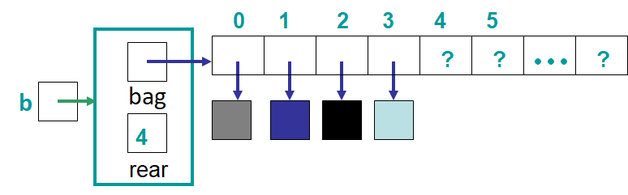
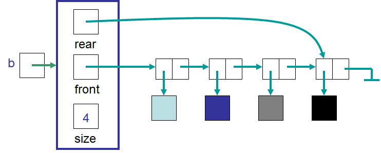

*******************
Bag Implementations
*******************

* Given the definition of a ``Bag``
* And given the definitions of the specialized bags

    * ``IndexedBag``
    * ``SortedBag``

* How can they be implemented?

Array Implementation Idea
=========================

    A representation of how a ``Bag`` could be implemented with an array.

* The idea will be similar to the ``Stack`` and ``Queue`` array based implementations
* Unlike a ``Queue``, the front will always be at index 0

    * With bags, adding and removing can happen anywhere
    * Adding to the middle would require a linear time operation to make room
    * Removing from the middle would require a linear time operation to eliminate the gap

* An ``expandCapacity`` will be required

    * The simpler version though since the front is always index 0

* The functionality of a ``Bag``, regardless of what specific version it is

    * ``boolean add(T element)``
    * ``boolean remove(T element)``
    * ``boolean contains(T element)``
    * ``int count(T element)``
    * ``boolean isEmpty()``
    * ``int size()``
    * ``Iterator<T> iterator()``

ArrayIndexedBag
===============

* In addition to the functionality of the ``Bag``, an ``IndexedBag`` must also be able to

    * ``boolean add(int index, T element)``
    * ``T remove(int index)``
    * ``T set(int index, T element)``
    * ``T get(int index)``
    * ``int indexOf(T element)``

.. note::

    For brevity, only a subset of methods are included below. See the
    :download:`ArrayIndexedBag </../main/java/ArrayIndexedBag.java>` class for the full implementation.

.. literalinclude:: /../main/java/ArrayIndexedBag.java
    :language: java
    :lineno-match:
    :lines: 1-35
    :emphasize-lines: 2

* Note the import of ``Iterator`` and the implementation of ``Iterator<T>``

    * Iterators are used for *iterating* over a collection
    * More on this later

Private Methods
---------------

.. literalinclude:: /../main/java/ArrayIndexedBag.java
    :language: java
    :lineno-match:
    :lines: 37-62

* ``shiftLeft`` and ``shiftRight``

    * These move elements up or down the array to make or eliminate room for adding and removing elements

Iterator Method
---------------

.. warning::

    Iterators are the focus of another topic, so they are only briefly presented here.

* Iterators are used to provide a common way to iterator over a collection, regardless of the underlying contained

    * Array vs. linked structure

.. literalinclude:: /../main/java/ArrayIndexedBag.java
    :language: java
    :lineno-match:
    :lines: 176-179

* All this method does is create an instance of an ``ArrayIterator`` and return it
* What the ``ArrayIterator`` class looks like is discussed later in the course

Add Methods
-----------

.. literalinclude:: /../main/java/ArrayIndexedBag.java
    :language: java
    :lineno-match:
    :lines: 82-100

* Note that ``add(T element)`` simply delegates to ``add(int index, T element)`` for ease and code/logic reuse
* Unlike the methods for adding to a ``Stack`` or ``Queue``, this method may throw an exception

    * The exception is thrown if the specified index is out of bounds

* Like the ``Stack`` and ``Queue``, the array may run out of space
* Unlike before, an ``expandCapacity`` method is not included
* Instead, the ``copyOf`` function from the ``Arrays`` class is used

    * It creates a new array with the specified capacity containing a copy of the elements in the original array

* The ``shiftRight`` private method is used to make room for the element to be added

Remove
------

.. literalinclude:: /../main/java/ArrayIndexedBag.java
    :language: java
    :lineno-match:
    :lines: 120-140

* The ``remove(T element)`` method delegates to the ``remove(int index)`` for ease and code/logic reuse

ArraySortedBag
==============

* In addition to the functionality of the ``Bag``, we want to add a few more methods for our ``SortedBag`` implementation
    * ``void add(T element)`` --- add to the proper spot in the sorted bag to preserve the sorted order
    * ``T removeFirst()``
    * ``T removeLast()``
    * ``T first()``
    * ``T last()``

.. warning::

    Like the indexed bag, some methods are skipped. See the
    :download:`ArraySortedBag </../main/java/ArraySortedBag.java>` implementation to view the full implementation.

.. literalinclude:: /../main/java/ArraySortedBag.java
    :language: java
    :lineno-match:
    :lines: 1-25
    :emphasize-lines: 12

* This looks nearly the same as the ``ArrayIndexedBag`` implementation, but we see one major difference

    ``<T extends Comparable<? super T>>``

* There is a little bit to unpack here

* First, when something extends `Comparable <https://docs.oracle.com/en/java/javase/11/docs/api/java.base/java/lang/Comparable.html>`_, it means that the type has some defined ordering
    * The method ``compareTo`` is implemented for the type

* If we call ``x.compareTo(y)``
    * Return a negative integer if ``x < y``
    * Return zero if ``x == y``
    * Return a positive integer if ``x > y``

* When we have something that is extending ``Comparable<T>``, that means we can compare ``this`` to some type ``T``
    * ``this`` can be compared to things of type ``T``, but not the other way around

* By saying ``T extends Comparable<T>``, this means that the type ``T`` we want in our ``ArraySortedBag`` can be compared to things of type ``T`` to provide some defined ordering
    * Which is needed, if we want to sort things

* Finally, with ``Comparable<? super T>``, we are saying that ``T`` or one of its superclasses must extend ``Comparable``
    * ``?`` is a *wildcard*
    * If our type ``T`` does not extend ``Comparable`` and have a ``compareTo`` method written, that may be fine as long as one of its superclasses does

* Putting this all together, ``<T extends Comparable<? super T>>`` means that our type ``T`` must have a defined ordering for itself either through a direct implementation of ``compareTo`` or through inheriting from a superclass

Adding Method
-------------

.. literalinclude:: /../main/java/ArraySortedBag.java
    :language: java
    :lineno-match:
    :lines: 84-113

* The ``add`` method makes use of the private method ``findInsertIndex``
* When analyzing this method, notice that we are using an iterator
    * Ultimately, this method is doing a linear search
* We are also making use of the ``compareTo`` method
* Remember
    * The elements themselves should determine the ordering
    * We do not know what the type ``T``, so how can we compare them?
        * Sure, if they're numbers we can use ``<``, ``>``, ``==``, and so on
        * What if we are sorting strings? Or Colours?

* Since I know that type ``T`` has a ``compareTo`` implemented, we will make use of it so I can guarantee I always get the proper ordering, regardless of the type

* Given this, the loop will execute while:
    * There are more elements in the collection
    * and the thing we want to insert is belongs after the current element in the collection

Testing
=======

* Although not discussed in depth here, check out the testing methods for these implementations to get a sense of what functionality is being tested and how
    * :download:`ArrayIndexedBagTest </../test/java/ArrayIndexedBagTest.java>`
    * :download:`ArraySortedBagTest </../test/java/ArraySortedBagTest.java>`

Linked Implementation
=====================

* There is nothing stopping us from building a linked implementation of the bag
* :doc:`Reviewing the different types of insertions and removals from a linked structure will help </topics/linked-structures/linked-structures>`

For Next Time
=============

.. note::

    Note that there are better implementations of these data structures. One will be discussed later in the course.

* Read Chapter 6 Sections 6 & 7

    * 17 pages

Playing Code
------------

* Download and play with

    * :download:`ArrayIndexedBag </../main/java/ArrayIndexedBag.java>`
    * :download:`ArraySortedBag </../main/java/ArraySortedBag.java>`
    * :download:`ArrayIndexedBagTest </../test/java/ArrayIndexedBagTest.java>`
    * :download:`ArraySortedBagTest </../test/java/ArraySortedBagTest.java>`

