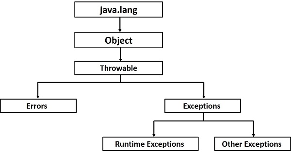

**********
Exceptions
**********

* Exceptions provides a way to logical separate the regular code and what to do in an exceptional situation
* They make it easy to propagate the exception up the call stack such that the situation can be managed in a desired place
* They also allow for differentiating between exception types and how to deal with them specifically

    Java's ``Throwable`` class hierarchy.

Errors
======

* In Java, there are two classes of throwable objects

    * A *throwable* object is one that can be thrown with a ``throw`` statement

* Errors are one of the two throwable classes
* Errors are typically for unrecoverable situations

    * They're generally **very** abnormal situations

* Typically, these are not to be caught and handled
* Errors and regarded as *unchecked* for the purpose of compile-time checks

* To understand why these are not caught, consider Java's `OutOfMemoryError <https://docs.oracle.com/en/java/javase/17/docs/api/java.base/java/lang/OutOfMemoryError.html>`_

    * Gets thrown if the Java Virtual Machine (JVM) cannot allocate enough memory for the creation of a new object

* If the JVM runs out of memory, there is nothing the program can do to resolve this situation

Throwing an Exception
=====================

* Several methods written so far have thrown exceptions
* Below are the ``remove`` and ``removeFirst`` methods from the ``ArraySortedBag`` implementation

    * ``remove`` does not throw an exception, but ``removeFirst`` will if trying to remove from an empty bag

.. literalinclude:: /../main/java/ArraySortedBag.java
    :language: java
    :lineno-match:
    :start-after: // [start-remove_removeFirst]
    :end-before: // [end-remove_removeFirst]

* The exception being thrown by ``removeFirst``, ``NoSuchElementException``,  is a subclass of ``RuntimeException``

    * It is an unchecked exception, so the method does not need to include a ``throws NoSuchElementException`` in the method signature

* The motivation for using an exception in ``removeFirst`` is, when removing from an empty bag, what should happen?

    * Perhaps this means some critical error happened and the program must stop immediately
    * Or maybe the program using the bag can just ignore the exception and carry on

* Either way, as the writers of the ``ArraySortedBag``, it is not possible to know how the user of the ``ArraySortedBag`` should address the situation
* All that can be done is to throw the exception to inform the uservthat something exceptional happened

* One may wonder why the more general ``remove`` does not throw an exception
* This is because

    #. The return type of the general ``remove`` is a ``boolean``

        * ``false`` is a reasonable value to return to communicate that the ``remove`` was not successful

    #. The expected return value of ``removeFirst`` is type ``T`` --- the actual first thing in the bag

        * There is no obvious explicit way to communicate a failure with the returned value
        * One *could* return null or some other special value, but exceptions are a more appropriate tool for this scenario

    #. `Conforms to Java's collection interface <https://docs.oracle.com/en/java/javase/21/docs/api/java.base/java/util/Collection.html#remove(java.lang.Object)>`_

* Ultimately, however, it would not be *wrong* to have the general ``remove`` throw an exception in this situation

    * In the end it is a design decision

Messages
--------

* Notice the string provided the the exception's constructors

    * ``"Empty bag"``

* The string is the *message* the exception provide to give details on the exceptional situation
* Consider how an ``ArrayIndexOutOfBoundsException`` provides details on the index used that caused the exception

Catching Exceptions
===================

* If someone is using the ``ArraySortedBag`` implementation two years from now, it's not possible to know what they should do to manage the exceptional situations
* The users of the ``ArraySortedBag`` class will need to deal with them as they see fit

    * What should be done if calling ``remove`` on an empty ``ArraySortedBag``?
    * What should be done if calling ``remove`` when the element does not exist within the ``ArraySortedBag``?

Ignore
------

* Maybe this doesn't matter and they don't even try to catch the exception

    * If the exception is thrown, their program will crash, but this doesn't matter to them

.. code-block:: java
    :linenos:

    // I know this may throw an exception, but whatever
    bag.remove(element);

* Since the exception is not caught here, the exception would be propagated to the calling method
* This exception will keep being propagated to the calling methods until it is either

    * Caught somewhere
    * The ``main`` method propagates the exception and the program crashes

Stop Immediately
----------------

* Maybe they need to stop the execution of the code immediately

    * They are running medical equipment that delivers radiation therapy

.. code-block:: java
    :linenos:

    try {
        bag.remove(element);
    } catch (NoSuchElementException e) {
        someCleanUpMethod();
        System.exit(1);
    }

Carry On
--------

* Maybe they can catch it, print out the stack trace, and then carry on and ignore the issue

    * The program keeps the spaceship running, so it better not crash

.. code-block:: java
    :linenos:

    try {
        bag.remove(element);
    } catch (NoSuchElementException e) {
        System.out.println("Caught an Exception");
        e.printStackTrace();
    }

Rethrow
-------

* Perhaps we want to catch the exception and then rethrow it as something more appropriate for our context

.. code-block:: java
    :linenos:

    try {
        bag.remove(element);
    } catch (NoSuchElementException e) {
        throw new MySpecificException(e);
    }

Catching Different Exception Types
==================================

* It is possible that the code being called may throw different exception types
* These can be individually caught and handled accordingly
* The general idea is as follows

.. code-block:: java
    :linenos:

    try {
        mayThrowVariousExceptions();
    } catch (SomeExceptionA e) {
        handleSomeExceptionA();
    } catch (SomeExceptionB e) {
        handleSomeExceptionB();
    } catch (SomeExceptionC e) {
        handleSomeExceptionC();
    } finally {
        codeThatWillAlwaysRun();
    }

* With multiple ``catch`` statements, the exception class hierarchy must be considered
* Always order the ``catch`` statements from most specific to most general
* For example ``IOException`` and ``FileNotFoundException``

.. code-block:: java
    :linenos:

    // This is bad
    try {
        ...
    } catch (IOException e) {
        ...
    } catch (FileNotFoundException e) {
        ...
    }

* Since ``FileNotFoundException`` is a subclass of ``IOException``, if a ``FileNotFoundException`` is thrown, the first ``catch`` statement will catch it
* In this scenario, it would not be possible for the code within the second ``catch`` statement to ever run
* This is easily fixed by switching the order of the ``catch`` statements

Finally
-------

* Sometimes it is necessary to have some code run regardless of if an exception was thrown or which exception was caught
* The ``finally`` keyword is used to specify code to be run no matter what happens

    * Eg. Closing files

For Next Time
=============

* Go back and read Chapter 3 Section 5

    * 2 pages
