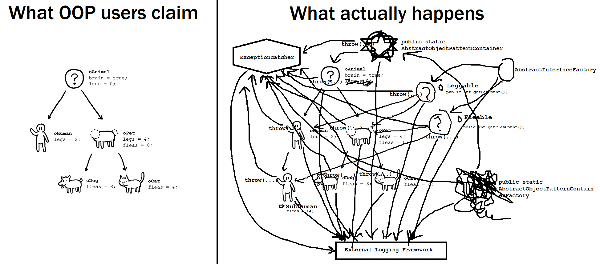
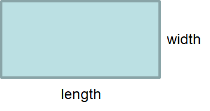
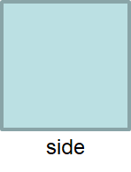

*****************
Aside --- Careful
*****************

.. warning::

    Don't think of objects as their real world counterparts --- that's a fallacy that OOP promised but failed to
    deliver.





* There is nothing wrong with extending concrete classes, but this is where things can become problematic
* Sometimes taking literal inspiration can be bad


Rectangles and Squares
======================

* A classic example used for teaching inheritance is squares and rectangle

    * `It's also known for being a problematic example <https://en.wikipedia.org/wiki/Circle%E2%80%93ellipse_problem>`_






* In reality, a square is a special type a rectangle

    * A square is a rectangle where the length and width are equal


* Below is a simple ``Rectangle`` class


.. code-block:: java
    :linenos:

    public class Rectangle {

        private double length;
        private double width;

        public Rectangle() {
            this(1,1);
        }

        public Rectangle(double length, double width) {
            this.length = length;
            this.width = width;
        }

        public double getLength() {
            return length;
        }

        public void setLength(double length) {
            this.length = length;
        }

        public double getWidth() {
            return width;
        }

        public void setWidth(double width) {
            this.width = width;
        }

        public double getArea() {
            return length * width;
        }

        public String toString() {
            return String.format("Rectangle(Length = %.2f, Width = %.2f)", length, width);
        }
    }


* One can also make a ``Square`` class that extends the ``Rectangle`` class


.. code-block:: java
    :linenos:

    public class Square extends Rectangle {

        public Square() {
            // Call the superclass' constructor
            super();
        }

        public Square(double side) {
            // Call the superclass' constructor
            super(side, side);
        }

        public double getSide() {
            // Could have done getLength
            return getWidth();
        }

        public void setSide(double width) {
            setWidth(width);
        }

        public String toString() {
            return String.format("Square(Side = %.2f)", getSide());
        }
    }


* This *seems* great
* Inherit the ``getLength``, ``getWidth``, and ``getArea``
* Override the ``toString`` for our special needs
* Can even hijack the superclass' constructors with ``super()`` in a similar way to using ``this()``


Liskov's Substitution Principle
===============================

* `"Functions that use pointers or references to base classes must be able to use objects of derived classes without knowing it" <https://en.wikipedia.org/wiki/Liskov_substitution_principle>`_

    * This is the "L" in the `SOLID design principals <https://en.wikipedia.org/wiki/SOLID>`_

.. code-block:: java
    :linenos:

    public void pumpItUp(Rectangle rect) {
        rect.setWidth(2.0 * rect.getWidth());
    }


* ``pumpItUp`` is a method that will double the area of a rectangle

* Think of what will happen when running this

.. code-block:: java
    :linenos:

    Square mySquare = new Square(10);
    pumpItUp(mySquare);


* Since ``Square`` inherits from ```Rectangle``,  ``setWidth`` exists
* But this code will cause the ``Square`` to have an unequal length and width

    * Thus, the ``Square`` is no longer a square


* This can be fixed by overriding the ``setWidth`` (and ``setLength``) methods in the ``Square`` class

.. code-block:: java
    :linenos:

        // Add to Square class to override
        // Rectangle's setters
        public void setWidth(double width) {
            super.setWidth(width);
            super.setLength(width);
        }

        public void setLength(double length) {
            this.setWidth(length);
        }


* What happens now if we call this?


.. code-block:: java
    :linenos:

    Square mySquare = new Square(10);
    pumpItUp(mySquare);


* This will then cause the ``Square`` to not double in size, but quadruple, which is a problem
* This means it is not possible to substitute the ``Rectangle`` for a ``Square`` for ``pumpItUp``
* However, this can be fixed by changing the ``pumpItUp`` method

.. code-block:: java
    :linenos:

    public void pumpItUp(Rectangle rect) {
        if (rect instanceof Square) {
            rect.setWidth(Math.sqrt(2.0) * rect.getWidth());
        } else {
            rect.setWidth(2.0 * rect.getWidth());
        }
    }


* Now this *solves* it
* Except, `Hyrum's Law <https://www.hyrumslaw.com/>`_ says that all observable behaviours, intentional or not, will be depended on by somebody
* So, someone out there depends on the fact that ``pumpItUp`` is quadrupling the ``Square``, even though it honestly shouldn't be
* Maybe this can be fixed by adding another method and changing ``pumpItUp`` back for the person depending on the problematic functionality


.. code-block:: java
    :linenos:

    public void pumpItUp(Rectangle rect) {
        rect.setWidth(2.0 * rect.getWidth());
    }

    public void myPumpItUp(Rectangle rect) {
        if (rect instanceof Square) {
            rect.setWidth(Math.sqrt(2.0) * rect.getWidth());
        } else {
            pumpItUp(rect);
        }
    }


* Now this *solves* it
* But, now there is a function saying: if it's a ``Square`` do one thing, if it's a ``Rectangle`` do another thing

    * So... it would seem that here, a ``Square`` is **not** a ``Rectangle``


* There is also two pieces of code trying to do the same thing

    * What happens if ``Rectangle`` gets extended again?
    * Write another version of the method?


* This ended up requiring a lot of extra work for no reason at all

    * The code got more complex


* It's going to be a lot easier to just not use inheritance here
* If one is truly set on reusing the code, then the better idea here is `composition over inheritance <https://en.wikipedia.org/wiki/Composition_over_inheritance>`_

    * Have the ``Square`` use an internal instance of a ``Rectangle`` to get the desired functionality from ``Rectangle``
