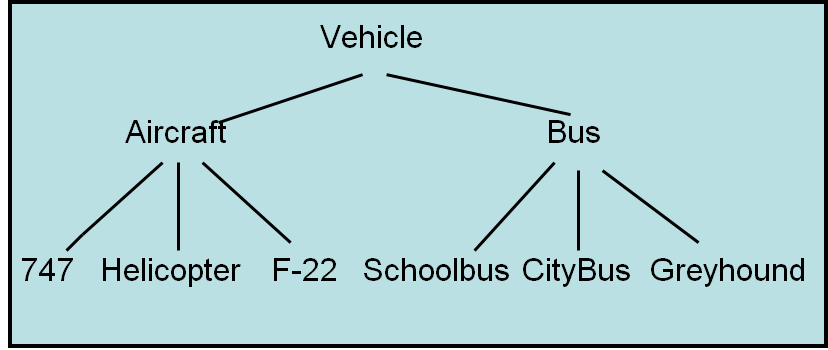
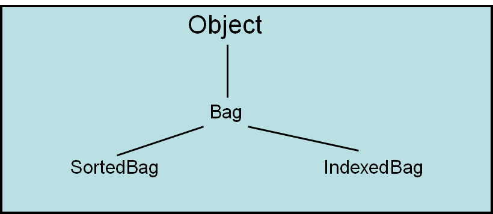
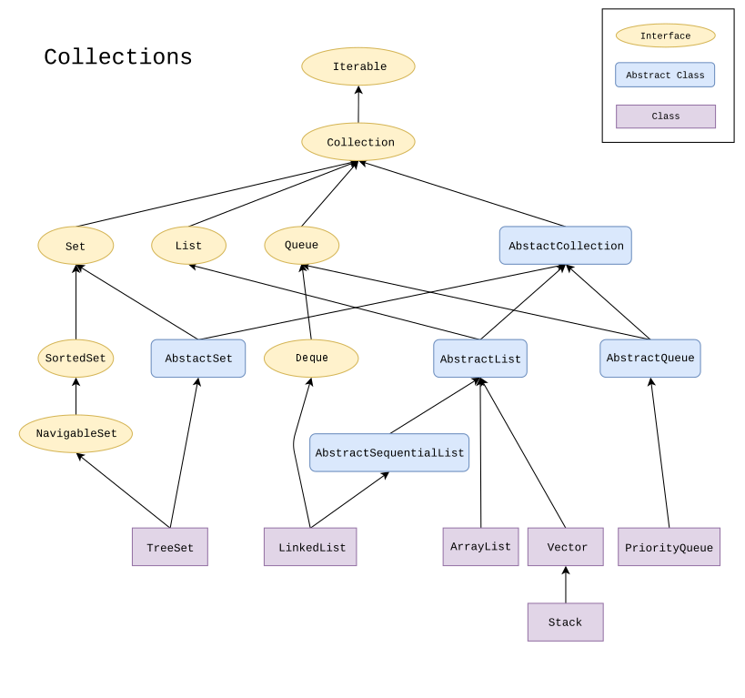

***********
Inheritance
***********

* Inheritance is a way to derive a class from an existing one
* This allows the ability to *inherit* functionality from the base class



    Example class hierarchy of elements based on the most general (top) to the least general/most specific (bottom).
    Moving down the tree, elements become more and more specific. However, when moving down the tree, each element is
    still a type of the elements above it.




    Example class hierarchy for the ``Bag`` class and its subtypes --- ```SortedBag`` and ``IndexedBag``.


* This hierarchical thinking exists in everyday life

    * However, one should be careful not to translate what makes sense in reality to code


Terminology
===========

* The class that is being inherited *from* is referred to as the **superclass**
    * Parent class
    * Base class

* The class that is inheriting from a superclass is called the **subclass**
    * Child class
    * Derived class

* When considering the hierarchies, these terms are relative
    * A ``SortedBag`` is a subclass of a ``Bag``
    * A ``Bag`` is a superclass of a ``IndexedBag``
    * An ``Object`` is also a superclass of ``Bag``, ``SortedBag``, and ``IndexedBag``


Object
======

* The ``Object`` class is always at the root of the hierarchy
* Every class in Java will inherit from the ``Object`` class

    * This is done automatically; it is not necessary to ``extend`` ``Object`` explicitly


* Child classes inherit everything from their superclasses
* This means that all the methods from ``Object`` are inherited for free

    * ``toString``
    * ``equals``
    * ``hashCode``


* However, they are typically overridden with class specific functionality if they are to be used
* For example, inherited behaviour of ``equals`` checks if the references are to the same exact object

    * ``x.equals(y)`` checks if ``x`` and ``y`` are the same object (same as ``x == y``)


Collections Example
===================



    Visualization of part of Java's collections' class hierarchy.


Abstract Class
--------------

* Notice the *Abstract Class* designation
* An abstract class is one that

    * Is declared with the ``abstract`` keyword
    * May or may not include abstract methods

        * Method signatures, like interfaces


    * Cannot be instantiated
    * May be subclassed/inherited from
    * May include concrete methods that will be the same among multiple subclasses


* `Take Java's AbstractQueue class <https://docs.oracle.com/en/java/javase/11/docs/api/java.base/java/util/AbstractQueue.html>`_ and its subclass, `PriorityQueue <https://docs.oracle.com/en/java/javase/11/docs/api/java.base/java/util/PriorityQueue.html>`_

* The ``AbstractQueue`` has several important concrete methods implemented within the abstract class

    * It also inherits a bunch from superclasses too)


* ``add``

    * ``addAll``
    * ``clear``
    * ``element``
    * ``remove``


* The ``PriorityQueue`` class, which ``extends AbstractQueue``, makes direct use of a few of these methods

    * ``addAll``
    * ``element``
    * ``remove``


* But the ``PriorityQueue`` also overrides a few of the methods from ``AbstractQueue`` since it requires a specific implementation

    * ``add``
    * ``clear``


* If you open the ``PriorityQueue.java`` file

    * One cannot find ``addAll``, ``element``, or ``removed`` within it since they are inherited
    * One can find the overridden methods ``add`` and ``clear``


Polymorphism
============

* Polymorphism is the idea that behavior can change depending on the type of the *object*
* Consider the below ``Stack`` examples

    ``Stack<Integer> myStack = new ArrayStack<>();``

    ``Stack<Integer> myStack = new LinkedStack<>();``


* The reference variables is for something of type ``Stack``
* Yet, it can reference an object of type ``ArrayStack`` or ``LinkedStack``
* This is because ``ArrayStack`` *is a* ``Stack`` and ``LinkedStack`` *is a* ``Stack``

* However, it is not possible to do this

    ``ArrayStack<Integer> myStack = new LinkedStack<>();``


* This is because a ``LinkedStack`` is **not** an ``ArrayStack``


.. note::

    .. code-block:: java
        :linenos:

        Stack<Integer> myStack = new LinkedStack<>();
        Object o = myStack;

    The data both ``myStack`` and ``o`` reference has the type ``LinkedStack``. It is the reference variable that's type
    changed (and can change to any supertype). However, the type of the object itself does not change.


.. warning::

    One should be careful with the *is a* metaphor as it can be abused and cause trouble. *Is a* is fine if referring to
    the types, not the things they represent.


Binding
-------

.. code-block:: java
    :linenos:

    Stack<Integer> myStack;
    if (randomNumber < 50) {
        myStack = new ArrayStack<>();
    } else {
        myStack = new LinkedStack<>();
    }

    myStack.push(11);
    myStack.push(22);
    myStack.push(33);
    System.out.println(myStack);


* Given the above code, which version of ``toString`` would be called?

    * ``ArrayStack``?
    * ``LinkedStack``?


* Connecting a call of a method to the actual implementation of the method is called *binding*
* Sometimes this is known at compile time --- *static binding*
* Other times, like in the above example, this is not known until runtime --- *dynamic binding*


* It is possible to get the type of the object at runtime

    ``myStack.getClass()``


For Next Time
=============

* :doc:`Read the aside on inheriting from concrete classes <careful>`
* Have a *quick* look at the JDK specification link (you won't understand everything, but that's OK)

    * `AbstractCollection <https://docs.oracle.com/en/java/javase/17/docs/api/java.base/java/util/AbstractCollection.html>`_
    * `Queue <https://docs.oracle.com/en/java/javase/17/docs/api/java.base/java/util/Queue.html>`_
    * `AbstractQueue <https://docs.oracle.com/en/java/javase/17/docs/api/java.base/java/util/AbstractQueue.html>`_
    * `PriorityQueue <https://docs.oracle.com/en/java/javase/17/docs/api/java.base/java/util/PriorityQueue.html>`_


* Read Chapter 3 Section 3

    * 3 pages
