*****
Links
*****

.. note::

    This topic is not introducing a ADT. Instead, it is introducing the idea of linked structures. These linked
    structures may be used to implement ADTs

* Arrays have a fixed size

    * But the ``expandCapacity`` trick can hide this

* When using an array, data may need to me shifted around when adding and/or removing
* Traditionally speaking, arrays are in contiguous memory addresses

    * The successor value is in the next array cell
    * JVM asterisk --- In Java, arrays are objects, and objects go into the *heap*, which isn't necessarily contiguous

Linked Structure
================

* A linked data structure is one that consists of objects referencing other objects

    .. figure:: example0.png
        :width: 500 px
        :align: center

        Example linked structure consisting of five "nodes". Note that "head" is not a node, but a reference to a node.

* Linked structures do not have a fixed size
* With this linking idea, data does not need to be stored in consecutive memory locations

    * Successors can be anywhere

* Data can be inserted and removed by updating the references/links

    * No need to shift data around

Nodes
=====

* A *node* is a basic unit in the linked structures
* For the following examples, the focus is on *singly linked structures*

    * Each node has only one *link*

* The series of nodes linked together is what makes up the singly linked structure

    * The nodes link to their successor nodes

    .. figure:: node_example.png
        :width: 400 px
        :align: center

        Example single node containing a reference to some data and a reference to a successor/next node. These
        references may refer to null.

* A node for a singly linked structure typically has two fields

    * **data** --- a reference to the data to be stored

        * To compare to the array, this would be the data put into the cells of the array

    * **next** --- a reference to the successor/next node

        * Arrays don't have this because the successor is just in the next cell in the array

Inserting into a Linked Structure
=================================

.. figure:: example1.png
    :width: 500 px
    :align: center

    Example of a singly linked structure. Note that "head" is not a node, but a reference to a node.

* With a reference to the head of the linked structure and the two fields (``data`` and ``next``) of the node class

    * How would one access the *first* node's data?
    * How would one access the *second* node's data?
    * How would one access an arbitrary node's data?
    * How would you access the predecessor?

    * How would we add something to the *front* of this linked structure?
    * How would we add something to the *middle* of this linked structure?
    * How would we add something to the *end* of this linked structure?

    * How would we remove something to the *front* of this linked structure?
    * How would we remove something to the *middle* of this linked structure?
    * How would we remove something to the *end* of this linked structure?

Adding to the Front
-------------------

* Given a reference to the front of the linked structure (``head``) and a reference to the node to be inserted (``node``)

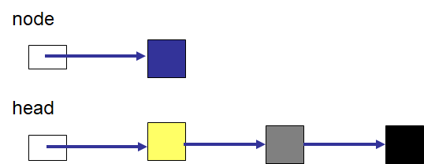

* Have the node to be inserted's ``next`` reference the node referenced by ``head``

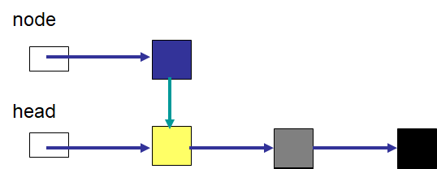

* Have ``head`` reference the new node, which is the new front of the linked structure

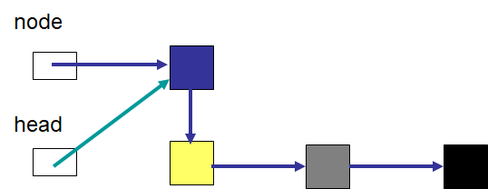

* The new node is now at the front of the linked structure

Adding to the Middle
--------------------

* Given a reference to the front of the linked structure (``head``) and a reference to the node to be inserted (``node``)

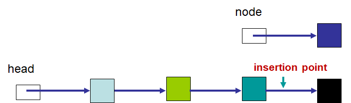

* Locate the node the new node will be inserted after
* In this example, ``current`` is a reference to the node the new node will be inserted after

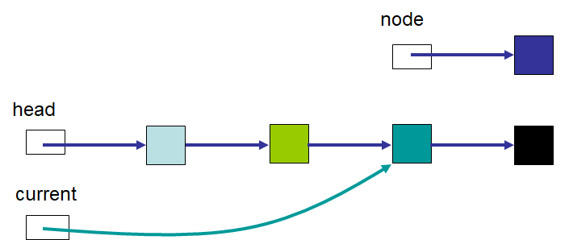

* Have the new node's ``next`` reference its soon to be predecessor's (``current``) ``next``

    * This is the node that the node being inserted will come before

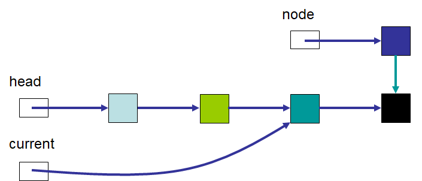

* Update the predecessor's (``current``) ``next`` to reference the new node being inserted

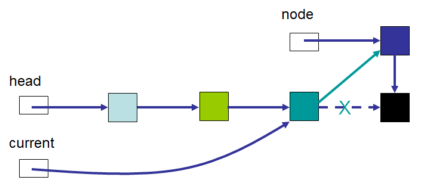

* The new node is now at the desired location

Adding to the End
-----------------

* Adding to the middle is a more general case compared to adding to the front

    * Adding to the front is a special case

* The process to add to the end of a linked structure is the same as adding to the middle

    * The difference is that the predecessor's next will have been ``null``, but this does not change the algorithm

Removing from a Linked Structure
=================================

Deleting from the Front
-----------------------

* Removing from the front may be the easiest operation

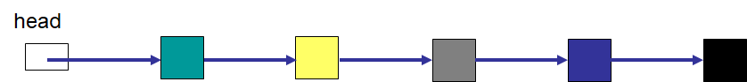

* Make head, the reference to the start of the linked structure, point to the first node's ``next``

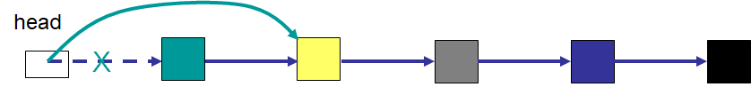

Deleting from the Middle
------------------------

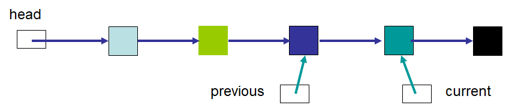

* Locate the node to be deleted (``current``) and the node immediately before it (``previous``)

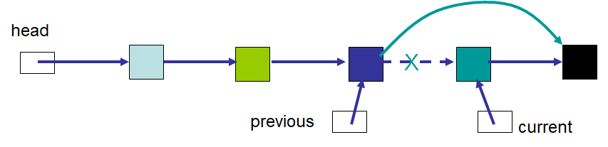

* Make the proceeding node's (``previous``) ``next`` reference the node to be deleted's (``current``) ``next``

Deleting from the End
---------------------

* Is deleting from the end a special case?

Node Implementation
===================

.. warning::

    Note that ``head`` is **not** a node; ``head`` is a reference to a node. For example, ``head = someNode;`` and
    ``head.setNext(someNode);`` have two very different meanings. The first means that our reference ``head`` will
    refer to the node ``someNode``, while the second means that the node referenced by ``head``\'s ``next`` node
    reference will refer to ``someNode``.

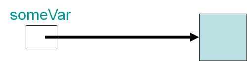

* Remember, reference variables contain a reference to an object
* The linked structure uses these references to link it together

* The node implementation for the singly linked structure is kept simple
    * A field to keep track of the data
    * A field to keep track of the next/successor node
    * Constructors
    * Getters and setters

.. code-block:: java
    :linenos:

    public class Node<T> {

        private T data;
        private Node<T> next;

        public Node() {
            this(null);
        }

        public Node(T data) {
            this.data = data;
            this.next = null;
        }

        public T getData() {
            return data;
        }

        public void setData(T data) {
            this.data = data;
        }

        public Node<T> getNext() {
            return next;
        }

        public void setNext(Node<T> next) {
            this.next = next;
        }
    }

Explore the Implementation
--------------------------

.. code-block:: java
    :linenos:

    // Create a Node
    Node<Integer> head = new Node<>(5);
    System.out.println(head.getData());

    // Make a linked structure of the numbers 0 -- 9
    Node<Integer> currentNode = head;
    Node<Integer> newNode;

    for (int i = 1; i < 10; ++i) {
        newNode = new Node<>(i);
        currentNode.setNext(newNode);
        currentNode = currentNode.getNext();
    }

    // Print the contents of the linked structure
    currentNode = head;
    while (currentNode!= null) {
        System.out.println(currentNode.getData());
        currentNode = currentNode.getNext();
    }

    // Try adding to the front, middle, and end of the structure

    // Try removing from the front, middle, and end of the structure

Variations
==========

* For many of the stuff we're learning, there are variations
* You may be wondering: *Can we add references going more than one direction?*
    * Absolutely

Doubly Linked
-------------

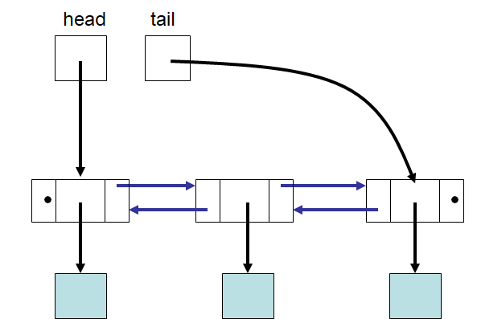

* How would our ``Node`` implementation need to change to achieve this?

For next time
=============

* Download and play with the :download:`Node.java </../main/java/Node.java>` file
* Try writing code to add/remove from the front/middle/end of the linked structure
* Read Chapter 4 Sections 1 -- 3
    * 7 pages
