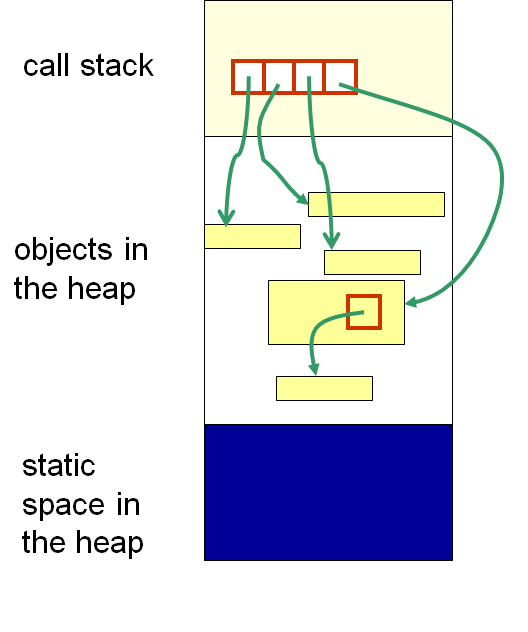
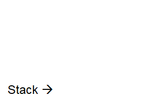
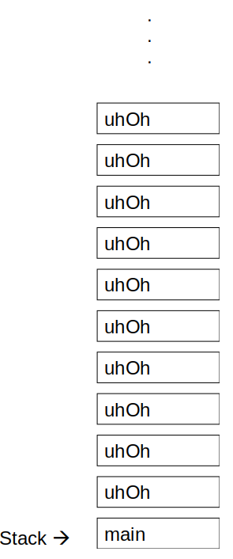

***********************
Memory & The Call Stack
***********************

* Programs use and access memory in different ways
* Typically, instructions *and* data are physically stored in the same memory address space

    * This is called a *Von Neumann* based architecture
    * A noteworthy alternative is the *Harvard* architecture, which separates the instruction and data memory

* Having a common memory address space for instructions and data could be a recipe for disaster
* However, modern computer systems have strategies for mitigating potential issues
* In many programming languages, Java included, memory is logically seperated into areas for

    * Instructions

        * e.g. Classes & Interfaces

    * Dynamically allocated data (memory being allocated at runtime)

        * e.g. Instances of objects

    * Program elements related to what is currently happening

        * e.g. Variables & parameters

.. warning::

    This topic is intentionally kept at a high-level for the purpose of introducing these ideas. There are several
    nuances and details related to statements contained within this topic that are skipped.

Memory Allocation
=================

* Memory is broken down into two broad sections:

#. The Stack

    * Stores information about the current method running

        * Local variables
        * Formal parameters
        * Return address

#. The Heap

    * Which can be broken down further into storage for

		* Static information

		    * e.g. Program code

		* Instance information

		    * e.g. Instances of objects
		    * Technically, in Java, this can be broken down further into an area for longer living objects and an area for younger ones

    High-level representation of how Java logically separates portions of memory. The stack portion stores details
    related to what is currently running. The static portion of the heap stores the program instructions, and the
    instance portion of the heap stores data that required memory to be allocated at runtime.

* For example, calling ``Bag<T> myBag = new ArraySortedBag<>();``

    * The information on *what* an ``ArraySortedBag`` is is stored in the static area of the heap
    * The ``ArraySortedBag`` *instance that is created* is put into the instance area of the heap
    * The *reference variable* ``myBag`` is stored in the stack

The Call Stack
==============

* The call stack is the part of memory where the information about the current method being run is stored

    * Along with the other methods that were running, but are waiting on the current running method to end so it can resume

* The call stack is also a *stack*

    * Push and pop information to/from the stack at one end

* `People operate with a mental stack throughout their everyday life <https://youtu.be/AbSehcT19u0>`_

    * Consider a situation of debugging some problem ``a``
    * But when working on ``a``, there is a realization that another issue ``b`` must first be solved
    * Then, to fix ``b``, problem ``c`` needs to be resolved
    * Once ``c`` is fixed, issue ``b`` can be fixed
    * Since ``b`` is fixed, situation ``a`` can finally be resolved

Call Frame
----------

* Each time a new method starts running, a *call frame* containing relevant information for the method is created and pushed onto the stack
* The call frame contains important information for the execution of the method

    * Space for the method's parameters
    * Space for local variables

        * If the data type is a primitive type, the data is simply stored here
        * If the data is an object, then the data stored is a reference to where the object is in the heap

    * Memory address of where the program returns to when the method finishes

        * Where the calling method's call frame can be found in memory

* When the running method finishes, it is popped from the stack and the memory it used is deallocated

.. code-block:: java
    :linenos:

    public static void main(String[] args) {
        function1();
    }

    static void function1() {
        System.out.println("Starting function1");
        System.out.println("Calling function2");
        function2();
        System.out.println("Calling function3");
        function3();
        System.out.println("Finished function1");
    }

    static void function2() {
        System.out.println("Starting function2");
        System.out.println("Calling function4");
        function4();
        System.out.println("Finished function2");
    }

    static void function3() {
        System.out.println("Starting function3");
        System.out.println("Finished function3");
    }

    static void function4() {
        System.out.println("Starting function4");
        System.out.println("Finished function4");
    }

* Running the above example would result in the call stack behaving like the below animation

    Animation of call frames being pushed to and popped from the call stack.

Heap
====

* Very broadly speaking, the heap can be broken into static space and instance space

Static Space
------------

* The static space contains one copy of all the code

    * Classes
    * Static methods
    * Static variables
    * Interfaces

Instance Space
--------------

* The instance space stores the object instances created at runtime

    * The object type
    * Values of the object's fields

        * This includes primitive types and references variables to other objects in the heap

* When an object is created, it is put into the instance part of the heap

Garbage Collection
==================

* When a method finishes running and the call frame from the call stack is not needed anymore, the memory is deallocated
* When an object in the instance space is not needed anymore, *garbage collection* comes into play

* In some programming languages, when something from the heap that has been allocated is not needed anymore, it must be manually deallocated

    * If it is not deallocated, it causes a *memory leak*

* In Java, and most modern languages, when an object is not reachable, it is available for garbage collection

    * However, memory leaks can still happen in languages with garbage collection

        * For example, failing to close a file

* If an object is not reachable, it can't be used
* An object is *not reachable* when there is no accessible reference to it anymore

.. figure:: /topics/linked-structures/example1.png
    :width: 500 px
    :align: center

    Example linked structure with a single reference (``head``) providing access to all nodes in the linked structure.
    Although each node contains a reference to its successor node, if the node's proceeding reference did not exist, it
    would not be possible to access that node anymore.

* In the above example there are several reference variables

    * ``head``
    * Each node's ``next`` field
    * There are also references to the data being referenced by the ``data`` field, but those can be ignored here

* In this example, ``head`` is a critically important reference variable as it ultimately provides access to all nodes

    * ``head``
    * ``head.getNext()``
    * ``head.getNext().getNext()``
    * etc.

* If one of the references in the structure changes such that it loses reference to its subsequent node, all following nodes become unreachable

    * e.g. ``head.getNext().getNext().setNext(null)``

* All the nodes after the changed reference are now deemed available for garbage collection

* If ``head`` gets reassigned and there is other reference to the first node in the linked structure, all nodes become unreachable

    * e.g. ``head = null``

* Even though all nodes, except for the first one, have references to them via their predecessor's ``next`` field, none are actually reachable anymore
* In the end, all nodes end up being available for garbage collection

Stack Overflow
==============

* What would happen if the following method was run?

.. code-block:: java
    :linenos:

    static void uhOh() {
        System.out.println("Weeeeeeeeeeeeeeeeeeeeeeee!!!");
        uhOh();
    }

    Representation of the call stack after calling the function ``uhOh`` from ``main``.

For Next Time
=============

* Read Chapter 8

    * 28 pages
