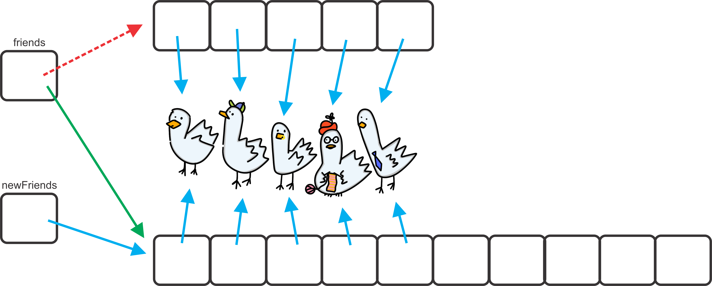

**********************
Data Structures Review
**********************

* Like objects, defining a data structure is similar between Python and Java
* Most of the differences are syntax related

.. note::

    Although Python code was included for the previous topic defining a ``Friend`` class, for brevity and an exercise in
    understanding Java, Python is not included here when defining the data structure.

Contact List Class
==================

* With the ``Friend`` class complete, there needs to be a way to keep track of and manage the ``Friend`` objects
* To do this, a new class called ``ContactList`` will be created

* What fields should this have?

    * A way to keep track of the ``Friends`` in the ``ContactList``

        * An *array* will be used here

    * A count of how many ``Friend`` objects the ``ContactList`` contains

        * Just an ``int``

Setting Fields and Writing the Constructor
------------------------------------------

.. literalinclude:: /../main/java/ContactList.java
    :language: java
    :lineno-match:
    :start-after: // [start-class_fields_constructor]
    :end-before: // [end-class_fields_constructor]

* Things to notice

    * The imports
    * The two constants
    * The declaring of the fields
    * Two constructors

* Most of these are ideas one should already be familiar with

    * The imports are used for functionality described below
    * One constant, ``DEFAULT_CAPACITY``, defines the default size an array should have --- more on this below
    * The other constant, ``NOT_FOUND``, is used to provide a name to the sentinel value of ``-1`` --- more detail below
    * The declaring of the fields is similar to what was seen in the ``Friend`` class

* Having two constructors is a new idea that was not used in Python
* In several programming languages, it is possible to have multiple methods with the same name that take different parameters

    * This is called *overloading*

* Notice that one constructor takes no parameters and the other takes a single integer ``capacity``
* For now, focus on the second one; the one that takes the parameter
* It first sets the ``size`` field of the ``ContactList`` to ``0`` since a new ``ContactList`` is empty
* It then creates a new empty ``Friend`` array of size ``capacity``

    * Remember, arrays have a fixed size
    * The strategy here is to make an array that is sufficiently large, but only use what is needed
    * Consider the following example,

        * The array is size ``10``
        * Only two ``Friend`` objects are in the ``ContactList``
        * Then only indices ``0`` and ``1`` of the array are actually used

* The second constructor, the one that takes an integer, is used to create a new ``ContacList`` with the array of some specified size
* The first constructor, the one with no parameter, is used to create a new ``ContactList`` with a default capacity

    * More precisely, the default capacity set to the class constant ``DEFAULT_CAPACITY``
    * It does this with the use of constructor chaining

        * The use of ``this(DEFAULT_CAPACITY)`` simply calls the constructor that takes a single integer as a parameter
        * In this example, it ultimately calls ``ContactList(10)``
        * See the :doc:`constructor chaining <chaining>` aside for more details

    * The fact that ``DEFAULT_CAPACITY`` was set to ``10`` in this class is entirely arbitrary
    * Further, the inclusion of the constructor that takes no parameter is entirely optional

* Below is a visualization of a new and empty ``ContactList``

    .. figure:: contacts.png
        :width: 600 px
        :align: center

        Example of an empty ``ContactList``  that was created ``ContactList contacts = new ContactList(5);``.

``size`` and ``isEmpty``
------------------------

.. literalinclude:: /../main/java/ContactList.java
    :language: java
    :lineno-match:
    :start-after: // [start-isEmpty_size]
    :end-before: // [end-isEmpty_size]

* ``isEmpty`` returns a ``boolean`` indicating if the ``ContactList`` is empty or not
* The ``size`` method returns the number of ``Friends`` actually within the ``ContactList``

    * Remember, the size of the array and the number of ``Friends`` in the ``ContactList`` are different things

``add``
-------

* There is some complexity involved with adding a ``Friend`` to the ``ContactList``

    * Arrays have a fixed size
    * The capacity of the array is not the same as the number of ``Friends`` in the collection

* Since the array has a fixed size, it's not possible to add more ``Friend`` objects beyond the size of the array
* However, it would be ideal if it were possible to continually add ``Friend`` objects without worrying about the capacity
* If more space is needed, a simple solution is

    * Make a new array that is bigger
    * Copy over the contents of the old array to the new array
    * Assign the array field ``friends`` to reference the new, bigger array

    "Expanding" the capacity. No array actually grows, but a new array that is larger is created and the contents of the
    old array is copied to the new array. The object's field that references the array is updated to refer to the new
    larger array.

.. literalinclude:: /../main/java/ContactList.java
    :language: java
    :lineno-match:
    :emphasize-lines: 9, 10, 11
    :start-after: // [start-add]
    :end-before: // [end-add]

* The ``expandCapacity`` method gets called automatically by the ``add`` method if the array has run out of space

    * If the array had enough room, ``expandCapacity`` is not called

* Either way, the ``Friend`` being added via the ``add`` method will always go to the next available spot

    * Notice that the value in the ``size`` field also corresponds to the next available spot in the array
    * For example, if there are ``0`` ``Friend`` objects in the ``ContactList``, the next available spot in the array is ``0``

* When done, this method returns a ``boolean`` indicating if the ``add`` worked correctly
* Also notice that the ``expandCapacity`` method is ``private``

    * This method is important for the inner workings of the ``ContactList`` class
    * This method is not something one wants a user of this ``ContactList`` class to care about

``contains`` and ``find``
-------------------------

.. literalinclude:: /../main/java/ContactList.java
    :language: java
    :lineno-match:
    :start-after: // [start-contains_find]
    :end-before: // [end-contains_find]

* The ``find`` method, which is ``private``, is an internal helper method for finding the index of a given ``Friend``
* This method is just a linear search

    * Mind the use of ``Objects.equals`` which is a null safe way to check if two objects are equal via their defined ``equals`` method

* If no such ``Friend`` object exists, a special *sentinel* value of ``-1`` is returned

    * Referred to by the class constant ``NOT_FOUND``
    * This sentinel value has special meaning

        * Since ``-1`` is not a valid index, it can be used to indicate that the object was not found

* The ``contains`` method returns a ``boolean`` indicating if a ``Friend`` object exists within the ``ContactList``
* This method makes use of the private ``find`` method

``indexOf``
-----------

* The ``indexOf`` method returns the index of the specified ``Friend``, if it exists

.. literalinclude:: /../main/java/ContactList.java
    :language: java
    :lineno-match:
    :start-after: // [start-indexOf]
    :end-before: // [end-indexOf]

* This method checks if the ``Friend`` exists, and if it does not, it throws an exception

    * A string representation of the provided ``Friend`` is given to the exception for its message

        * It uses ``Objects.toString`` as it is null safe

    * This way the exception provides details on what happened
    * For example, if trying to get the index a ``Friend`` object that does not exist

        * ``Exception in thread "main" java.util.NoSuchElementException: Friend(Sammy, Silver, samtheman@yahoo.com)``

* If it does exist, this method simply delegates the work to the private ``find`` method

``get``
-------

* The ``get`` method returns the ``Friend`` at the specified index

.. literalinclude:: /../main/java/ContactList.java
    :language: java
    :lineno-match:
    :start-after: // [start-get]
    :end-before: // [end-get]

* If the index is out of bounds, an exception is thrown

    * The invalid index is provided to the exception for its message
    * Example message from an exception being thrown --- ``Exception in thread "main" java.lang.IndexOutOfBoundsException: Index out of range: 99``

``remove``
----------

* Below is an example of a ``remove`` method that will remove a ``Friend`` from the ``ContactList``
* This method returns a ``boolean`` to indicate if the ``remove`` was successful

.. literalinclude:: /../main/java/ContactList.java
    :language: java
    :lineno-match:
    :start-after: // [start-remove]
    :end-before: // [end-remove]

* Remove first checks if the ``Friend`` object exists within the ``ContactList``

    * If does not exist, an exception will be thrown
    * A string representation of the provided ``Friend`` is given to the exception for its message

* To actually remove the ``Friend``, all that needs to happen is for the program to lose reference to it
* In the above example, the array at the index of the ``Friend`` to be removed is set to reference the ``Friend`` at the end of the array

    * ``friends[size - 1]``

* Once this is done, the array has no reference to the ``Friend`` that was removed
* The array at index ``size - 1`` is set to ``null``

    * Although not necessary, it is not a bad idea to explicitly remove the reference at the end

* After the ``Friend`` has been removed, the size of the ``ContactList`` needs to be decreased by ``1``

.. figure:: remove.png
    :width: 600 px
    :align: center

    ``Friend`` objects are removed by deliberately losing reference to them. After a ``remove``, the array index that
    referred to the ``Friend`` that was removed now refers to the ``Friend`` that was at the end of the ``ContactList``.

``clear``
---------

* Clear out all the ``Friend`` objects within the ``ContactList``

.. literalinclude:: /../main/java/ContactList.java
    :language: java
    :lineno-match:
    :start-after: // [start-clear]
    :end-before: // [end-clear]

* Here, simply create a new empty array and set the size to ``0``
* Since the old array referenced by ``friends`` has no more reference to it, it get managed by the garbage collector
* One could have gone through the array and set each index to reference ``null``, but this is easier
* Further, setting the size to ``0`` would also be sufficient

``toString``
------------

* A good representation of the collection would be an aggregate of the string representations of the ``Friend`` objects

    * Have each ``Friend`` within the ``ContactList`` be on its own line

* One could simply loop over the array and perform several string concatenations
* However, due how ``String`` objects work, it ends up being wasteful to continually append to strings

    * ``String`` objects are *immutable*

        * They cannot be changed once they are created

    * When appending, a new ``String`` object needs to be created

* An alternative to continually appending to a ``String`` is a ``StringBuilder``, which eliminates the extra overhead
* See the below example of the ``ContactList`` class' ``toString`` that makes use of a ``StringBuilder``

.. literalinclude:: /../main/java/ContactList.java
    :language: java
    :lineno-match:
    :emphasize-lines: 11
    :start-after: // [start-toString]
    :end-before: // [end-toString]

.. note::

    In the above example, the instances of ``Friend`` objects are not having their ``.toString()`` methods called
    explicitly. This is unnecessary here since the ``StringBuilder`` object's ``append`` method would call it
    automatically.

``equals`` and ``hashCode``
---------------------------

.. literalinclude:: /../main/java/ContactList.java
    :language: java
    :lineno-match:
    :start-after: // [start-equals]
    :end-before: // [end-equals]

* Here, ``Arrays.equals`` is used to check the equality on the array

    * The alternative would be to loop over the array and check equality on each element within the loop
    * `Have a look at the relevant javadocs <https://docs.oracle.com/en/java/javase/17/docs/api/java.base/java/util/Arrays.html#equals(boolean%5B%5D,int,int,boolean%5B%5D,int,int)>`__

.. literalinclude:: /../main/java/ContactList.java
    :language: java
    :lineno-match:
    :start-after: // [start-hashCode]
    :end-before: // [end-hashCode]

* Above is an example of the ``hashCode`` method for the ``ContactList`` class

    * Although clearly more complex than the ``Friend`` class in the previous topic, it still follows the same basic idea

        * Sum the hash values of all the fields
        * Although, the summing was delegated to the ``Objects`` ``hash`` function in the ``Friend`` class

* First the ``size`` value is hashed
* Then the array is iterated over and each element's hash is included to the running total that is ultimately returned
* Also notice the use of the ``Objects`` class' ``hashCode`` function

    * Like the ``Objects`` class' ``equals`` function, this is a null safe way to use the ``Friend`` class' ``hashCode``

* The value ``97`` is used to scale the result since it is a prime number

    * This increases the chance of producing a unique hash value

.. warning::

    The ``ContactListTest`` class is provided below, but it will not be covered here. Testing collections can be
    difficult for a variety of reasons. The first collection that testing will be discussed with will be the
    ``ArrayStack`` as it is a simpler collection.

    Nevertheless, feel free to explore the ``ContactListTest`` below.

For Next Time
=============

* Read Chapter 1 of the text

    * 15 pages

Playing Code
------------

* Download and play with

    * :download:`Friend </../main/java/Friend.java>`
    * :download:`ContactList </../main/java/ContactList.java>`
    * :download:`ContactListTest </../test/java/ContactListTest.java>`
    * :download:`PlayingObjects </../main/java/PlayingObjects.java>`

* If everything was done correctly, the following code from ``PlayingObjects`` should work

.. literalinclude:: /../main/java/PlayingObjects.java
    :language: java
    :lineno-match:
