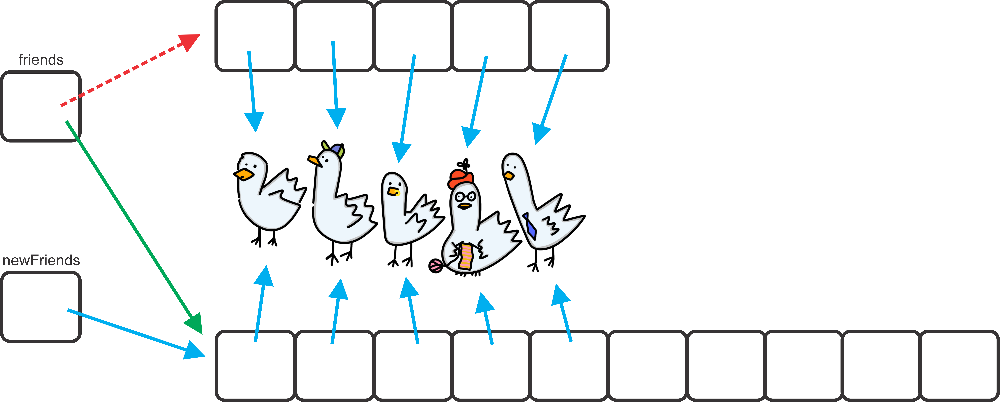
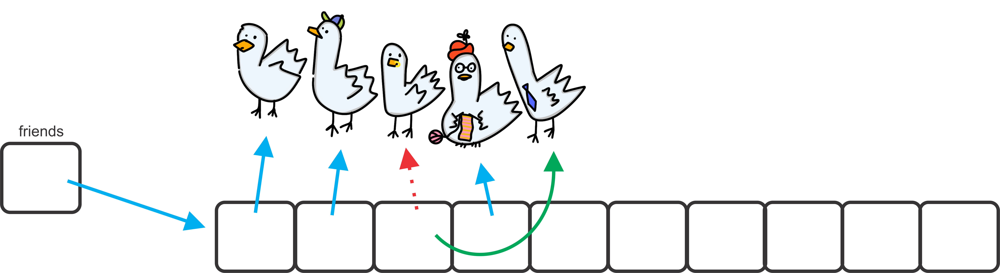

**************
Objects Review
**************

* Defining objects and data structures is similar between Python and Java
* Most of the differences are syntax related

Objects and Classes
===================

* Objects are *things* that typically contain data, can do some actions, and can be acted on
* Often, when programming with Java, several objects will be interacting

Objects
-------

* All objects have

    * Properties

        * These are the *data*
        * These are called *fields*
        * They're variables, but they belong to an instance of an object

    * Behaviours

        * This is what the object can do
        * These are called **methods**
        * They're functions, but they belong to an object

Class
-----

* Every object belongs to a *class*

    * A *class* defines what it means to be an object of that class

* For example

    * One could think of ``Human`` as a class

        * With the fields ``firstName`` and ``lastName``
        * And methods ``eat()`` and ``goToBed()``

    * One could make Bob Smith an instance of the ``Human`` class

        * ``firstName`` is Bob
        * ``lastName`` is Smith
        *  Calling the method ``eat()`` would tell the specific instance to eat

* All objects of the same class have the same fields, but their values can differ

    * All instances of ``Human`` have ``firstName`` and ``lastName``
    * But Bob Smith's ``firstName`` is Bob
    * If there was another instance for Jane Doe, then their ``firstName`` would be Jane

* Objects of the same class have the same methods, but calling a method on an instance only calls it on *that* instance

But Why?
--------

* Classes and objects make abstraction easier

    * How many of you know exactly how your HVAC system works?
    * How many of you have ever turned up the heat in your house?

* It also makes encapsulating ideas together easier

    * Although, there are several arguments as to why this isn't always great

High-Level Idea
---------------

* A typical class will consist of

    * Fields
    * Methods
    * Constructors (which are also methods)

* In Java, class code is written in a file with the same name of the class

    * The code is written in a file with a ".java" file extension
    * The ``Human`` class would be in a file called Human.java

Contact List Example
====================

* It may be easier to learn these ideas with an example
* Let's consider the following problem

    * There is a need to keep track of the name and email address of friends
    * There is also a need to manage several friends' names and email addresses

* To do this, a class could be made to represent a friend --- ``Friend`` class
* Another class can be made to keep track of the collection of friends --- ``ContactList`` class

Friend Class
------------

* For this particular problem, the ``Friend`` class can be kept simple

    * This is a good thing

* The only information the ``Friend`` objects need to know is their

    * First Name
    * Last Name
    * Email Address

* A constructor will be be needed that describes the setup for the ``Friend`` object

    * Assigning the values to the fields

* The behaviours of the ``Friend`` class

    * A way to retrieve information from the ``Friend``
    * A way to obtain a string representation of the ``Friend``
    * A way to check if two ``Friend`` objects are equal

Setting Fields and Writing the Constructor
^^^^^^^^^^^^^^^^^^^^^^^^^^^^^^^^^^^^^^^^^^

* The constructor is a special method that is called automatically when an object of the class is created
* Typically, setup related things that needs to happen for the object will be put in the constructor

* In Python, the ``Friend`` class' constructor and the creation and assigning of fields would look like the following

    * Remember, in Python ``self`` is used to refer to an instance of the class

.. code-block:: python
    :linenos:
    :emphasize-lines: 4

    class Friend:

        # Python --- Constructor and creating and setting fields
        def __init__(self, first_name, last_name, email):
            self.first_name = first_name
            self.last_name = last_name
            self.email = email

In Java, the class' declaration of fields, constructor, and assigning values to the fields would look like the following

.. literalinclude:: /../main/java/Friend.java
    :language: java
    :linenos:
    :lineno-start: 3
    :lines: 3-26
    :emphasize-lines: 8, 9, 10, 21, 22, 23

* The class is set to ``public`` so it can be accessed from any other class
* The class is also set to ``final`` since, once an instance is created, it should not change --- immutable

* The fields are declared inside the class, but not within any method

    * They can be accessed by the whole class

* To provide control over how the fields are accessed outside the class, they are set to ``private`` and ``final``

    * ``private`` means the fields are not directly accessible outside the class

        * If they were assigned ``public``, it would behave like Python

    * Although ``private``, the values of the fields will ultimately be accessible, but through accessor methods

        * Discussed in more detail below

    * The ``Friend`` class will be made in such a way that the data is immutable --- it doesn't change once set

        * Thus, the fields are set to ``final`` so they can be set once and only once

* Notice the java documentation (javadoc) comment is *above* the method
* The constructor is ``public``, has the same name as the class and file, and does not have a ``self`` parameter

    * Although Java does have a similar keyword --- ``this``

* The ``this`` in the above example let's Java resolve the ambiguity between the field and constructor parameter

    * ``this.firstName`` is the field where ``firstName`` is a local parameter for the constructor
    * It is not always necessary to use ``this`` in Java like how ``self`` is used in Python

.. note::

    Two of the major differences seen between Python and Java is the use of the visibility modifiers
    ``public``/``private`` and ``final``. This was done to tell Java that instances of this class are to be immutable.

    At first one may feel these extra keywords make the code too verbose, but consider that these extra keywords provide
    the programmer with more explicit control over how their code is or is not used. Although these keywords are not
    *necessary*, they are very powerful.

Accessors
^^^^^^^^^

* Below are the accessor/getter methods for the fields
* All these methods do are return their respective values
* They are ``public`` as they should be accessible outside the class
* Note, however, that there are no methods to set any of the field values

    * The ``Friend`` is immutable --- can access data, but cannot change it

.. literalinclude:: /../main/java/Friend.java
    :language: java
    :linenos:
    :lineno-start: 28
    :lines: 28-38

toString
^^^^^^^^

* In Python, for creating a string representation of an object, the ``__repr__`` magic method was used

    * If one called ``print(some_object)``, the ``__repr__`` would automatically get called

* All classes *inherited* a ``__repr__`` for free, but the default behaviors was not all too helpful

    * ``<__main__.Friend object at 0x7f130d9c52e0>``
    * The inherited one simply provides the object name and a memory address

        * Inheritance is a topic discussed later in the course

* If one wanted to change this behaviour, they would override the default ``__repr__``
* An example of a ``__repr__`` for the ``Friend`` class in Python is below

.. code-block:: python
    :linenos:

    def __repr__(self):
        return f"Friend({self.first_name}, {self.last_name}, {self.email})"

* An f-string was used in the above example, but string concatenation could have been used

    * ``"Friend(" + self.first_name + ", " + self.last_name + ", " + self.email + ")"``

* The same principal exists in Java, but the method is called ``toString``
* The inherited behaviour is a little different --- it returns a string of the class name and the object's  *hash code*

    * `This is, more or less, a memory address of where the object is in memory <https://docs.oracle.com/en/java/javase/17/docs/api/java.base/java/lang/Object.html#hashCode()>`__
    * For example --- ``Friend@77459877``

* One can override the inherited ``toString``

.. literalinclude:: /../main/java/Friend.java
    :language: java
    :linenos:
    :lineno-start: 40
    :lines: 40-42

* In the above example, ``String.format`` was used, but string concatenation could have been used

    * ``"Friend(" + firstName + ", " + lastName + ", " + email + ")"``

* Like Python, ``toString`` is automatically get called when printing the object

    * ``System.out.println(aFriend);``

.. warning::

    The idea is that this *returns* a string; it does not just print something.

equals
^^^^^^

* Python also provides the ``__eq__`` magic method for describing equality

.. code-block:: python
    :linenos:

    def __eq__(self, other) -> bool:
        if isinstance(other, Friend):
            return self.first_name == other.first_name and \
                        self.last_name == other.last_name and \
                        self.email == other.email
        return False

* In Java, there is an ``equals`` method to define what it means for two objects to be equivalent
* However, unlike Python, it does not overload the ``==`` operator

    * ``==`` for objects is reserved for checking if two things are literally the same object -- aliases

        * Same memory address --- it compares the memory addresses

* ``equals`` is used to compare the content of the objects in some way

    * This is where equality between objects of the class is defined

* Like ``toString``, if not overridden, ``equals`` has the inherited behavior of checking sameness --- ``==``

* For the ``Friend`` class, two objects will be equal if all their fields match

.. code-block:: java
    :linenos:

    /**
     * Checks if two Friend objects are equal. Friend objects are considered equal if all their attributes are equal.
     *
     * @param other A Friend being compared to.
     * @return True if the two objects are equal, false otherwise.
     */
    public boolean equals(Friend other) {
        return this.firstName.equals(other.firstName) &&
                this.lastName.equals(other.lastName) &&
                this.email.equals(other.email);
    }

* In the above example, notice the use of ``this`` and ``other``

    * This eliminates any ambiguity of which ``Friend`` instance the field is coming from

* Also notice the use of the ``equals`` method on the strings since it's a check for equality of strings, not sameness

        * e.g., ``this.firstName.equals(other.firstName)``

.. warning::

    The above ``equals`` is actually not particularly good, but is included here for simplicity. The ``equals``
    implemented in the provided ``Friend.java`` file is more complex, but better.

    :doc:`Read the aside on equals for more details. <equals>` The more complex, but improved ``equals`` will be used
    going forward in the course.

Creating an Instance of a Friend
^^^^^^^^^^^^^^^^^^^^^^^^^^^^^^^^

* Below is an example of creating an instance of a ``Friend`` object based on the ``Friend`` class
* It is a simple example where an instance is created, but that is all

.. code-block:: java
    :linenos:

    public class SomeClass {
        public static void main(String[] args) {

            // Declare a Friend variable
            // Create an instance of a Friend
            // Assign the variable to reference the newly created Friend
            Friend aFriend = new Friend("Bob", "Smith", "bsmith@gmail.com");
        }
    }

* There is a bit going on:

    * Declare a variable of type ``Friend``

        * ``Friend aFriend``

    * Create an instance of a ``Friend`` object

        * ``new Friend("Bob", "Smith", "bsmith@gmail.com")``

    * Assign the variable to reference the newly created object

        * The single equals is used for assignment --- ``=``

.. note::

    Be mindful about what is *actually* stored in the ``aFriend`` variable. The object is not stored in the variable,
    but a *reference* to the object is.

        .. image:: reference_aFriend.png
           :width: 250 px
           :align: center

* If the following line of code was run, two instances of a ``Friend`` would exist

    * ``Friend bFriend = new Friend("Jane", "Doe", "jdoe@gmail.com");``

* ``aFriend`` would have a ``firstName`` of Bob
* ``bFriend`` has a ``firstName`` of Jane

* They both have the ``firstName`` field, but the actual value associated with it differs

    .. image:: reference_aFriend_bFriend.png
       :width: 500 px
       :align: center

* Below is an example of two ``Friend`` objects being created and being used

    * Get ``aFriend``\'s first name
    * Use the ``toString`` method
    * Use the ``equals`` method

.. code-block:: java
    :linenos:

    Friend aFriend = new Friend("Bob", "Smith", "bsmith@gmail.com");
    Friend bFriend = new Friend("Jane", "Doe", "jdoe@gmail.com");

    System.out.println(aFriend.getFirstName());
    System.out.println(aFriend);
    System.out.println(bFriend);
    System.out.println(aFriend.equals(bFriend));

* What is the output of the above code?

References
^^^^^^^^^^

* As noted above, be careful about what is actually stored in these variables
* The objects themselves are not stored in the variables
* Instead, references to where the objects are in memory are stored in the variables

* In the below example, ``bFriend = aFriend`` copies the contents of ``aFriend`` and puts the copy in the ``bFriend``

    * But the contents of the ``aFriend`` variable is a reference to a ``Friend``
    * The *reference* stored in ``aFriend`` gets copied; the ``Friend`` is **not** copied
    * This results in an aliases --- both ``aFriend`` and ``bFriend`` reference the exact same object

.. code-block:: java
    :linenos:
    :emphasize-lines: 4

    Friend aFriend = new Friend("Bob", "Smith", "bsmith@gmail.com");
    Friend bFriend = new Friend("Jane", "Doe", "jdoe@gmail.com");

    bFriend = aFriend;

* This also means that the object that ``bFriend`` used to point to now has no reference to it
* This would cause Java to delete the Jane ``Friend`` object

    .. image:: reference_lost.png
       :width: 500 px
       :align: center

.. warning::

    One may feel that the assignment works different between primitive types when compared to objects, but this is
    wrong.

    Remember what is stored in the variables --- the contents of the variables are copied. The variables may store a
    primitive type, or maybe a reference to an object. Either way, it's the variable's contents that are copied.

Contact List Class
------------------

* With the ``Friend`` class complete, there needs to be a way to keep track of and manage the ``Friend`` objects
* To do this, a new class called ``ContactList`` will be created

* What fields should this have?

    * A way to keep track of the ``Friends`` in the ``ContactList``

        * An array will be used here

    * A count of how many ``Friend`` objects the ``ContactList`` contains

        * Just an ``int``

Setting Fields and Writing the Constructor
^^^^^^^^^^^^^^^^^^^^^^^^^^^^^^^^^^^^^^^^^^

* Below is an example of a constructor for the ``ContactList`` class in Python

    * The ``_friends`` list should be *private*
    * The length of that list will be the number of ``Friend`` objects in the ``ContactList``

.. code-block:: python
    :linenos:

    def __init__(self):
        self._friends = []

* The Java example below includes a few new ideas

.. literalinclude:: /../main/java/ContactList.java
    :language: java
    :linenos:
    :lineno-start: 1
    :lines: 1-33

* Things to notice

    * The imports
    * The two constants
    * The declaring of the fields
    * Two constructors

* Most of these are ideas one should already be familiar with

    * The imports are used for functionality described below
    * One constant, ``DEFAULT_CAPACITY``,  defines the default size an array should have --- more on this below
    * The other constant, ``NOT_FOUND``, is used to provide a name to the sentinel value of ``-1`` --- more detail below
    * The declaring of the fields is similar to what was seen in the ``Friend`` class

* Having two constructors is a new idea that was not used in Python
* In several programming languages, it is possible to have multiple methods with the same name that take different parameters

    * This is valued *overloading*

* Notice that one constructor takes no parameters and the other takes a single integer ``capacity``
* For now, focus on the second one; the one that takes the parameter
* It first sets the size of the ``ContactList`` field to ``0`` since a new ``ContactList`` is empty
* It then creates a new empty ``Friend`` array of size ``capacity``

    * Remember, arrays have a fixed size
    * The strategy here is to make an array that is sufficiently large, but only use what is needed
    * Consider the following example,

        * The array is size ``10``
        * Only two ``Friend`` objects are in the ``ContactList``
        * Then only indices ``0`` and ``1`` of the array are actually used

* The second constructor, the one that takes an integer, is used to create a new ``ContacList`` with the array of some specified size
* The first constructor, the one with no parameter, is used to create a new ``ContactList`` with a default capacity

    * More precisely, the default capacity set to the class constant ``DEFAULT_CAPACITY``
    * It does this with the use of constructor chaining

        * The use of ``this(DEFAULT_CAPACITY)`` simply calls the constructor that takes a single integer as a parameter
        * In this example, it ultimately calls ``ContactList(10)``
        * See the :doc:`constructor chaining <chaining>` aside for more details

    * The fact that ``DEFAULT_CAPACITY`` was set to 10 is entirely arbitrary
    * Further, the inclusion of the constructor that takes no parameter is entirely optional

* We will have something like this created

    .. figure:: contacts.png
        :width: 600 px
        :align: center

        Example of an empty ``ContactList``  that was created ``ContactList contacts = new ContactList(5);``.

Adding Friends
^^^^^^^^^^^^^^

* Adding a friend to the collection in Python could be done by appending to the ``_friends`` field

.. code-block:: python
    :linenos:

    def add(self, friend):
        self._friends.append(friend)

* In Java, things are a little different since

    * Arrays have a fixed size
    * The capacity of the array is not the same as the number of ``Friends`` in the collection

.. literalinclude:: /../main/java/ContactList.java
    :language: java
    :linenos:
    :lineno-start: 35
    :lines: 35-67
    :emphasize-lines: 9, 10, 11

* Since the array has a fixed size, it's not possible to add more ``Friend`` objects beyond the size of the array
* However, it would be ideal if it were possible to continually add ``Friend`` objects without worrying about the capacity
* If more space is needed, a simple solution is

    * Make a new array that is bigger
    * Copy over the contents of the old array to the new array
    * Assign the field ``friends`` to reference the new, bigger array

* The ``expandCapacity`` method gets called automatically by the ``add`` method if the array has run out of space

    * If the array had enough room, ``expandCapacity`` is not called

* Either way, the ``Friend`` being added via the ``add`` method will always go to the next available spot
* When done, this method returns a ``boolean`` indicating if the ``add`` worked correctly

* Also notice that the ``expandCapacity`` method is ``private``

    * This method is important for the inner workings of the ``ContactList`` class
    * This method is not something one wants a user of this ``ContactList`` class to care about

Contains and Find
^^^^^^^^^^^^^^^^^

.. literalinclude:: /../main/java/ContactList.java
    :language: java
    :linenos:
    :lineno-start: 69
    :lines: 69-95

* The ``find`` method, which is ``private``, is an internal helper method for finding the index of a given ``Friend``
* This method is just a linear search

    * Mind the use of ``Objects.equals`` which is a null safe way to check if two objects are equal

* If no such ``Friend`` object exists, a special *sentinel* value of ``-1`` is returned

    * Referred to by the class constant ``NOT_FOUND``
    * This sentinel value has special meaning

        * Since ``-1`` is not a valid index, it can be used to indicate that the object was not found

* The ``contains`` method returns a ``boolean`` indicating if a ``Friend`` object exists within the ``ContactList``
* This method makes use of the private ``find`` method

Index Of
^^^^^^^^

* The ``indexOf`` method returns the index of the specified ``Friend``, if it exists

.. literalinclude:: /../main/java/ContactList.java
    :language: java
    :linenos:
    :lineno-start: 97
    :lines: 97-110

* This method checks if the ``Friend`` exists, and if it does not, it throws an exception

    * The provided ``Friend`` is provided to the exception for its message

* If it does exist, this method simply delegates the work to the private ``find`` method

Get
^^^

* The ``get`` method returns the ``Friend`` at the specified index

.. literalinclude:: /../main/java/ContactList.java
    :language: java
    :linenos:
    :lineno-start: 112
    :lines: 112-125

* If the index is out of bounds, an exception is thrown

    * The invalid index is provided to the exception for its message

Remove Friends
^^^^^^^^^^^^^^

* Below is an example of a ``remove`` method that will remove a ``Friend`` from the ``ContactList``
* This method returns a ``boolean`` to indicate if the ``remove`` was successful

.. literalinclude:: /../main/java/ContactList.java
    :language: java
    :linenos:
    :lineno-start: 127
    :lines: 127-151

* Remove first checks if the ``Friend`` object exists within the ``ContactList``

    * If does not exist, an exception will be thrown
    * The provided ``Friend`` is provided to the exception for its message

* To actually remove the ``Friend``, all that needs to happen is for the program to lose reference to it
* In the above example, the array at the index of the ``Friend`` to be removed is set to the ``Friend`` at the end of the array

    * ``friendCount - 1``

* Once this is done, the array has no reference to the ``Friend`` that was removed
* The array at index ``friendCount - 1`` is set to ``null``

    * Although not necessary, it is not a bad idea to explicitly remove the reference at the end

* After the ``Friend`` has been removed, the size of the ``ContactList`` needs to be decreased by 1

Clear Friends
^^^^^^^^^^^^^

* Clear out all the ``Friend`` objects within the ``ContactList``

.. literalinclude:: /../main/java/ContactList.java
    :language: java
    :linenos:
    :lineno-start: 153
    :lines: 153-159

* Here, simply create a new empty array and set the size to ``0``
* Since the old array referenced by ``friends`` has no more reference, it get managed by the garbage collector
* One could have gone through the array and set each index to reference ``null``, but this is easier
* Further, setting the size to ``0`` would also be sufficient

Size and isEmpty
^^^^^^^^^^^^^^^^

.. literalinclude:: /../main/java/ContactList.java
    :language: java
    :linenos:
    :lineno-start: 161
    :lines: 161-167

* ``isEmpty`` returns a ``boolean`` indicating if the ``ContactList`` is empty or not
* The ``size`` method returns the number of ``Friends`` actually within the ``ContactList``

    * Remember, the size of the array and the number of ``Friends`` in the ``ContactList`` are different things

toString
^^^^^^^^

* A good representation of the collection would be an aggregate of the string representations of the ``Friend`` objects

    * Have each ``Friend`` within the ``ContactList`` be on its own line

.. code-block:: java
    :linenos:
    :emphasize-lines: 4

    public String toString() {
        String s = "";
        for (int i = 0; i < size(); i++) {
            s = s + friends[i].toString() + "\n";
        }
        return s;
    }

* Notice that this actually makes use of the ``Friend`` class' ``toString`` method

.. warning::

    Although the above example is correct, in practice one would want to use something called a ``StringBuilder``.
    :doc:`See the aside on string builders for more details. <builder>`

What We Get
===========

* Modularity
    * Break a problem down into smaller components
    * Ideally, these components should be independent from each other
    * Each component performs a well defined task
    * We encapsulate data and behaviours together

* Information Hiding
    * Hide some of the implementation details
    * It can protect important pieces of the system from being modified by others bits
    * It gives us some control over how our code is used
    * For example
        * You all used Python lists, but you didn't know any of their implementation details
        * And it didn't matter!

For next time
=============

* Assuming you have not done it, read Chapter 1 of your text
    * 15 pages

Playing Code
============

* Download and play with
    * :download:`Friend </../main/java/Friend.java>`
    * :download:`ContactList </../main/java/ContactList.java>` code
    * :download:`PlayingObjects </../main/java/PlayingObjects.java>`

* If everything was done correctly, the following code from ``PlayingObjects`` should work

.. literalinclude:: /../main/java/PlayingObjects.java
   :language: java
   :linenos:
