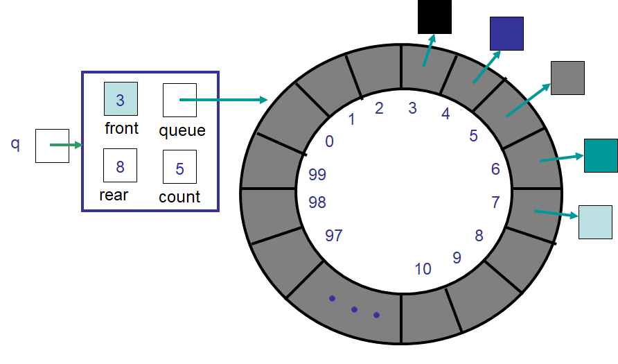

**********
ArrayQueue
**********

* Things needed for the implementation

    * A container
    * A way to keep track of the front/head
    * A way to keep track of the rear/tail
    * A way to keep track of the size

* A linked structure was used as a container for a ``Queue``
* Now an array will be used to implement the ``Queue``

Idea #1
=======

* Use an array for the container
* Keep track of the front by simply having it always be index ``0``
* Keep track of the ``rear`` index
* Size will conveniently be equal to ``rear``

.. figure:: arrayqueue_first_idea0.png
    :width: 500 px
    :align: center

    An example of idea #1's ``ArrayQueue`` containing four elements. This implementation requires that index ``0``
    always be the front. Note the value stored in ``rear`` refers to the next available spot in the array. Also notice
    that the value in ``rear`` corresponds to the number of elements currently in the queue.

* All adding (``enqueue``) happens at the ``rear`` end
* Add the element to index ``rear``
* Increment ``rear``

.. figure:: arrayqueue_first_idea1.png
    :width: 500 px
    :align: center

    The state of idea #1's ``ArrayQueue`` after an element was enqueued. Note that the element was added at index
    ``rear`` and the value of ``rear`` was increased such that it refers to the next available spot in the array.

* All removing (``dequeue``) happens at index ``0``
* Requires that elements are shuffled down ``1`` index
* Decrement ``rear``

.. figure:: arrayqueue_first_idea2.png
    :width: 500 px
    :align: center

    The state of idea #1's ``ArrayQueue`` after an element was dequeued. Note that the element at index ``0`` was
    removed and all elements moved down one index in the array. Further, the value of ``rear`` was decreased by one.

Discussion
----------

* Will this implementation work?

    * Is it *correct*

* Knowing that this is an array implementation, will something like an ``expandCapacity`` be required?
* What is the computational complexity of an ``enqueue`` with this idea?

    * Amortized :math:`O(1)`

* What is the computational complexity of a ``dequeue`` with this idea?

    * :math:`O(n)` as it requires all :math:`n` elements be shuffle down one index in the array

* The drawback of idea #1 is a :math:`O(n)` ``dequeue``

    * The ``LinkedQueue`` implementation has an :math:`O(1)` ``dequeue``

Idea #2
=======

* Use an array for the container
* Keep track of the ``front`` index
* Keep track of the ``rear`` index
* Size will conveniently be ``rear - front``

.. figure:: arrayqueue_second_idea0.png
    :width: 500 px
    :align: center

    An example of idea #2's ``ArrayQueue`` containing four elements. This implementation keeps track of the ``front``
    and ``rear`` indices. Note the value stored in ``rear`` refers to the next available spot in the array. Also notice
    that the difference between ``rear`` and ``front`` corresponds to the number of elements currently in the queue.

* All adding (``enqueue``) happens at the ``rear`` end
* Add the element to index ``rear``
* Increment ``rear``

.. figure:: arrayqueue_second_idea1.png
    :width: 500 px
    :align: center

    The state of idea #1's ``ArrayQueue`` after an element was enqueued. Note that the element was added at index
    ``rear`` and the value of ``rear`` was increased such that it refers to the next available spot in the array.

* All removing (``dequeue``) happens at index ``front``
* Remove the element at index ``front``
* Increment ``front``

.. figure:: arrayqueue_second_idea2.png
    :width: 500 px
    :align: center

    The state of idea #2's ``ArrayQueue`` after an element was dequeued. Note that the element at index ``front`` was
    removed and the value of ``front`` increased by one. Note that, with the exception of the removed element, no other
    elements were required to be moved within the array.

Discussion
----------

* Will this implementation work?

    * Is it *correct*

* Knowing that this is an array implementation, will something like an ``expandCapacity`` be required?
* What is the computational complexity of an ``enqueue`` with this idea?

    * Amortized :math:`O(1)`

* What is the computational complexity of a ``dequeue`` with this idea?

    * :math:`O(1)`

* The drawback of idea #2 is the wasted space caused by ``dequeue``

    * All indices before ``front`` are wasted
    * ``expandCapacity`` would need to be called after :math:`n + 1` enqueues despite the number of elements actually in the queue

Idea #3
=======

* An array for the container
* Keep track of the ``front`` index
* Keep track of the ``rear`` index
* If there is space at the front of the array, loop the indices back to ``0`` once we hit the end

"Circular Array"
----------------

* We can *pretend* our array is a circle
    * It's still a linear array, but that's OK

* For example, pretend we have an array with a capacity of ``n``
* The indices order would be

    ``0, 1, 2, 3, 4, ..., n-2, n-1, 0, 1, 2, 3, 4, ..., n-2, n-1, 0, 1, 2, 3, 4, ...``

* The index that comes before ``n-1`` is ``n-2``
* The index that comes after ``n-1`` is ``0``
* The index that comes before ``0`` is ``n-1``
* The index that comes after ``0`` is ``1``

* Take this "circular array" with 7 things in it

.. image:: arrayqueue_circle0.png
   :width: 500 px
   :align: center

* If we ``dequeue`` 5 times, we end up with this

.. image:: arrayqueue_circle1.png
   :width: 500 px
   :align: center

* And after 8 more ``enqueues`` we have this

.. image:: arrayqueue_circle2.png
   :width: 500 px
   :align: center

* With this idea, we can think of our idea #3 implementation as this

* After a bunch of ``enqueues`` and ``dequeues`` it will loop around like this

.. image:: arrayqueue_third_idea1.png
   :width: 500 px
   :align: center

* Here is the same scenario, but with the array shown as a linear array

.. image:: arrayqueue_third_idea2.png
   :width: 500 px
   :align: center

Modulo
------

* We've already seen the modulo operator: ``%``
* With this ``%`` operator, we can get the remainder of a division
    * ``4 % 2``
        * :math:`4/2 = 0` remainder :math:`0`
        * Therefore, ``4 % 2`` is :math:`0`
    * ``5 % 4``
        * :math:`5/4 = 1` remainder :math:`1`
        * Therefore, ``5 % 4`` is :math:`1`
    * ``7 % 8``
        * :math:`7/8 = 0` remainder :math:`7`
        * Therefore, ``7 % 8`` is :math:`7`

* The modulo operator is handy for checking if a number is even or odd
    * ``x % 2`` will be 0 when the number is evenly divisible by 2 and will be 1 if there is a remainder (not evenly divisible)

* We can make use of this ``%`` operator to help us loop back around to the beginning of our linear array

* We'll try to derive this ourselves
* Assume we have an array with a capacity ``10``
* Our ``rear`` is currently ``9``
* If we do an ``enqueue`` we simply add the element to index ``9`` and increment ``rear`` such that it's now ``10``
* **However** this causes a problem because there is no index ``10``; we want ``rear`` to become ``0`` instead

* We *could* do this with an ``if`` statement and just check ``if (rear == queue.length) rear = 0``
* But notice that when ``rear == queue.length``, that would mean that ``rear % queue.length`` is ``0``
* But also notice that, if ``rear`` was another number, like ``4``, then ``rear % queue.length`` would be ``4``

* With this information, the following expression for incrementing the ``rear`` should make sense

    ``rear = (rear + 1) % queue.length;``

* If ``rear`` is ``9`` and we use this expression, ``rear`` will end up being ``(9 + 1) % 10 == 10 % 10 == 0``
* If ``rear`` is any other number ``< 10``, the number is not divisible by ``10`` and the ``%`` will effectively make no difference

Discussion
----------

* With this special expression for updating the ``rear``, do we need it for updating the ``front``?
* With this idea, will we ever run out of room in our array?

.. warning::

    Sometimes, *good enough is good enough*.

    In this ``ArrayQueue`` implementation scenario, idea #3 is quite clearly the superior option and is not overly
    difficult to implement. However, as you continue in computer science and work on more complex problems, sometimes
    ease of implementation and maintainability become very important.

    Better algorithms always exist, and a subpar implementation may do the trick, especially when your problem space is
    small enough that performance doesn't matter.

    Computational complexity is very important, but sometimes in practice we may lose the forrest through the trees. If
    you can change your algorithm from :math:`O(n^{2})` to :math:`O(n)`, then you should probably do it. But then again,
    if the updated algorithm will take you a day and you only need to run the algorithm once on a small problem, perhaps
    :math:`O(n^{2})` is good enough.

    Even worse, if you're trying to save a few *FLOPS* here and there, great, but if that's distracting you from other
    more important issues, perhaps you should move on.

    Donald Knuth, a very famous computer scientists, says:

        *Programmers waste enormous amounts of time thinking about, or worrying about, the speed of noncritical parts of their programs, and these attempts at efficiency actually have a strong negative impact when debugging and maintenance are considered. We should forget about small efficiencies, say about 97% of the time: premature optimization is the root of all evil. Yet we should not pass up our opportunities in that critical 3%.*

Expand Capacity
---------------

.. image:: arrayqueue_expand_capacity0.png
   :width: 500 px
   :align: center

* Suppose we ``enqueue`` one more element

.. image:: arrayqueue_expand_capacity1.png
   :width: 500 px
   :align: center

* Now the queue is full
    * ``size == queue.length``

* If we ``enqueue`` again, we'll need to call ``expandCapacity``
* **However** we can't just double the size of the array and copy the contents over like we did before
    * :doc:`See the aside on expandCapacity. <expand-capacity>`

.. Skip arrayqueue_expand_capacity2 since it is just a copy of 1
.. image:: arrayqueue_expand_capacity3.png
   :width: 500 px
   :align: center

* Instead, we could copy the contents into contiguous indices starting at index ``front``

.. image:: arrayqueue_expand_capacity4.png
   :width: 500 px
   :align: center

* Or, we could even copy the contents into contiguous indices starting at the beginning (index ``0``) of the new array

.. image:: arrayqueue_expand_capacity5.png
   :width: 500 px
   :align: center

* Doing another ``enqueue`` will add the element at index ``rear``
* Update ``rear`` with ``rear = (rear + 1) % queue.length;``

Discussion Again
----------------

* Will this implementation work?
    * Is it *correct*
* What is the computational complexity of this ``enqueue``?
* What is the computational complexity of this ``dequeue``?
* How often will this call ``expandCapacity`` relative to idea #1 and #2?

Implementing a Queue --- Array Container
========================================

* All the code is available for download at the bottom of the page
* Here, only a subset of methods are shown

``enqueue``
-----------

.. literalinclude:: /../main/java/ArrayQueue.java
    :language: java
    :lineno-match:
    :lines: 38-47
    :emphasize-lines: 4, 7

* Note the call to ``expandCapacity`` and ``nextIndex``

.. literalinclude:: /../main/java/ArrayQueue.java
    :language: java
    :lineno-match:
    :lines: 95-104

* ``nextIndex`` is a simple private helper method to return the next index for a "circular" array

.. literalinclude:: /../main/java/ArrayQueue.java
    :language: java
    :lineno-match:
    :lines: 49-64

* The ``expandCapacity`` used here is different from earlier versions
* First, notice that the copying is from index ``front`` to ``i``

    * Previously, for the ``ArrayStack``, ``newStack[i] = stack[i]``

* Each time the loop updates both ``i`` and ``front``

    * ``front`` is updated with ``nextIndex``

* After all the copying is complete, the ``front`` for the ``newQueue`` is set to ``0``
* ``rear`` is set to the size

    * When ``front`` is ``0``, ``rear`` must be equal to ``size``

.. warning::

    Take time to understand this one as there is some nuance here.

``dequeue``
-----------

.. literalinclude:: /../main/java/ArrayQueue.java
    :language: java
    :lineno-match:
    :lines: 66-75
    :emphasize-lines: 7

* Since ``front`` may wrap around to index ``0``, the private method ``nextIndex`` is used

For Next Time
=============

* Read Chapter 5 Section 7

    * 7 pages

Playing Code
------------

* Download and play with

    * :download:`ArrayQueue </../main/java/ArrayQueue.java>` code
    * :download:`ArrayQueueTest </../test/java/ArrayQueueTest.java>` tests
    * :download:`ArrayQueue playing code </../main/java/PlayingArrayQueue.java>`

* One could use the same code from ``PlayingLinkedQueue`` to play with the ``ArrayQueue``
* Only need to make one change

    * ``LinkedQueue`` -> ``ArrayQueue``

* If everything was done correctly, the following code from ``PlayingArrayQueue`` should work

.. literalinclude:: /../main/java/PlayingLinkedQueue.java
   :language: java
   :linenos:
