**********
ArrayQueue
**********

* Things needed for the implementation

    * A container
    * A way to keep track of the front/head
    * A way to keep track of the rear/tail
    * A way to keep track of the size

* A linked structure was used as a container for a ``Queue``
* Now an array will be used to implement the ``Queue``

Idea #1
=======

* Use an array for the container
* Keep track of the front by simply having it always be index ``0``
* Keep track of the ``rear`` index
* Size will conveniently be equal to ``rear``

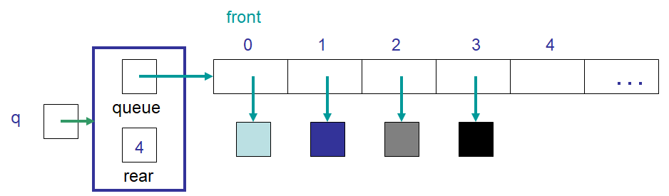

    An example of idea #1's ``ArrayQueue`` containing four elements. This implementation requires that index ``0``
    always be the front. Note the value stored in ``rear`` refers to the next available spot in the array. Also notice
    that the value in ``rear`` corresponds to the number of elements currently in the queue.

* All adding (``enqueue``) happens at the ``rear`` end
* Add the element to index ``rear``
* Increment ``rear``

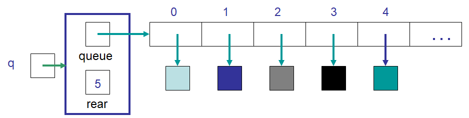

    The state of idea #1's ``ArrayQueue`` after an element was enqueued. Note that the element was added at index
    ``rear`` and the value of ``rear`` was increased such that it refers to the next available spot in the array.

* All removing (``dequeue``) happens at index ``0``
* Requires that elements are shuffled down ``1`` index
* Decrement ``rear``

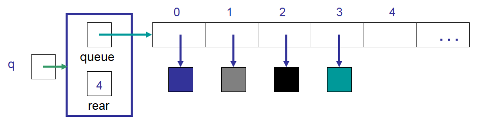

    The state of idea #1's ``ArrayQueue`` after an element was dequeued. Note that the element at index ``0`` was
    removed and all elements moved down one index in the array. Further, the value of ``rear`` was decreased by one.

Discussion
----------

* Will this implementation work?

    * Is it *correct*

* Knowing that this is an array implementation, will something like an ``expandCapacity`` be required?
* What is the computational complexity of an ``enqueue`` with this idea?

    * Amortized :math:`O(1)`

* What is the computational complexity of a ``dequeue`` with this idea?

    * :math:`O(n)` as it requires all :math:`n` elements be shuffle down one index in the array

* The drawback of idea #1 is a :math:`O(n)` ``dequeue``

    * The ``LinkedQueue`` implementation has an :math:`O(1)` ``dequeue``

Idea #2
=======

* Use an array for the container
* Keep track of the ``front`` index
* Keep track of the ``rear`` index
* Size will conveniently be ``rear - front``

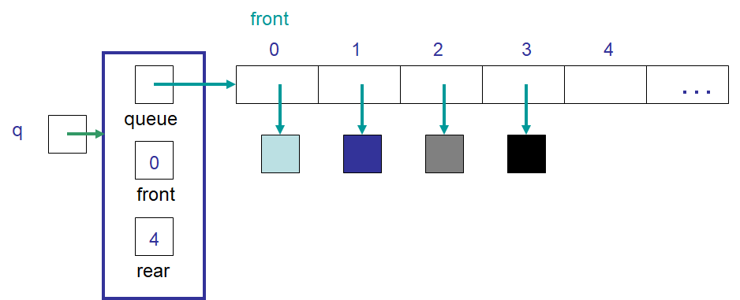

    An example of idea #2's ``ArrayQueue`` containing four elements. This implementation keeps track of the ``front``
    and ``rear`` indices. Note the value stored in ``rear`` refers to the next available spot in the array. Also notice
    that the difference between ``rear`` and ``front`` corresponds to the number of elements currently in the queue.

* All adding (``enqueue``) happens at the ``rear`` end
* Add the element to index ``rear``
* Increment ``rear``

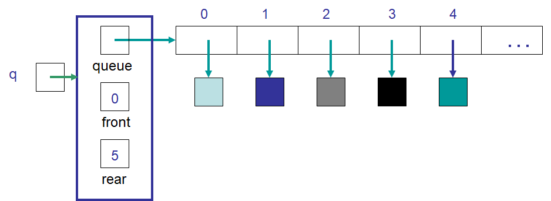

    The state of idea #1's ``ArrayQueue`` after an element was enqueued. Note that the element was added at index
    ``rear`` and the value of ``rear`` was increased such that it refers to the next available spot in the array.

* All removing (``dequeue``) happens at index ``front``
* Remove the element at index ``front``
* Increment ``front``

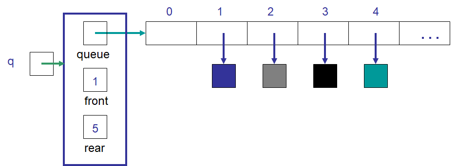

    The state of idea #2's ``ArrayQueue`` after an element was dequeued. Note that the element at index ``front`` was
    removed and the value of ``front`` increased by one. Note that, with the exception of the removed element, no other
    elements were required to be moved within the array.

Discussion
----------

* Will this implementation work?

    * Is it *correct*

* Knowing that this is an array implementation, will something like an ``expandCapacity`` be required?
* What is the computational complexity of an ``enqueue`` with this idea?

    * Amortized :math:`O(1)`

* What is the computational complexity of a ``dequeue`` with this idea?

    * :math:`O(1)`

* The drawback of idea #2 is the wasted space caused by ``dequeue``

    * All indices before ``front`` are wasted
    * ``expandCapacity`` would need to be called after :math:`n + 1` enqueues despite the number of elements actually in the queue

Idea #3
=======

* Use an array for the container
* Keep track of the ``front`` index
* Keep track of the ``rear`` index
* Keep track of the ``size``
* If there are empty indices before the ``front``, loop the ``rear`` back to ``0`` when the end of the array is hit

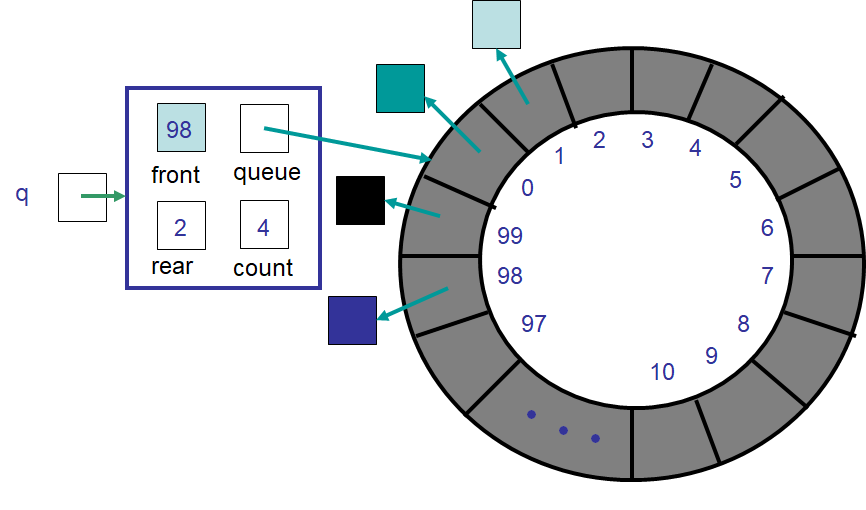

    An example of idea #3's ``ArrayQueue`` containing four elements. Note that the ``rear`` index has looped back to the
    beginning of the "circular" array.

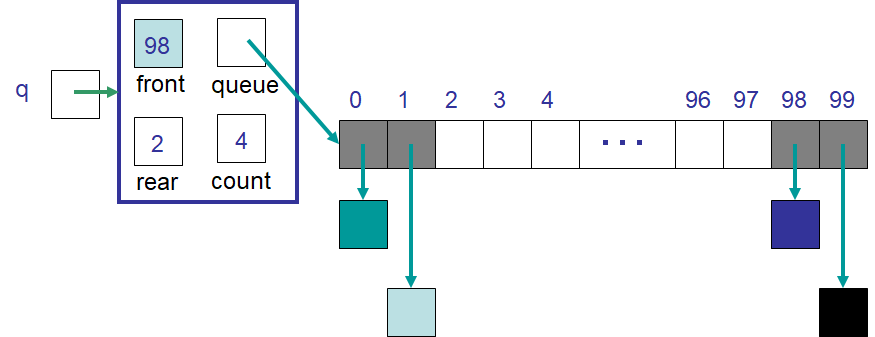

    An example of idea #3's ``ArrayQueue`` containing four elements. This figure contains the same ``ArrayQueue`` shown
    in the previous figure but with the "circular" array shown as a typical linear array.

"Circular" Array
----------------

* *Pretend* the array is a circle

    * The array is still, in reality, a linear array

* For example, given an array with a capacity of ``n``
* The indices' order would be

    ``..., 0, 1, 2, 3, ..., n-2, n-1, 0, 1, 2, 3, ..., n-2, n-1, 0, 1, 2, 3, ...``

* The index that comes after ``n-1`` is ``0``
* The index that comes before ``0`` is ``n-1``

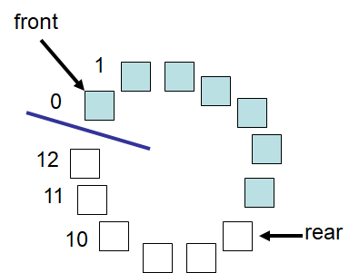

    Example "circular" array with a capacity of 13. This figure shows the array containing seven elements stored in
    indices ``0`` -- ``6``. Within the context of the ``ArrayQueue``, ``front`` would be index ``0`` and ``rear`` would
    be ``7``.

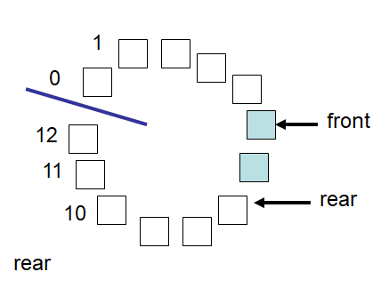

    Example "circular" array with a capacity of 13 containing two elements stored in indices ``5`` and ``6``. This would
    be the state of the ``ArrayQueue`` shown in the proceeding figure after ``dequeue`` is called five times.

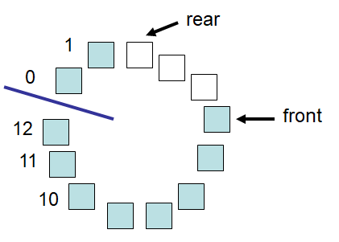

    Example "circular" array with a capacity of 13 containing 10 elements stored in indices ``5`` -- ``12``, ``0`` and
    ``1``. This would be the state of the ``ArrayQueue`` shown in the proceeding figure after ``enqueue`` is called
    eight times. Notice that ``rear`` looped back to the beginning of the array.

Modulo --- ``%``
----------------

* The modulo (``%``) operator provides a way to get the remainder of a division

    * ``4 % 2``

        * ``4/2 == 0`` remainder ``0``
        * Therefore, ``4 % 2`` is ``0``

    * ``5 % 4``

        * ``5/4 == 1`` remainder ``1``
        * Therefore, ``5 % 4`` is ``1``

    * ``7 % 8``

        * ``7/8 == 0`` remainder ``7``
        * Therefore, ``7 % 8`` is ``7``

* Knowing the remainder provides a way to loop back to the beginning of an array

``rear = (rear + 1) % queue.length``
^^^^^^^^^^^^^^^^^^^^^^^^^^^^^^^^^^^^

* Assume an array with a capacity ``10``
* Also assume ``rear`` is currently ``9``
* ``rear`` should always be the index of the next available spot in the array

* If ``enqueue`` is called, the new element is added to index ``9`` and ``rear`` is updated
* However, ``rear`` cannot simply be incremented to ``10`` since there is no index ``10`` in an array of capacity ``10``
* Instead, in this case, ``rear`` should be updated to ``0``

* This *could* be achieved with an ``if`` statement --- ``if (rear == queue.length) rear = 0``
* But notice that when ``rear == queue.length``, ``rear % queue.length`` is ``0``
* But also notice that when ``rear`` is another number, like ``4``, ``rear % queue.length`` would be ``4``
* With this information, the following expression for incrementing the ``rear`` should make sense

    ``rear = (rear + 1) % queue.length``

* If ``rear`` is ``9`` and this idea is used, ``rear`` will end up being ``(9 + 1) % 10 == 10 % 10 == 0``
* If ``rear`` is any other number ``< 10``, the number is not divisible by ``10`` and the ``%`` will make no difference

Discussion
----------

* Does the strategy for updating ``front`` need to also be changed?
* Will this "circular" array ever run out of room?

.. warning::

    Sometimes, *good enough is good enough*.

    With this ``ArrayQueue`` implementation scenario, idea #3 is quite clearly the superior option and is not overly
    difficult to implement. However, as one continues in computer science and works on more complex problems, sometimes
    ease of implementation and maintainability becomes very important.

    Better algorithms always exist, but a subpar implementation may do the trick, especially when the problem space is
    small enough that performance doesn't matter.

    Computational complexity is very important, but sometimes in practice one may lose the forrest through the trees. If
    an algorithm can be changed from :math:`O(n^{2})` to :math:`O(n)`, then do it. But then again, if the updated
    algorithm will take a day to implement and it only needs to be run once on a small problem, perhaps :math:`O(n^{2})`
    is good enough.

    Even worse, trying to save a few *FLOPS* here and there is great and all, but if that's distracting someone from
    other more important issues, perhaps they should move on.

    Donald Knuth, a very famous computer scientist, says:

        *Programmers waste enormous amounts of time thinking about, or worrying about, the speed of noncritical parts of their programs, and these attempts at efficiency actually have a strong negative impact when debugging and maintenance are considered. We should forget about small efficiencies, say about 97% of the time: premature optimization is the root of all evil. Yet we should not pass up our opportunities in that critical 3%.*

Expand Capacity
---------------

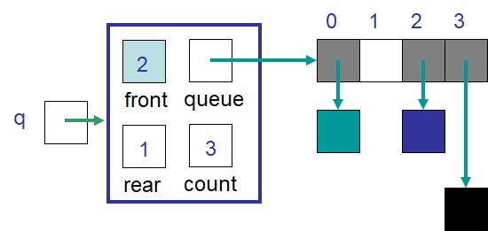

    Example ``ArrayQueue`` with an array of capacity four containing three elements. The value of ``rear`` is ``1`` as
    it is the next available spot in the array.

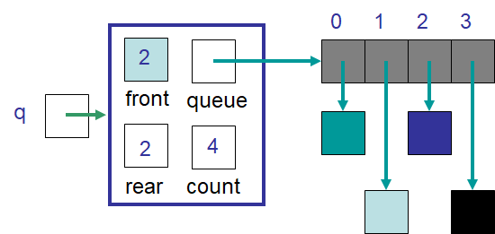

    Example ``ArrayQueue`` after a single element was added. The value of ``rear`` is ``2`` as it would be the next
    available spot in the array, however, the array is at capacity --- ``size == queue.length``.

* With an ``ArrayQueue`` at capacity, some ``expandCapacity`` method would need to be called
* Unlike before, however, the size of the array cannot simply just be doubled with the contents copied

    * :doc:`See the aside on expandCapacity <expand-capacity>`

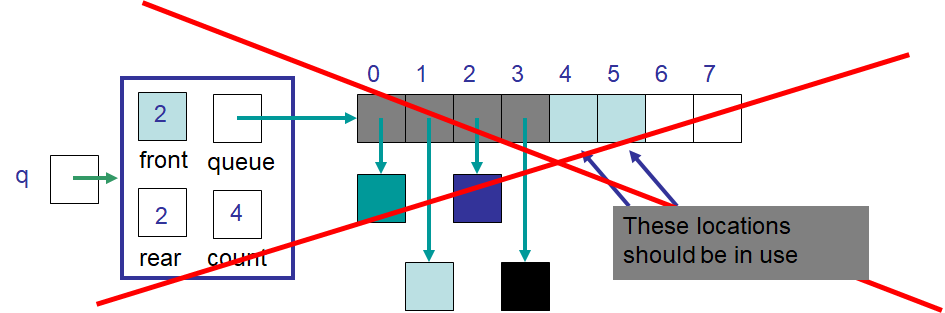

    Example ``ArrayQueue`` after a naive ``expandCapacity``. In this scenario, there is a "hole" in the middle of the
    elements as the ``front`` is index ``2`` and the elements wrapped back to the beginning of the array.

* Instead, copy the contents into contiguous indices starting at index ``front``

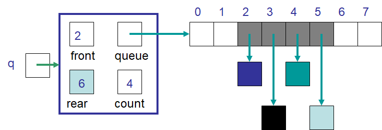

    Example ``ArrayQueue`` with an improved ``expandCapacity``. The elements are copied starting at index ``front``.

* Another alternative is to copy the contents into contiguous indices starting at the beginning (index ``0``) of the new array

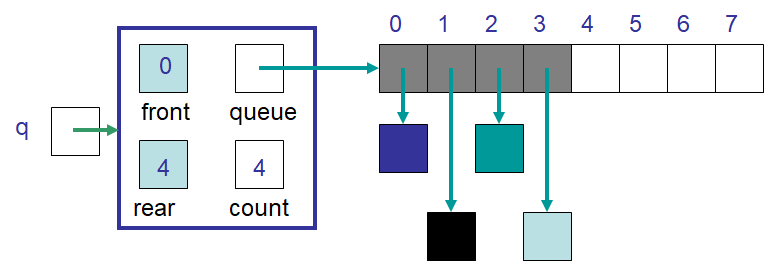

    Example ``ArrayQueue`` with another improved ``expandCapacity``. These elements are copied by starting at index
    ``front`` in the old array and copying them starting at index ``0`` in the new array.

Discussion Again
----------------

* Will this implementation work?

    * Is it *correct*

* What is the computational complexity of this ``enqueue``?
* What is the computational complexity of this ``dequeue``?
* How often will this call ``expandCapacity`` relative to idea #1 and #2?

Implementing a Queue --- Array Container
========================================

* All the code is available for download at the bottom of the page
* Here, only a subset of methods are shown

``enqueue``
-----------

.. literalinclude:: /../main/java/ArrayQueue.java
    :language: java
    :lineno-match:
    :lines: 38-47
    :emphasize-lines: 4, 7

* Note the call to ``expandCapacity`` and ``nextIndex``

.. literalinclude:: /../main/java/ArrayQueue.java
    :language: java
    :lineno-match:
    :lines: 95-104

* ``nextIndex`` is a simple private helper method to return the next index for a "circular" array

.. literalinclude:: /../main/java/ArrayQueue.java
    :language: java
    :lineno-match:
    :lines: 49-64

* The ``expandCapacity`` used here is different from earlier versions
* First, notice that the copying is from index ``front`` to ``i``

    * Previously, for the ``ArrayStack``, ``newStack[i] = stack[i]``

* Each time the loop updates both ``i`` and ``front``

    * ``front`` is updated with ``nextIndex``

* After all the copying is complete, the ``front`` for the ``newQueue`` is set to ``0``
* ``rear`` is set to the size

    * When ``front`` is ``0``, ``rear`` must be equal to ``size``

.. warning::

    Take time to understand this one as there is some nuance here.

``dequeue``
-----------

.. literalinclude:: /../main/java/ArrayQueue.java
    :language: java
    :lineno-match:
    :lines: 66-75
    :emphasize-lines: 7

* Since ``front`` may wrap around to index ``0``, the private method ``nextIndex`` is used

``equals``
----------

.. literalinclude:: /../main/java/ArrayQueue.java
    :language: java
    :lineno-match:
    :lines: 118-141
    :emphasize-lines: 13,14,20,21

* It does not matter *where* in the array the contents are
* It also does not matter what the capacities of the arrays are
* All that matters is that the elements, starting at ``front`` and wrapping when necessary, are equivalent

For Next Time
=============

* :doc:`See the aside on expandCapacity <expand-capacity>`
* Read Chapter 5 Section 7

    * 7 pages

Playing Code
------------

* Download and play with

    * :download:`ArrayQueue </../main/java/ArrayQueue.java>` code
    * :download:`ArrayQueueTest </../test/java/ArrayQueueTest.java>` tests
    * :download:`ArrayQueue playing code </../main/java/PlayingArrayQueue.java>`

* One could use the same code from ``PlayingLinkedQueue`` to play with the ``ArrayQueue``
* Only need to make one change

    * ``LinkedQueue`` -> ``ArrayQueue``

* If everything was done correctly, the following code from ``PlayingArrayQueue`` should work

.. literalinclude:: /../main/java/PlayingLinkedQueue.java
   :language: java
   :linenos:
