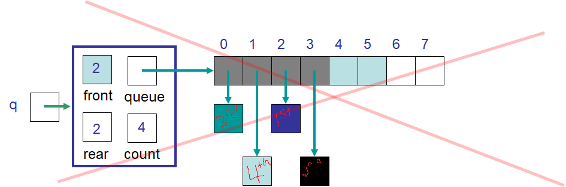

****************************
Aside --- ``expandCapacity``
****************************

ArrayStack
==========

.. figure:: /topics/stacks/arraystack0.png
    :width: 500 px
    :align: center

    An example ``ArrayStack`` containing four elements. The elements are always stored contiguously  as the bottom is
    always index ``0`` and there was no way to introduce "holes" between index ``0`` and ``top``.

* With the ``ArrayStack``, the adding and removing only happened from one end of the array

    * The array will always be contiguous from the bottom of the stack (index ``0``) to the ``top``

* If ``expandCapacity`` was ever needed, all elements would be copied to the new array such that each element would be in the same index as the old array

    * The element at index ``0`` in the old array would be in index ``0`` of the new array
    * The element at index ``1`` in the old array would be in index ``1`` of the new array
    * The element at index ``2`` in the old array would be in index ``2`` of the new array
    * ...
    * The element at index ``top - 1`` in the old array would be in index ``top - 1`` of the new array

ArrayQueue
==========

* For ideas #1 and #2 of the ``ArrayQueue``, an ``expandCapacity`` like the one used for the ``ArrayStack`` would work just fine
* The added complexity of ``expandCapacity`` for idea #3 of the ``ArrayQueue`` is caused by the "circle" array idea

    * The "circular" array idea allows for the elements to not be contiguous in the underlying linear array

* Consider using the ``ArrayStack`` implementation's ``expandCapacity`` for idea #3 of the ``ArrayQueue``

    * Double the size of the array and copy the elements over

    Example of idea #3 for the ``ArrayQueue`` that had wrapping elements after performing the ``expandCapacity`` used in
    the ``ArrayStack``. Notice that the third element, which is at index ``0``, should be immediately following the
    second element, which is at index ``3``. Instead, index ``4`` contains no element, meaning there is a "hole".

* Note that ``front`` is ``2`` and ``rear`` is ``2``
* The order of the elements' indices in the queue from first to last is ``2``, ``3``, ``0``, ``1``

    * Idea #3's ``ArrayQueue`` manages this ordering with the index update rule of ``rear = (rear + 1) % queue.length``

* Even after the ``expandCapacity`` there is no room for any new element in index ``2``
