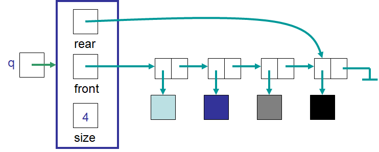
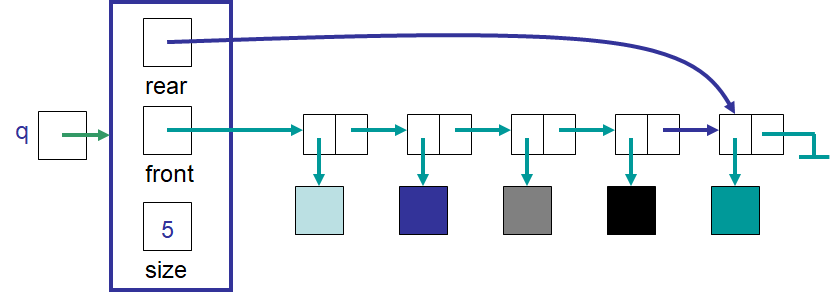
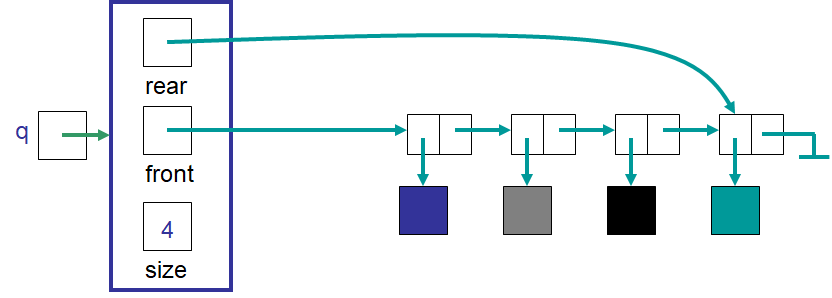

***********
LinkedQueue
***********

* Given the definition of a Queue, how can it be implemented?

    * Remember, the *what* and the *how* are separate

* Things needed for the implementation

    * A container
    * A way to keep track of the front/head
    * A way to keep track of the rear/tail
    * A way to keep track of the size

Implementing a Queue with a Linked Structure
============================================

    An example ``LinkedQueue`` containing four elements. Note that ``front`` and ``rear`` reference ``Node`` objects
    that have reference to the actual data stored in the queue.

    The state of the ``LinkedQueue`` after an element was enqueued to the rear of the queue. Note that ``rear`` changed
    to reference a new ``Node`` containing the newly pushed element. The ``front`` was left unchanged after the enqueue.

    The state of the ``LinkedQueue`` after an element was dequeued from the front of the queue. Note that ``front``
    changed to reference the ``Node`` that was after the ``Node`` that contained the element at the front of the queue
    (the ``Node`` that was removed). The ``rear`` was left unchanged after the dequeue.

Edge Cases
----------

* What would the ``LinkedQueue`` look like if the queue is empty?
* What if it only had one element?

Implementation
==============

.. literalinclude:: /../main/java/LinkedQueue.java
    :language: java
    :lineno-match:
    :lines: 10-23

* Like the ``Stack`` implementations, the ``LinkedQueue`` implements the ``Queue`` interface
* The constructor creates an empty queue
* Both ``front`` and ``rear`` reference ``null`` since there are no ``Node`` objects containing any elements

``enqueue``
-----------

.. literalinclude:: /../main/java/LinkedQueue.java
    :language: java
    :lineno-match:
    :lines: 25-40

* The above ``enqueue`` method has some nuance to it

Enqueuing into an Empty Queue
^^^^^^^^^^^^^^^^^^^^^^^^^^^^^

* This is an *edge case*
* If the queue is empty, both ``front`` and ``rear`` reference ``null``

* When this is the case, the element being enqueued will end up being the only element in the queue

    * Thus, both ``front`` and ``rear`` need to reference the new ``Node`` containing the enqueued element
    * The new ``Node`` will be both the first and last thing in the queue

* When looking at the code, this would result in

    #. Create a new ``Node`` with the element to be enqueued
    #. Set ``front`` to reference the newly added ``Node``
    #. Update ``rear`` to reference the newly added ``Node``
    #. Update ``size``

Enqueuing into a Nonempty Queue
^^^^^^^^^^^^^^^^^^^^^^^^^^^^^^^

* This is the general case

    * Notice how this is just adding to the *rear of a linked structure*

* If the queue is not empty, both ``front`` and ``rear`` reference a ``Node``

    * It is possible for ``front`` and ``rear`` to reference the same ``Node``
    * This happens where there is only one element in the queue

* When looking at the code, this would result in

    #. Create a new ``Node`` with the element to be enqueued
    #. Add the new ``Node`` after the current ``rear`` ``Node``
    #. Update ``rear`` to reference the newly added ``Node``
    #. Update ``size``

* What is the computational complexity of an ``enqueue``?

``dequeue`` & ``first``
-----------------------

.. literalinclude:: /../main/java/LinkedQueue.java
    :language: java
    :lineno-match:
    :lines: 42-63

* Like ``LinkedStack`` and ``ArrayStack``, trying to access something from the empty queue throws an exception
* ``dequeue`` does a *remove/delete from the front of a linked structure*

* Notice the edge case of a ``dequeue`` resulting in an empty queue

    * The update to the ``front`` will not be a problem

        * ``front = front.getNext()`` will set ``front`` to ``null`` since ``front.getNext()`` in this situation would return ``null``

    * The trouble is with ``rear`` --- typically ``rear`` is left alone with a ``dequeue``
    * However, if the ``dequeue`` resulted in an empty queue, ``rear`` would be left referencing the ``Node`` that was just removed
    * The solution is to simply set it to ``null`` if the stack is empty after the dequeue

.. note::

    Although not true in general, with the provided implementation of the ``LinkedQueue``, missing this edge case in the
    ``dequeue`` would not actually cause a problem since the ``enqueue`` was written such that it also checks for the
    empty case.

    However, ignoring this edge case in the ``dequeue`` because it is caught in the ``enqueue`` only further couples the
    methods together. It is better to have independent functional units be correct. Further, removing *dangling* edge
    cases is good practice.

    Remember, it's not only about having correct code, but correct, understandable, and well written code.

* What is the computational complexity of a ``dequeue``?

Queue Variation ---  Priority Queue
===================================

* Think of triage at a hospital
* It somewhat operates on a first-come-first-served basis
* But if someone is there for a cut thumb and someone else comes in with an arrow sticking out of their knee, they will be helped first
* In other words, it's first-come-first-served, but those with a priority value deemed more important will jump the line

What
----

* Everything would be the same except ``dequeue``
* It would need to get the element with the most important priority of all those in the queue

    * If there is a tie, then use first-come-first-serve to break the tie

How
---

* There is an implementation decision to be made

#. On ``enqueue``, insert the element into the queue such that the queue is always ordered based on priority and time of arrival

    * This requires a linear search to find the right place to insert
    * This would make ``enqueue`` :math:`O(n)`
    * This makes ``dequeue`` :math:`O(1)` since it simply removes from the front of the queue

#. On ``dequeue``, search for and remove the element with the most important priority

    * This requires a linear search to find the element to remove
    * This would make ``dequeue`` :math:`O(n)`
    * This makes ``enqueue`` :math:`O(1)` since it simply adds to the rear of the queue

* Which implementation is better?

For Next Time
=============

* Read Chapter 5 Section 6

    * 6 pages

Playing Code
------------

* Download and play with

    * :download:`LinkedQueue </../main/java/LinkedQueue.java>`
    * :download:`LinkedQueueTest </../test/java/LinkedQueueTest.java>`
    * :download:`LinkedQueue playing code </../main/java/PlayingLinkedQueue.java>`

* If everything was done correctly, the following code from ``PlayingLinkedQueue`` should work

.. literalinclude:: /../main/java/PlayingLinkedQueue.java
   :language: java
   :linenos:
