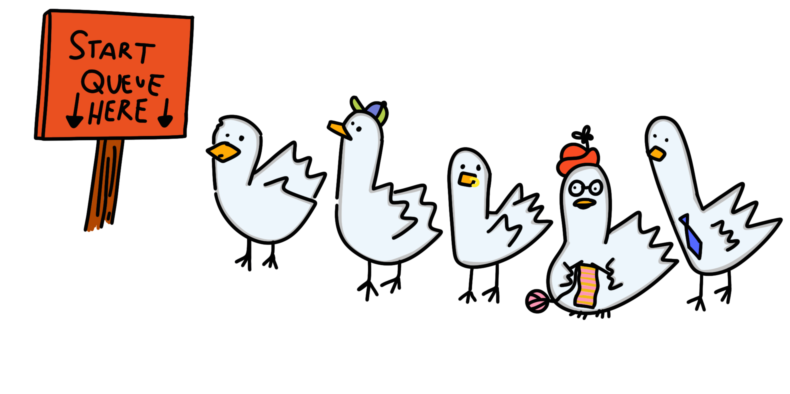
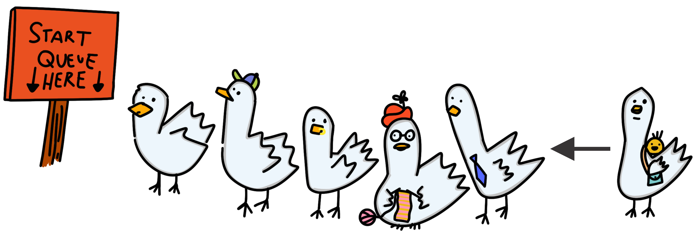
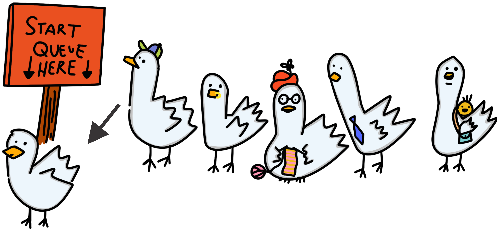
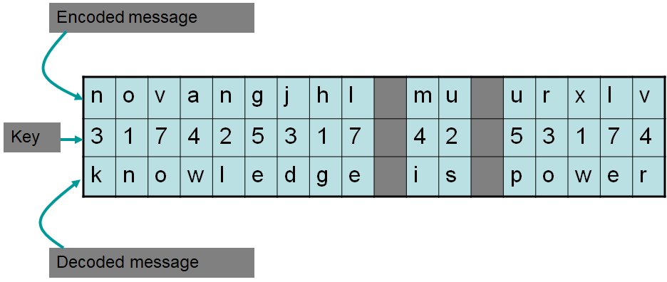

*************
The Queue ADT
*************

* Queues are a collection of elements where

    * Things are added to the queue at one end (rear/tail)
    * Things are removed from the queue at the other end (front/head)

* Given this, the **F**\ irst thing **I**\ n will be the **F**\ irst thing **O**\ ut

    * FIFO

* For an example of a queue, consider any ordinary single file line

    * Assuming people were following the rules and not cutting in line

    Example of a queue (lineup) of five people. The queue has two ends --- a front and a rear.

    Adding (enqueuing) to the rear of the queue.

    Removing (dequeuing) from the front of a queue.

Queue Operations
================

* Like other collections, there should be a way to

    * Add something to the queue
    * Remove something from the queue
    * Look at something, but do not remove it

* Within the context of a queue, these operations are called

    * Enqueue

        * Add an element to the collection
        * The element added will be the new rear of the queue

    * Dequeue

        * Remove an element from the collection
        * The removed element will be from the front of the queue
        * The element after the removed element will be the new front, if it exists
        * The element removed is returned

    * First

        * Return the element at the front of the queue, but leave it in the queue
        * Calling first does not alter the queue

.. note::

    It is against this definition of a queue to access anything from anywhere other than the *front* of the queue.

.. warning::

    When referring to Java's actual
    `Queue Interface <https://docs.oracle.com/en/java/javase/17/docs/api/java.base/java/util/Queue.html>`_, one may
    notice ``add``, ``remove``, and ``element``, along with ``offer``, ``poll``, and ``peek``. The first three are the
    same as the defined ``enqueue``, ``dequeue``, and ``first``. The other three are the same, but do not throw
    exceptions.

    The names ``enqueue``, ``dequeue``, and ``first`` are used here as they are the typical names used when
    `referring to a Queue ADT <https://en.wikipedia.org/wiki/Queue_(abstract_data_type)>`_.

Example Use
===========

* Examples

    * Any typical single file queueing line, like at a grocery store checkout
    * Cars at a stoplight
    * Input buffers

Rotating Cipher
---------------

* A Caesar cipher is a simple way to encode a message
* The idea is, shift each letter in the message by some constant amount ``k``
* If ``k=5``

    * ``a`` becomes ``f``

        * ``a -> b -> c -> d -> e -> f``

    * ``b`` becomes ``g``

        * ``b -> c -> d -> e -> f -> g``

    * ...
    * ``z`` becomes ``e``

        * ``z -> a -> b -> c -> d -> e``

* However, the Caesar cipher can be broken with a brute force algorithm fairly easily
* The code breaking can be made much harder with a *rotating key*

* For example, a rotating key may be ``3, 1, 7, 4, 2, 5``

    * Shift the first letter of the message to be encoded by ``3``
    * The second by ``1``
    * The third by ``7``
    * Fourth ``4``
    * Fifth ``2``
    * Sixth ``5``
    * Then for the seventh, start over at ``3``
    * Eighth by ``1``
    * ...

    Example of an encoded and decoded message with a rotating key. Notice that the key repeats.

* This idea can easily be implemented with a queue

    * Dequeue the key
    * Apply key to letter
    * Enqueue the key

Interface
=========

.. code-block:: java
    :linenos:

    public interface Queue<T> {

        // Javadoc comments within Queue.java file
        boolean enqueue(T element);
        T dequeue();
        T first();
        boolean isEmpty();
        int size();
    }

* Just like the ``Stack`` interface, any implementation of a queue will implement the ``Queue`` interface

For Next Time
=============

* Download the :download:`Queue.java</../main/java/Queue.java>` interface
* Read Chapter 5 Sections 1 -- 5

    * 14 pages
