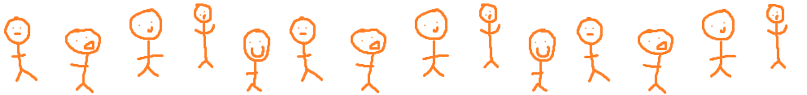
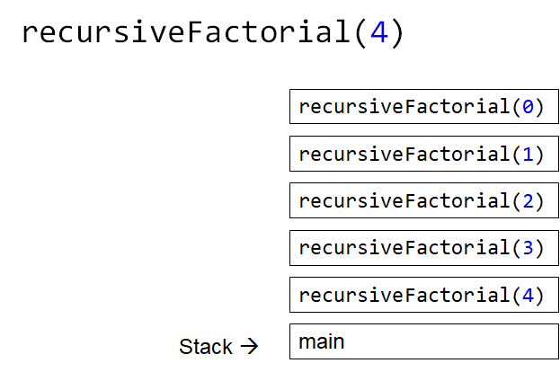
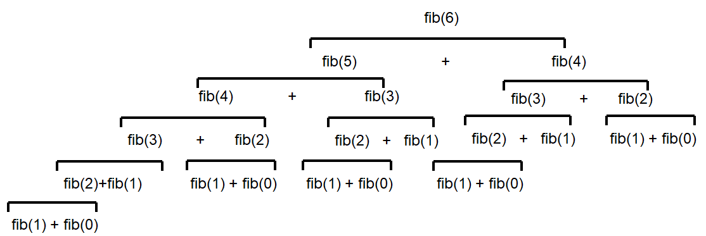
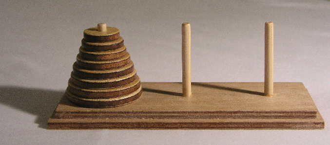

*********
Recursion
*********

* How many people are in this line?

    * How does one count them?

* Just by looking at the first person, it's exactly ``1 +`` the number of people after the first person

Iterative Definition vs. Recursive Definition
=============================================

* Iterative definitions of things are fairly natural
* Recursion on the other hand may *feel* a little less natural, but it pops up a lot in everyday life and in nature

Groups of People
----------------

* Like the line of people example above, it may seem like a silly question because it is so intuitive

* A group of people is:

    * 2 people
    * OR 3 people
    * OR 4 people
    * OR ...
    * ...
    * ...

* Alternatively, the idea of recursion can be used to define a group of people a different way
* When defining something recursively, the definition of something is used within its definition

    * Define something in terms of itself

* A recursive definition of a **group of people** is:

    * 2 people
    * OR a **group of people** plus one more person

* Based on this recursive definition, if asked if 2 people are a group of people, the answer is clearly yes

    * It's the first part of the recursive definition of a group of people

* But if asked if 4 people is a group of people, some more digging is needed

    * In order to know if 4 people is a group of people, it needs to be known if 3 people is a group of people

        * If 3 is, then it can be concluded that 4 is since 4 is 3, a group of people, plus one more person
        * This is the second part of the recursive definition of a group of people

    * To know if 3 people is a group of people, it needs to be known if 2 people is a group of people

        * If 2 is, then it can be concluded that 3 is since 3 is 2, a group of people, plus one more person

    * By definition, 2 people is, in fact, a group of people
    * Therefore, 3 people is a group of people
    * Thus, 4 people is a group of people

* In the above recursive example, notice a *base case* and a *recursive case*

    * The base case is something with a clear definition
    * The recursive case is one that defines something in terms of itself

.. warning::

    Although there is no hard rule saying that a base case is needed, and there are examples of situations where it
    would not be included, not including a base case is a recipe for disaster. Remember the ``uhOh()`` example from the
    *Memory & The Call Stack* topic?

    For the purposes of this course, always include a base case.

Lists
-----

* Think of a list from Python, or a linear linked structure
* One can define this recursively in a rather natural way

* A list is:

    * **Base Case** --- An empty list
    * **Recursive Case** --- There is a head of the list, followed by a tail --- the remaining portion of the list

* Consider the following list

    ``[a, b, c, d, e]``

* This can be broken down into the head ``a`` and the tail ``[b, c, d, e]``

    ``a + [b, c, d, e]``

* The tail list can be broken down again and again until the empty list (base case) is hit

    ``a + b + [c, d, e]``

    ``a + b + c + [d, e]``

    ``a + b + c + d + [e]``

    ``a + b + c + d + e + []``

Repeating Patterns
==================

* In counting example, it may feel like cheating by saying "1 + however many are after the front"

    * "however many are after the front" seems like skipping a step

* But, with the list example, it was observed that repeatedly applying the same rule over and over on smaller and smaller lists resulted in hitting an *end*

    * The empty list
    * The base case
    * This pattern arises a lot with recursion --- repeatedly apply the same rules on slightly different versions of the problem

* As mentioned earlier, there is typically going to be a *base case* and a *recursive case*
* In fact, there can be multiple base cases and recursive cases

    * Several examples of this will be seen when discussing trees

Going Up and Down
-----------------

* The set of natural numbers :math:`\mathbb{N}` can be recursively defined as:

    * 0 is a natural number
    * A natural number :math:`+ 1` is a natural number

* This recursive definition provides a complete definition of :math:`\mathbb{N}`

* One can start at the base case and repeatedly apply the recursive case to generate all natural numbers

    * This is a great way to mathematically define something infinite

        * Though, computers will not be all too happy with running this

* One could also take this definition and use it to answer questions by working down to the base case, and then back up with the answer

    * Is :math:`4` a natural number?
    * Is :math:`3 + 1` a natural number?
    * Is :math:`(2 + 1) + 1` a natural number?
    * Is :math:`((1 + 1) + 1) + 1)` a natural number?
    * Is :math:`((((0 + 1) + 1) + 1) + 1)` a natural number?
    * :math:`0` is a natural number
    * Therefore :math:`1`, which is :math:`0 + 1`, is a natural number
    * Therefore :math:`2`, which is :math:`1 + 1`, is a natural number
    * Therefore :math:`3`, which is :math:`2 + 1`, is a natural number
    * Therefore :math:`4`, which is :math:`3 + 1`, is a natural number

Recursive Programming
=====================

* The factorial, :math:`n!`, of a non-negative integer is the product of all non-negative integers between :math:`n` and :math:`1` inclusively

    * It also includes zero, but this is addressed below

    :math:`n! = n \times (n - 1) \times (n - 2) \times \dots \times 3 \times 2 \times 1`

* This can nicely be defined recursively

.. math::

    n! =
    \begin{cases}
        1 & \text{if $n = 0$} \\
        n \times (n-1)! & \text{if $n > 0$} \\
    \end{cases}

.. note::

    Notice that :math:`0! = 1`. This is because:

    #. It is :math:`1` by definition (because someone said so), but this isn't really a satisfying answer

    #. :math:`1` is the multiplicative identity, and it is used as the result when multiplying no factors

        * This is just like how adding *nothing* together results in :math:`0` --- the additive identity

    #. It also aligns with the `gamma function <https://en.wikipedia.org/wiki/Gamma_function>`_

* If asked what :math:`4!` is, it can be calculated by applying the rules; there are no real tricks to it

    :math:`4! = 4 \times 3!`

        :math:`3! = 3 \times 2!`

            :math:`2! = 2 \times 1!`

                :math:`1! = 1 \times 0!`

                    :math:`0! = 1`

                :math:`1! = 1 \times 0! = 1 \times 1 = 1`

            :math:`2! = 2 \times 1! = 2 \times 1 = 2`

        :math:`3! = 3 \times 2! = 3 \times 2 = 6`

    :math:`4! = 4 \times 3! = 4 \times 6 = 24`

.. code-block:: java
    :linenos:

    static int iterativeFactorial(int n) {
        int factorial = 1;
        for (int i = 1; i <= n; ++i) {
            factorial = factorial * i;
        }
        return factorial;
    }

.. code-block:: java
    :linenos:

    static int recursiveFactorial(int n) {
        if (n == 0) {
            return 1;
        }
        return n * recursiveFactorial(n - 1);
    }

* Both the iterative and recursive functions do the same thing

    * But, doesn't the recursive function have a sort of beauty to it?

* When considering the call stack, the stack will grow until it hits the base case
* Then, each call frame will return the product to the calling function

    * Regardless of if the calling function is ``recursiveFactorial`` or ``main``

    Example call stack of calling ``recursiveFactorial(4)`` when the program is currently executing the base case ---
    when ``n`` is ``0``. This is the state of the call stack before any values have been returned by any call frames.

Some Observations
=================

* Notice how ``recursiveFactorial(4)`` makes a call to  ``recursiveFactorial(3)``
* If ``recursiveFactorial(5)`` was called, it would need to calculate ``recursiveFactorial(4)`` *again*
* In other words, to know ``recursiveFactorial(x)``, an answer to ``recursiveFactorial(x - 1)``, ``recursiveFactorial(x - 2)``, ... ``recursiveFactorial(1)``, and ``recursiveFactorial(0)`` must be calculated

* One many also notice the relationship between the ``Stack`` ADT and the call stack

* Additionally, anything that can be done with iteration can be done with recursion, and *vice versa*
* However, just because it *can* doesn't mean it *should*

    * Based on the design of the computational systems used, recursion creates additional overhead that slows things down

        * Creating call frames
        * Pushing/popping from the call stack

    * In some programming languages, like Java, compilers will optimize certain types of recursive functions by translating them to an iterative version
    * This does not mean, however, that one should not use recursion as sometimes recursive implementations are elegant and easier to write and understand

        * Simplicity of code may be tradeoff --- remember, sometimes *good enough is good enough*
        * If performance needs improving *later*, do that later

.. warning::

    The computers we as humans use are one type of computational system, and although recursion often ends up being
    slower than iteration on these computational systems, this is due to how the computational systems operate.
    Recursion is not intrinsically a slower process when compared to iteration.

Computational Complexity
========================

* When analysing code, it is important to think about many operations will be needed relative to an input size ``n``
* Further, it is important to think about how much the amount of work done scales as ``n`` changes

* When looking at ``iterativeFactorial(n)``

    * There are a few constant time operations (do not depend on ``n``)
    * There is a loop doing constant time work that runs ``n`` times
    * Therefore, :math:`O(n)`

* When analyzing recursive functions, the idea is the same

    * How many operations will be needed relative to an input size ``n``
    * How much the amount of work done scales as ``n`` changes

* When looking at ``recursiveFactorial(n)``

    * There are constant time operations
    * There is a recursive call, which means the code inside this function can run repeatedly
    * The question then is, how many times will ``recursiveFactorial(n)`` get called?

.. list-table:: Number of times ``recursiveFactorial`` is called with input ``n``.
    :widths: 50 50
    :header-rows: 1

    * - Accumulative times run
      - Function call
    * - :math:`1`
      - ``recursiveFactorial(n)``
    * - :math:`2`
      - ``recursiveFactorial(n - 1)``
    * - :math:`3`
      - ``recursiveFactorial(n - 2)``
    * - :math:`\dots`
      - ``recursiveFactorial( ... )``
    * - :math:`n - 1`
      - ``recursiveFactorial(2)``
    * - :math:`n`
      - ``recursiveFactorial(1)``
    * - :math:`n + 1`
      - ``recursiveFactorial(0)``

* With input ``n``, ``recursiveFactorial`` runs a total of :math:`n + 1` times --- :math:`O(n)`

    * It's linear

Fibonacci
---------

* Consider the Fibonacci numbers
* If not familiar with this sequence, try to figure out how it is created

    :math:`0, 1, 1, 2, 3, 5, 8, 13, 21, 34, 55, 89, 144, 233, 377, 610, 987, 1597, 2584, 4181, 6765, ...`

* Here's a hint

    :math:`0, 1`

    :math:`0, 1, 1`

    :math:`0, 1, 1, 2`

    :math:`0, 1, 1, 2, 3`

    :math:`0, 1, 1, 2, 3, 5`

    :math:`0, 1, 1, 2, 3, 5, 8`

    :math:`0, 1, 1, 2, 3, 5, 8, 13`

    :math:`\dots`

* To generate this sequence, start with :math:`0, 1`, then to get the subsequent number, add the proceeding two together

.. code-block:: java
    :linenos:

    static int iterativeFibonacci(int n) {
        if (n == 0) {
            return 0;
        }
        int previous = 0;
        int current = 1;
        int next = 0;
        for (int i = 2; i <= n; i++) {
            next = current + previous;
            previous = current;
            current = next;
        }
        return current;
    }

* What is the computational complexity of ``iterativeFibonacci(n)``?

    * :math:`O(n)`

* The recursive definition of the Fibonacci numbers is quite elegant

.. math::

    F_{n} =
    \begin{cases}
        0 & \text{if $n = 0$} \\
        1 & \text{if $n = 1$} \\
        F_{n-1} + F_{n-2} & \text{if $n > 1$} \\
    \end{cases}

.. code-block:: java
    :linenos:

    static int recursiveFibonacci(int n) {
        if (n == 0 || n == 1) {
            return n;
        }
        return recursiveFibonacci(n - 1) + recursiveFibonacci(n - 2);
    }

* What is the computational complexity of ``recursiveFibonacci(n)``?
* This may feel a little less straight forward compared to ``recursiveFactorial(n)``, but the idea is the same

    * The function has constant time operations
    * But there are recursive calls, so, how many times does this function get called?

    Visualization of the recursive function calls when calling ``recursiveFibonacci(6)``. Unless it is the base case,
    each call to ``recursiveFibonacci`` produces two more recursive calls to ``recursiveFibonacci``. Notice how many
    times ``recursiveFibonacci(2)`` is calculated --- 5.

* When analyzing *factorial* (not Fibonacci), it was observed that each function call made one or zero recursive calls

    * There was ``1`` recursive call for each of the ``n`` values between ``1`` -- ``n``
    * There was no recursive call in the base case

* When looking at ``recursiveFibonacci(n)``, how many potential recursive calls are there for each of the ``n`` values?

    * Two

* Each new call will call two more, which will call two more, which will call two more...

    * :math:`1`
    * :math:`2`
    * :math:`4`
    * :math:`8`
    * :math:`16`
    * :math:`32`
    * :math:`64`
    * :math:`\dots`

* This patten follows :math:`2^{n}`

    * Roughly speaking, the number of recursive function calls doubles each step

* In other words, this recursive implementation is :math:`O(2^{n})`

* If given the choice between something that grows linearly or something that grows exponentially, take the linear
* Despite the simple elegance of the recursive fibonacci implementation, this would be a good example of going back and improving the implementation for better performance

* To get a sense of why the recursive version is so much worse than the iterative

    * Look at the above figure for a hint
    * When calculating ``recursiveFibonacci(6)``, ``recursiveFibonacci(2)`` is calculated a total of :math:`5` times
    * The iterative implementation would have only calculated this once

Towers of Hanoi
===============

* Given

    * Three pegs
    * Several disks that can be added or removed from the pegs
    * All disks vary in size
    * All disks start on one peg with the largest at the bottom and the smallest at the top

* The goal is to move all disks from one peg to another with the following constraints

    * Only one disk can move at a time
    * A disk may never be placed on top of any smaller disk
    * All disks must be on some peg at all times, with the exception of the one currently being moved

    Example Towers of Hanoi puzzle.

* `There is a legend that goes with this puzzle <https://en.wikipedia.org/wiki/Tower_of_Hanoi#Origins>`_

.. figure:: hanoi_tower.gif
    :width: 500 px
    :align: center
    :alt: This image is taken from wikipedia: https://en.wikipedia.org/wiki/File:Iterative_algorithm_solving_a_6_disks_Tower_of_Hanoi.gif

    Animation of Towers of Hanoi being solved.

* Towers of Hanoi is a classic example of where a recursive function is beautifully succinct
* The trick is to consider that, whenever moving a disk, there is a *source* peg, a *destination* peg, and an *extra* peg
* Further, what is considered the source, destination, and extra peg is relative to when and what disk is being moved

* Equipped with this information, to move :math:`n` disks from the source to the destination, simply

    #. Move the :math:`n - 1` disks from source peg to the extra peg
    #. Move the :math:`n^{th}` disk to the destination peg
    #. Move the :math:`n - 1` disks from the extra peg to the destination peg

* Steps 1 and 3 may feel like cheating, but notice that they are actually recursive calls
* Also, what one considers the source, destination, and extra peg will change when moving the :math:`n - 1` disks

    * Looking at the first step, it says move the :math:`n - 1` disks from source peg to the extra peg
    * Ok, how is that done?

        #. Move the :math:`(n - 1) - 1` disks from source peg to the extra peg
        #. Move the :math:`(n - 1)^{th}` disk from the source to the destination
        #. Move the :math:`(n - 1) - 1` disks from extra peg to the destination peg

    * But, the extra and destination pegs are different for the :math:`(n - 1)` disks

        * The extra peg when moving :math:`n` disks has become the destination peg when moving :math:`(n - 1)`
        * Similarly, the destination peg when moving :math:`n` disks is this recursive step's extra peg

.. warning::

    This is a non-trivial problem and algorithm. If the ideas are difficult to grasp, don't worry too much.

For Next Time
=============

* Read Chapter 8

    * 28 pages
