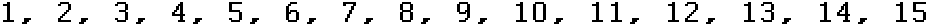
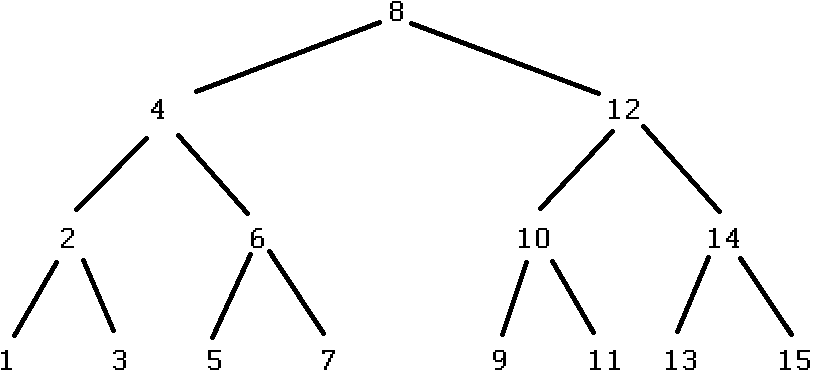

*********
Searching
*********

* For the purposes of this topic, searching is the process of looking for a specified *thing* in *some collection* to know if it exists within the collection
* For example, does a given number exist within an array of numbers?

* To write an algorithm to solve this problem, all that's needed is something that says if it's there or not

    * That's all that's required
    * Any algorithm that works would suffice

* However, the focus here will be on two intuitive ideas that people commonly use in one way or another throughout their lives

    * Linear Search
    * Interpolation Search

        * A specific kind of interpolation search called a *binary search* will be discussed

* Throughout this topic

    * The thing being searched for will be referred to as the ``needle``
    * The collection being searched through will be referred to as the ``haystack``

Linear Search
=============

* Linear search has been used several times already
* Start at the beginning of the ``haystack`` and sequentially look at each element until the ``needle`` is found

    * If the ``needle`` is found, then conclude that it is there
    * If the end of the ``haystack`` is reached without finding the ``needle``, then conclude that it is not there

* Notice that this description of the algorithm doesn't really go into any more details

    * It is fairly high-level --- abstract

* The computational complexity of this algorithm has already been discussed

    * Worst case scenario, every element in the ``haystack`` was looked at before making any conclusion --- linear :math:`O(n)`
    * Best case scenario, the ``needle`` is the first element in the ``haystack`` --- constant :math:`O(1)`

    * On average, the element will be in the middle --- linear :math:`O(n)`

        * For every time ``needle`` is the first element, it could be the last element in another search
        * For every time the ``needle`` is the second element, it could be in the second last position in another search
        * ...

    Example linear collection of data. With a linear search, to guarantee if some ``needle`` exists within this
    ``haystack``, each element must be looked at.

Iterative
---------

* Below is a generic implementation of a linear search on an array of type ``T``
* Other than being a generic method, this should be something you are familiar with

.. code-block:: java
    :linenos:

    public static <T> int iterativeLinearSearch(T needle, T[] haystack) {
        for (int i = 0; i < haystack.length; ++i) {
            if (haystack[i].equals(needle)) {
                return i;
            }
        }
        return -1;
    }

* This iterative implementation is also fairly similar to the high-level description of the algorithm
    * Start at ``i = 0`` --- the beginning of the array
    * If the element at index ``i`` is what we're looking for, we've found it and we're done
    * Otherwise continue and increment ``i``
    * If we ever look at all indices and do not find it, then we conclude that it's not there and we're done

Recursive
---------

* Now that we are more familiar with recursion, here is the same high-level abstract idea, but implemented with recursion

.. code-block:: java
    :linenos:

    public static <T> int recursiveLinearSearch(T needle, T[] haystack, int currentIndex) {
        // Not Found
        if (currentIndex == haystack.length) {
            return -1;
        } else if (haystack[currentIndex].equals(needle)) {
            return currentIndex;
        } else {
            return recursiveLinearSearch(needle, haystack, currentIndex + 1);
        }
    }

* If I wanted to call this method, I would start with ``currentIndex`` as ``0``
    * ``recursiveLinearSearch(someNeedle, someHaystack, 0)``

* It is also common to have a *helper* method that makes the first recursive call with the proper values

.. code-block:: java
    :linenos:

    public static <T> int recursiveLinearSearch(T needle, T[] haystack) {
        return recursiveLinearSearch(someNeedle, someHaystack, 0);
    }

* This may seem quite different from the iterative implementation, but take some time to look at the code and see what's happening
    * Start ``currentIndex`` at ``0``
    * Are we past the end of the array? If so, we conclude we didn't find it and we're done
    * If the element at index ``currentIndex`` is what we're looking for, we've found it and we're done
    * Otherwise, if we're not at the end and we didn't find it, check ``currentIndex + 1``

Binary Search
=============

* Let's say you're looking for page 554 in a textbook
* You'd probably open the book somewhere in the middle-ish
* If the page you end up turning to is page 383, which half of the book should you continue your search on?
    * Left pages, or right pages?
* Since 554 is greater than 383, it must be in the set of right pages
    * We eliminate the 383 pages from the set of left pages from our search since 554 must **not** be there
* Next, you turn to a page somewhere between pages 383 and the end of the book and see page number 621
    * Which set of pages do you then continue your search down?

* This general idea is the basis of binary search
    * Technically, this is `interpolation search <https://en.wikipedia.org/wiki/Interpolation_search>`_, but binary search is a special kind of interpolation search

* There is, however, a catch with binary search when compared to a linear search
    * The haystack we're searching, must be sorted, otherwise we would not be able to conclude which half our needle is

* The complexity analysis of binary search may feel intimidating, but the trick is to not overthink it and take your time

* When considering *linear search*, if we were looking for the number ``11.5``
* There are a total of ``15`` things in the haystack, so we would need to exhaustively look at all ``15`` of them
    * Here, ``15`` is :math:`n`

* When considering *binary search*, how many things would we need to look at if we wanted to know if ``11.5`` is there or not?
    * ``4``

* We get away with looking at fewer things because we are ignoring half the remaining elements every time we continue our search
    * ``11.5`` is greater than ``8``, therefore we can ignore all the elements on the left side

* Any idea what the relationship between the maximum number of checks and the number of elements in our haystack :math:`n`?
    * :math:`n = 2^{h + 1} - 1`, where `h` is the "height" of the tree, or, the number of steps needed to go from the top to the bottom
    * :math:`h = log_{2}(n + 1) - 1`

* Thus, the computational complexity of binary search is :math:`O(log_{2}(n))` since, as :math:`n` grows, the maximum number of steps we would need to take only grows like :math:`log_{2}(n)`

.. warning::

    We've gotten ahead of ourselves; the above explanation uses details we have not discussed yet, but will cover in the
    following topics. In other words, don't be too concerned if you are left scratching your head.

Iterative
---------

* Below is a generic implementation of an iterative binary search on an array of type ``T``
    * Take note that ``T`` or one of their superclasses must extend ``Comparable``
    * This is because the elements must be ordered

.. code-block:: java
    :linenos:

    public static <T extends Comparable<? super T>> int iterativeBinarySearch(T needle, T[] haystack) {
        int lowIndex = 0;
        int highIndex = haystack.length;
        int midpoint = (highIndex - lowIndex) / 2;

        while (lowIndex < highIndex) {
            if (haystack[midpoint].equals(needle)) {
                return midpoint;
            } else if (haystack[midpoint].compareTo(needle) > 0) {
                highIndex = midpoint - 1;
                midpoint = lowIndex + (highIndex - lowIndex) / 2;
            } else {
                lowIndex = midpoint + 1;
                midpoint = lowIndex + (highIndex - lowIndex) / 2;
            }
        }
        return -1;
    }

* This may look complicated, but again, take your time

* Here is what's happening
    * While we have not exhausted the search space (``lowIndex < highIndex``)
        * If ``lowIndex`` is ever greater than or equal to ``highIndex``, there are no more indices the element *could* exist
    * Look at the middle
    * If what you are looking at is what you're looking for
        * Done
    * If what you are looking at is less than what you're looking for
        * Continue the search on the remaining upper half by looking at the midpoint of the remaining elements
    * If what you are looking at is greater than than what you're looking for
        * Continue the search on the remaining lower half by looking at the midpoint of the remaining elements

Recursive
---------

* Below is a recursive implementation of a binary search
* Notice that, other than being recursive, the underlying high-level algorithm is the same as the iterative implementation

.. code-block:: java
    :linenos:

    public static <T extends Comparable<? super T>> int recursiveBinarySearch(T needle, T[] haystack, int lowIndex, int highIndex) {
        if (lowIndex >= highIndex) {
            return -1;
        }
        int midpoint = lowIndex + (highIndex - lowIndex) / 2;
        if (haystack[midpoint].equals(needle)) {
            return midpoint;
        } else if (haystack[midpoint].compareTo(needle) > 0) {
            return recursiveBinarySearch(needle, haystack, lowIndex, midpoint - 1);
        } else {
            return recursiveBinarySearch(needle, haystack, midpoint + 1, highIndex);
        }
    }

* If I wanted to call this method, I would start with ``lowIndex`` as ``0`` and ``highIndex`` as ``someHaystack.length``
    * ``recursiveBinarySearch(someNeedle, someHaystack, 0, someHaystack.length)``

* Again, a helper method for the initial call would look something like this

.. code-block:: java
    :linenos:

    public static <T extends Comparable<? super T>> int recursiveBinarySearch(T needle, T[] haystack) {
        return recursiveBinarySearch(someNeedle, someHaystack, 0, someHaystack.length);
    }

For next time
=============

* Download and play with the :download:`SearchingFunctions </../main/java/SearchingFunctions.java>` class
* Download and run the :download:`SearchingFunctionsTest </../test/java/SearchingFunctionsTest.java>` tests
* Read Chapter 9 Section 1
    * 7 pages
