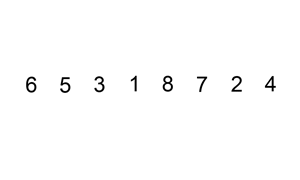

*******
Sorting
*******

* Like searching, sorting is a classic problem
* Everyone has sorted things before
* The problem is well understood
* But how much time has been spent really analyzing the process of sorting?

* Perhaps even more interesting, until relatively recently, humans have been pretty terrible at it

* There are many sorting algorithms out there
* They will work different ways, but result in sorted collections
* Some will more or less be the same in terms of the amount of computation required
* And some will be much better than others

.. note::

    Most of the sorting images are taken directly from their wikipedia articles. Click the image to visit their
    respective pages.

Sorting Problem
===============

* Given a collection of *things*

    * Numbers
    * Strings
    * People
    * Car Parts

* The goal is to arrange the collection of *things* such that they are *in order*

Order
-----

* What *in order* means however will depend on what is being sorted
* For example

    * Numbers come with an intrinsic ordering

        * Java uses the `Natural Order <https://docs.oracle.com/en/java/javase/17/docs/api/java.base/java/lang/Comparable.html>`_
        * *"This ordering is referred to as the class's natural ordering, and the class's compareTo method is referred to as its natural comparison method."*

    * Strings could be ordered alphabetically

        * Perhaps by length?

    * Sort people based on height

        * Or age?
        * Or month and day of birthday?

    * Car Parts by mass?

        * Or production code?
        * Date they were made?
        * Volume?
        * The amount of dust particles on the surface?

* With numbers, there's no need to ask
* But with other things, a well defined ordering is needed for the *things*

    * The things themselves have the order-*ness* property, not a sorting algorithm

* The orderness has already been discussed a few times in the context of an ordered bag and binary search tree

    * `Comparable defines a natural ordering <https://docs.oracle.com/en/java/javase/17/docs/api/java.base/java/lang/Comparable.html>`_

* More complex orderings can also be defined

    * For example, comparing things based on multiple values
    * For example, sorting music by artist and year
    * `Comparator defines an unnatural ordering <https://docs.oracle.com/en/java/javase/11/docs/api/java.base/java/util/Comparator.html>`_

.. note::

    For ease, numbers are used in the examples, but the ideas are generalizable to other *things* if they have a defined
    order.

    Here, a collection of numbers is considered ordered if and only if the elements are *monotonically increasing*. This
    is just fancy way of saying the numbers are always increasing or are equal, but **never** decreasing. For example:

        :math:`1, 2, 3, 5, 5, 6, 8, 8, 8, 9`

Bogosort
========

* Here's a fun idea

#. Given a function called ``isSorted(collection)`` that returns true if the collection is sorted and false otherwise

    * :math:`O(n)`

#. And given another function called ``shuffle(collection)`` that randomly shuffles the collection

    * :math:`O(n)`
    * Think of shuffling a deck of cards

#. The algorithm is then:

    ``while not isSorted(collection): shuffle(collection)``

* Best case scenario, get luck with the collection already being sorted --- ``isSorted`` is called only once
* Worst case is... *forever?*
* It's possible to get **really** unlucky and shuffle the elements such that they are the same *not in order* order every time

* This is obviously not a particularly great sorting algorithm in terms of the computation required

* If :math:`n` is very small, there's a reasonable chance to end up with a sorted collection after a while
* But to put things into perspective, there are a total :math:`8.0658175 \times 10^{67}` permutations of a deck of 52 cards ``!``

    * To put *this* in perspective, there are roughly :math:`2.4 \times 10^{67}` atoms in the Milky Way
    * If assigning orderings to individual atoms in the Milky way, there would be roughly :math:`5.7\times10^{67}` orderings left over
    * `There's also a fun story to go with this <https://www.reddit.com/r/AskReddit/comments/6il1jx/comment/dj71u1v>`_

Bubble Sort
===========

    Animation of Bubble Sort.

* The general idea of bubble sort is to look at the list, and if any adjacent numbers out of order, swap them
* What's neat about this is the order the swaps are applied does not matter

    :math:`4, 3, 2, 1`

* With the above example, one possible route could be

    :math:`4, 3, 2, 1`

    :math:`3, 4, 2, 1`

    :math:`3, 2, 4, 1`

    :math:`2, 3, 4, 1`

    :math:`2, 3, 1, 4`

    :math:`2, 1, 3, 4`

    :math:`1, 2, 3, 4`

* And another route is

    :math:`4, 3, 2, 1`

    :math:`4, 3, 1, 2`

    :math:`3, 4, 1, 2`

    :math:`3, 1, 4, 2`

    :math:`3, 1, 2, 4`

    :math:`1, 3, 2, 4`

    :math:`1, 2, 3, 4`

* Selecting an arbitrary pair of values to switch works, but a more systematic strategy would be better
* Instead of randomly selecting pairs, start at the beginning and look at each adjacent pair and move up the list

**Pass 1**

    :math:`4, 3, 2, 1`

    :math:`3, 4, 2, 1`

    :math:`3, 2, 4, 1`

    :math:`3, 2, 1, 4`

* However, simply doing one pass does not guarantee that the list will be in order
* In fact, all it does guarantee is that the largest value in the list will have *bubbled up* to its correct spot
* The trick is to repeat this process until the list is sorted

**Pass 2**

    :math:`3, 2, 1, 4`

    :math:`2, 3, 1, 4`

    :math:`2, 1, 3, 4`

**Pass 3**

    :math:`2, 1, 3, 4`

    :math:`1, 2, 3, 4`

Worst Case Scenario
-------------------

* The above example showed the *worst case scenario* for this specific bubble sort idea

    * This case here is where the list is in reverse order
    * But the true worst case scenario is when the smallest element is at the wrong end 

* The question is, how many passes must be done to guarantee that the list is sorted?

* If the list is length :math:`n`
* And after a single pass the largest value is in its proper location
* After a second pass, the second largest value is in its proper location
* After a third, the third largest will be where it needs to
* ...
* After :math:`n` passes, list is sorted

    * Actually, :math:`n-1` since putting the :math:`(n-1)^{th}` thing in its proper spot would result in also having the last element, the :math:`n^{th}`, also in its proper spot
    * See the above example, where :math:`n = 4` and only needing 3 passes

Best Case Scenario
------------------

* Consider the case where the list is already in order

    :math:`1, 2, 3, 4`

* It may feel rather silly doing a total of :math:`n-1` passes since after a single pass it can be concluded that it's already sorted
* In this case, an easy way to stop the sort early is to check if a pass is ever completed with no swaps

    * If nothing was swapped, then nothing was out of order, therefore the list must be sorted

Algorithm
---------

.. code-block:: text
    :linenos:

    While the list is not sorted
        For each adjacent pair of values
            If they are out of order
                Swap them
                Note that the list is not yet known to be sorted

Computational Complexity
------------------------

* For the best case scenario, a complete pass over all :math:`n` elements is needed
* This is because it can only be conclude that the collection is sorted by looking at the whole list

    * Best case :math:`O(n)`

* For the worst case, each pass is :math:`O(n)`, but a total of :math:`n-1` passes are needed

    * Worse Case :math:`O(n^{2})`

Insertion Sort
==============

    Animation of Insertion Sort.

* The idea of insertion sort is to select elements from the unsorted list and *insert* them into a sorted list in the correct spot such that the sorted list remains sorted

    * In the above animation, there is a single list with a sorted and unsorted part

* Similar to bubble sort, the order that elements from the unsorted list are selected in does not matter in terms of getting a sorted collection in the end

.. list-table:: Insertion Sort Example
    :widths: 50 50
    :header-rows: 1

    * - Unsorted
      - Sorted
    * - :math:`4, 3, 2, 1`
      -
    * - :math:`3, 2, 1`
      - :math:`4`
    * - :math:`3, 2`
      - :math:`1, 4`
    * - :math:`3`
      - :math:`1, 2, 4`
    * -
      - :math:`1, 2, 3, 4`

* Typically, for ease, each element in the unsorted list is picked for insertion in the order that they appear

Computational Complexity
------------------------

* To think of the computational complexity, consider a list of size :math:`n`
* For each element selected, the location in the sorted list where it must be inserted needs to be found

* If this is the first element being selected, then there is nothing in that sorted list, therefore finding where the element should be inserted is trivial
* If it's the second element, one element in the sorted list must be looked at to determine where the second element goes
* If it's the third element, two elements in the sorted list must be looked at
* ...
* If considering the :math:`n^{th}` element from the unsorted list,  :math:`n-1` elements in the sorted list must be looked at

* If sorting :math:`n` things

    * All :math:`n` things need to be inserted into the sorted list
    * And :math:`\frac{n}{2}` things are looked at on average to find the insertion spot
    * Therefore, it's :math:`O(n^{2})`

Worst Case Scenario
-------------------

* The situation for the worst case scenario would be if, for each of the :math:`n` elements to be sorted, it had to be compared to every single element in the sorted part
* For example, in the above animation, the worst case scenario would be if the numbers were in reverse order

    * Put the largest element (8) in the sorted list
    * Then take the next largest (7), and put it on the other side of the largest (8)
    * Then take the third largest (6), and it has to go on the other side of all elements already sorted (7, 8)
    * ...
    * Take the last element, which happens to be the smallest (1), and go over the whole sorted list to find where it belongs (2, 3, 4, 5, 6, 7, 8)

* However, if the list was scanned starting at index 0 each time, the worst case scenario configuration would be if the elements were already in order

Best Case Scenario
------------------

* The situation for the best case would be if, for each of the :math:`n` elements, only compare it to one thing
* In the animation example, the best case would be if the list happened to already sorted

    * Put the smallest element (1) in sorted
    * Select the next smallest (2), and since it's larger than the smallest (1), there is no need to look past it
    * Select the next one (3), and since it's larger than the second smallest (2), there is no need to look past it
    * ...
    * Look at the last element, the largest (8), and compare it to the sorted list and see that it is larger than the first thing it considers (7), therefore there is no need to look past it

* Like the worst case scenario, the best case scenario configuration depends on which way the elements in the sorted list are looked at

Algorithm
---------

.. code-block:: text
    :linenos:

    For each element in the unsorted list
        Scan the sorted list to find where the new element goes
            Insert the new element into the sorted list

Selection Sort
==============

.. figure:: selection_sort.gif
    :height: 333 px
    :align: center
    :target: https://en.wikipedia.org/wiki/Selection_sort

    Animation of Selection Sort.

* The general idea is

    * Scan the collection for the smallest element and put it in a sorted list
    * Scan the collection for the next smallest element and add it to the end of the sorted list
    * Scan the collection for the next smallest element and add it to the end of the sorted list
    * ...

.. list-table:: Selection Sort Example
    :widths: 50 50
    :header-rows: 1

    * - Unsorted
      - Sorted
    * - :math:`4, 3, 2, 1`
      -
    * - :math:`4, 3, 2`
      - :math:`1`
    * - :math:`4, 3`
      - :math:`1, 2`
    * - :math:`4`
      - :math:`1, 2, 3`
    * -
      - :math:`1, 2, 3, 4`

Algorithm
---------

* In fact, the basic idea is more or less the algorithm

.. code-block:: text
    :linenos:

    For each element in the unsorted list
        Scan the unsorted list for the next smallest element
            Add element to the end of the sorted list

Computational Complexity
------------------------

* Assuming a collection of :math:`n` elements that need to be sorted
* For each element, do a linear search through the unsorted collection for the current smallest element

    * :math:`O(n)`

* First time, look at :math:`n` elements
* Next time, look at :math:`n-1` elements
* Then :math:`n-2` elements
* ...

* Given :math:`n` things that need to be sorted

    * Each pass of the collection puts one element in its place, thus :math:`n` passes are needed
    * Each pass requires a linear search, which takes :math:`O(n)`
    * Therefore, it's :math:`O(n^{2})`

Best and Worse Case Scenario
----------------------------

* An interesting thing about selection sort is that there is no difference between the best or worse case scenarios
* No matter the configuration of the unsorted collection, an :math:`O(n)` linear search must be done for each of the :math:`n` elements to be sorted

* So, where insertion and bubble had a best case of :math:`O(n)` and worse case of :math:`O(n^{2})`, selection sort is always going to be :math:`O(n^{2})`

For Next Time
=============

* Read Chapter 9 Section 2

    * 26 pages
