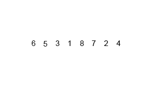
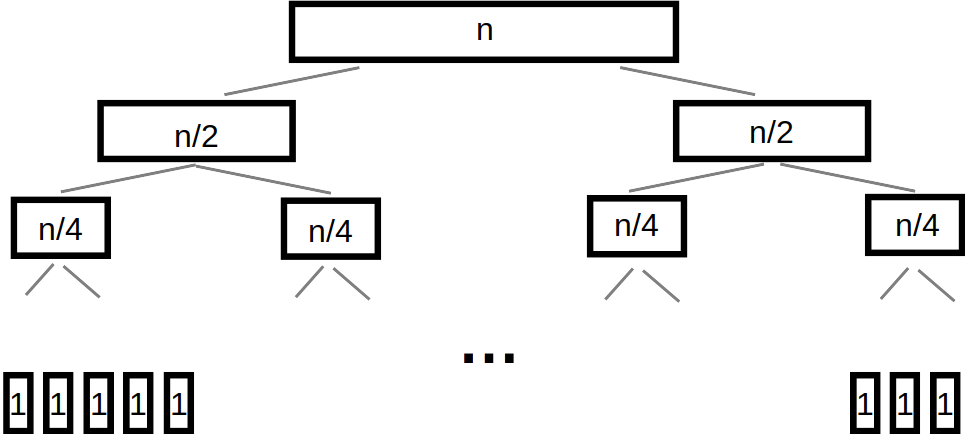
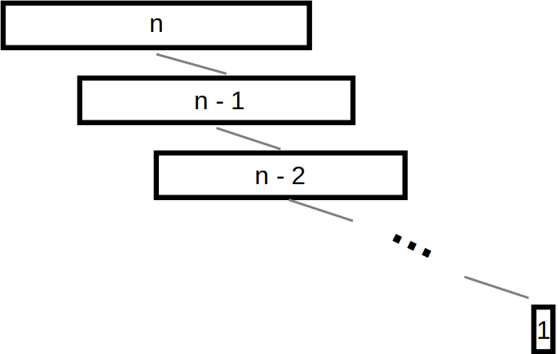

*******************
Sorting Recursively
*******************

* Additional interesting sorting algorithms

.. note::

    Most of the sorting images are taken directly from their wikipedia articles. Click the image to visit their
    respective pages.

Mergesort
=========

    Animation of Mergesort.

* There are two important, but simple ideas at the root of mergesort

    #. *Merging* two sorted lists, with the below idea, results in a single sorted list of all elements
    #. An empty list, or a list of size 1, is *sorted*

Merging Lists
-------------

1. Start with two sorted lists
2. Create an new empty list
3. Compare the first elements of the two lists
4. Remove the smaller of the two from its list and append it to the end of the new list
5. Go to 3

.. list-table:: Merge Example
    :widths: 50 50
    :header-rows: 1

    * - Two Sorted Lists
      - Merged List
    * - | :math:`2, 5, 8, 9`
        | :math:`1, 3, 4, 6, 7`
      -
    * - | :math:`2, 5, 8, 9`
        | :math:`3, 4, 6, 7`
      - :math:`1`
    * - | :math:`5, 8, 9`
        | :math:`3, 4, 6, 7`
      - :math:`1, 2`
    * - | :math:`5, 8, 9`
        | :math:`4, 6, 7`
      - :math:`1, 2, 3`
    * - | :math:`5, 8, 9`
        | :math:`6, 7`
      - :math:`1, 2, 3, 4`
    * - | :math:`8, 9`
        | :math:`6, 7`
      - :math:`1, 2, 3, 4, 5`
    * - | :math:`8, 9`
        | :math:`7`
      - :math:`1, 2, 3, 4, 5, 6`
    * - | :math:`8, 9`
        |
      - :math:`1, 2, 3, 4, 5, 6, 7`
    * - |
        |
      - :math:`1, 2, 3, 4, 5, 6, 7, 8, 9`

* In the last two rows, since the second list was empty, the remainder of the first list can simply be appended to the merged list

Splitting Lists
---------------

* The merge algorithm requires sorted lists to start merging
* However, when given an unsorted collection to sort, there are no sorted lists to start merging
* Fortunately this is trivial to address

    * Keep splitting the unsorted collection in half

* Eventually this will result in a set of lists that are either empty or size 1

    :math:`[a, b, c, d, e, f, g]`

    :math:`[a, b, c, d], [e, f, g]`

    :math:`[a, b], [c, d], [e, f], [g]`

    :math:`[a, b], [c, d], [e, f], [g]`

    :math:`[a], [b], [c], [d], [e], [f], [g], []`

Putting it Back Together Again
------------------------------

* To get to the single sorted list, simply merge all the smaller sorted lists together until 1 list remains

    :math:`[t], [u], [v], [w], [x], [y], [z], []`

    :math:`[t, u], [v, w], [x, y], [z]`

    :math:`[t, u, v, w], [x, y, z]`

    :math:`[t, u, v, w, x, y, z]`

Recursively Thinking
--------------------

* The beauty of this algorithm is it's simplicity when thinking about it recursively

.. code-block:: text
    :linenos:

    Define Mergesort
        If the list is of size 0 or 1
            Return the sorted list of size 0 or 1

        else
            Split the list into a first and second half
            Sort the first half with Mergesort
            Sort the second half with Mergesort
            Merge the sorted first and second halves back together
            Return the sorted merged list

Complexity Analysis
-------------------

* A simple way to think about the analysis is to consider

    * How much work is involved for a single merging of two lists
    * How many times merging needs to happen

* It can get more nuanced, but this level of detail is sufficient

Merging
^^^^^^^

* Given two lists of roughly the same size :math:`n` to merge into one
* The algorithm compares elements and eventually adds them all to a new, sorted merged list

    * Interestingly, the elements in the merged list never need to be compared to one another again

* The complexity of merging is :math:`O(n)`

Number of Merges
^^^^^^^^^^^^^^^^

    Assuming :math:`n` is a power of :math:`2`, repeatedly splitting a list of :math:`n` elements in half until
    :math:`n` lists of size :math:`1` exist.

* The splitting of data can be visualized as a tree
* On each level of the tree, there are a total of :math:`n` elements to be merged into larger lists

    * Merging is :math:`O(n)`

* When repeatedly halving, the relationship between :math:`n` and the number of levels in the tree is :math:`O(log_{2}(n))`
* :math:`O(n)` work is required a total of :math:`O(log_{2}(n))` times
* Therefore mergesort is :math:`O(n log_{2}(n))`

Quicksort
=========

.. figure:: quick_sort.gif
    :width: 333 px
    :align: center
    :target: https://en.wikipedia.org/wiki/Quicksort

    Animation of Quicksort.

* There are two important ideas at the root of quicksort

    #. Given a list of sorted values :math:`< x`, and another list of sorted values :math:`> x`

        * The first and second lists can be concatenated to create a larger sorted list
        * e.g.
            :math:`[0, 1, 2, 3, 4]` & :math:`[5, 6, 7, 8, 9]`

            :math:`[0, 1, 2, 3, 4, 5, 6, 7, 8, 9]`

    #. An empty list, or a list of size 1, is *sorted*

Pivoting
--------

* When given an unsorted collection to sort, there are no sorted lists to start concatenating
* Fortunately there is a simple way to do this

    * Repeat the following idea until left with lists of size 1 or 0

#. Select a *pivot* element in the list
#. Place all elements less than the pivot into a list
#. Place all elements larger than the pivot into a list

* Example:

    :math:`[4, 3, 8, 6, 0, 1, 9, 2, 7, 5]`

    :math:`[4, 3, 0, 1, 2], [5], [8, 6, 9, 7]`

    :math:`[0, 1], [2], [4, 3], [5], [6], [7], [8, 9]`

    :math:`[0], [1], [], [2], [], [3], [4], [5], [6], [7], [8], [9], []`

* Note that, in the above example:

    #. For simplicity, the last element of each list was selected as the pivot
    #. When there were no elements less than/greater than the pivot, an empty list was shown

* Also notice that one could start concatenating the lists of size 1 and 0 together to result in a sorted collection

Recursively Thinking
--------------------

.. code-block:: text
    :linenos:

    Define Quicksort
        If the list is of size 0 or 1
            Return the sorted list of size 0 or 1

        else
            Select a pivot
            Put all elements less than the pivot into a list
            Put all elements greater than the pivot into a second list
            Sort the first list with Quicksort
            Sort the second list with Quicksort
            Concatenate the sorted first list, the pivot, and the sorted second list together
            Return the sorted concatenated list

Complexity Analysis
-------------------

* The analysis of this algorithm gets interesting since it ends up depending a lot on the pivot

Good Pivots
^^^^^^^^^^^

    Assuming :math:`n` is a power of :math:`2`, repeatedly splitting a list of :math:`n` elements in half until
    :math:`n` lists of size :math:`1` exist.

* *If* pivots are selected such that the first and second lists are roughly the same size, then the analysis ends up similar to mergesort

    * In other words, the pivot ends up being the median, or roughly the median value in the list
    * This means that roughly half the values are less than the pivot, and the other half are greater than the pivot

* Like mergesort, the list sizes roughly half each time, thus the height of the tree is :math:`log_{2}(n)`

    * :math:`1028 \rightarrow 512 \rightarrow 256 \rightarrow 128 \rightarrow 64 \rightarrow 32 \rightarrow 16 \rightarrow 8 \rightarrow 4 \rightarrow 2 \rightarrow 1`
    * Notice in the above example, it took only 10 steps to get to 1
    * If it was linear, it would have taken 1027 steps

        * :math:`1028 \rightarrow 1027 \rightarrow 1026 \rightarrow 1025 \rightarrow ...`

* Concatenating these lists is linear --- :math:`O(n)`
* Concatenation is done for each level in the tree
* Therefore quicksort with *good* pivots is :math:`O(n log_{2}(n))`

Bad Pivots
^^^^^^^^^^

    Extreme example of selecting bad pivots. If the smallest element was selected as the pivot each time, the first list
    would be empty and the second list would have a size of :math:`n - 1`. The depth of the "tree" would be :math:`n`.

* The good pivot example assumed a pivot of roughly the median value being selected every time
* Unfortunately, it is also possible that the pivot is nowhere near the median value

* The above figure demonstrates what would happen if a particularly bad pivot was selected --- always the smallest element in the collection

    * Notice that this structure looks more like a list than a tree

* If it happens that there are :math:`0` elements less than the pivot, and :math:`n-1` elements larger, then each level of the tree only loses one element --- the pivot
* This means that the height of the tree is now :math:`n`

* Given that

    * Concatenating the list is linear --- :math:`O(n)`
    * Concatenation occurs for each level in the "tree"
    * There are a total of :math:`n` levels

* Therefore quicksort with *bad* pivots is :math:`O(n^{2})`

Average Pivots
^^^^^^^^^^^^^^

* Fortunately however, always selecting bad pivots is very unlikely
* In practice, quicksort is, on average, :math:`O(n log_{2}(n))`

    * Demonstrating this can get quite complex and will not be discussed
    * If interested, `check out the relevant wikipedia article <https://en.wikipedia.org/wiki/Quicksort#Average-case_analysis>`_

Heapsort
========

* Heapsort's magic comes from the underlying data structure --- a heap

    * Or perhaps more accurately, a min heap

* To learn about the heap data structure, see :doc:`lab 10 </labs/heaps/heaps>`

* To sort a collection of elements with a min heap, simply

    1. Add all elements to the min heap
    2. Remove the minimum element from the heap
    3. Append the removed element in the sorted collection
    4. Repeat steps 2 & 3 until the min heap is empty

Complexity Analysis
-------------------

* The whole sorting process is effectively done by the ordered property of the min heap data structure
* Given :math:`n` elements to be sorted, all that is needed is

    * Add all the elements to a min heap to build the min heap
    * Remove all the elements from the min heap

* All :math:`n` elements must be added to the min heap, and then :math:`n` elements must be removed from the min heap
* Thus, it becomes a matter of determining the complexity of the adding and removing to/from a min heap

Bubble Up
^^^^^^^^^

* Every time something is added to the min heap, it may have to bubble up
* The question is, how far might the element need to travel up the tree?
* Fortunately this is simple to answer

    * If the smallest element is added to an existing min heap
    * It will bubble all the way to the top and be the root

* Given that the heap is always a *complete binary tree*
* And the relationship between the number of elements :math:`n` in a complete binary tree and the height of the tree is :math:`O(log_{2}(n))`
* The complexity of bubbling up is, worst case, :math:`O(log_{2}(n))`

    * The furthest any element may need to "bubble up" is the height of the tree

* Therefore, if a total of :math:`n` elements may need to bubble up to build the min heap, this has a complexity of :math:`O(n log_{2}(n))`

Bubble Down
^^^^^^^^^^^

* Once the min heap is created, all that's needed is to repeatedly remove the root
* But when removing, in order to maintain the min heap property, bubbling down will be required

* The complexity analysis of bubbling down is more-or-less the same as bubbling up
* How far may the element need to travel down the min heap?

    * All the way to a leaf

* Given that the min heap is a complete binary tree
* Bubbling down to a leaf is :math:`O(log_{2}(n))`

* Therefore, if removing :math:`n` elements, bubble down will occur :math:`n` times

    * :math:`O(n log_{2}(n))`

Overall Complexity
^^^^^^^^^^^^^^^^^^

* Both building the min heap and removing from it are :math:`O(n log_{2}(n))`
* Although :math:`O(n log_{2}(n))` work is happening two times, coefficients are ignored
* Therefore, the computational complexity of heapsort is :math:`O(n log_{2}(n))`

Radix Sort
==========

* So far we have seen sorting algorithms that work based on comparing elements to other elements to determine where they should go
* However, it is actually possible to sort elements without ever comparing them to any other element

* The general idea is to group numbers based on individual digits
    * *Radix* means base, like base 10 numbers

* You may go from least significant to most significant digit, or *vice versa*
    * Here, we start with the least significant

* This strategy is probably best explained with an example
* Given an unsorted list, create a bin for each digit and place each element into the bin with the matching least significant digit

.. list-table:: Radix Sort Example Part 1
    :widths: 50 50

    * - :math:`44, 33, 11, 22, 154, 10, 1, 43, 99, 47`
      - :math:`\{10\} \{11, 1\} \{22\} \{33, 43\} \{44, 154\} \{\} \{\} \{47\} \{\} \{99\}`

* The next steps are to concatenate the bins and continue this process, but for each digit, moving left to right
    * Add leading zeros if needed

.. list-table:: Radix Sort Example Part 2
    :widths: 50 50

    * - :math:`10, 11, 01, 22, 33, 43, 44, 154, 47, 99`
      - :math:`\{01\} \{10, 11\} \{22\} \{33\} \{43, 44, 47\} \{154\} \{\} \{\} \{\} \{99\}`
    * - :math:`001, 010, 011, 022, 033, 043, 044, 047, 154, 099`
      - :math:`\{001, 010, 011, 022, 033, 043, 044, 047, 099\} \{154\} \{\} \{\} \{\} \{\} \{\} \{\} \{\} \{\}`
    * - :math:`0001, 0010, 0011, 0022, 0033, 0043, 0044, 0047, 0154, 0099`
      - :math:`\{0001, 0010, 0011, 0022, 0033, 0043, 0044, 0047, 0099, 0154\} \{\} \{\} \{\} \{\} \{\} \{\} \{\} \{\} \{\}`

* Once we end up with the bin for zero being size :math:`n`, we're done

    :math:`1, 10, 11, 22, 33, 43, 44, 47, 99, 154`

Computational Complexity
------------------------

* Assuming:
    * We have a collection of :math:`n` things that need to be sorted
    * The longest number to be sorted has :math:`w` symbols
        * E.g. the number of digits in the base 10 numbers

* Each of the :math:`n` elements need to be placed in their correct bin
    * Assuming the use of a dictionary, this will take :math:`n` :math:`O(1)` operations
    * Therefore, :math:`O(n)`

* This process needs to be repeated for each symbol
    * :math:`O(n * w)`
    * This is typically how the computational complexity is expressed for radix sort

* It is possible that in your case the length of the numbers :math:`w` is fixed and reasonably small, so sometimes people will treat this like a constant
    * If one thinks of it this way, the complexity *could* be interpreted as :math:`O(n)`

.. note::

    The radix value does have an impact on the algorithm too (e.g. base 10 numbers vs. base 16); however, (a) it mostly
    impacts the space complexity, (b) it will only impact the computational complexity if a naive strategy of a linear
    search is used to place elements in the correct bins, and (c) the radix value is very likely to be small and fixed,
    thereby making it effectively a constant.

For Next Time
=============

* Read Chapter 9 Section 2

    * 26 pages
