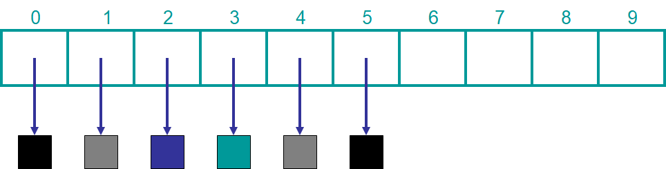
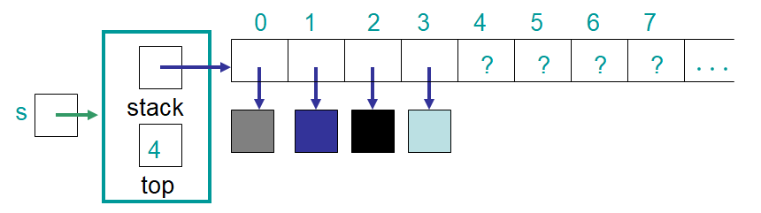
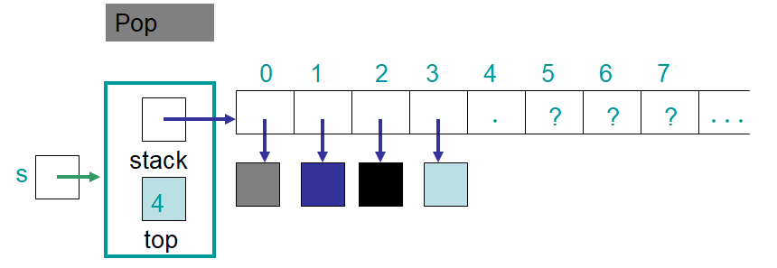
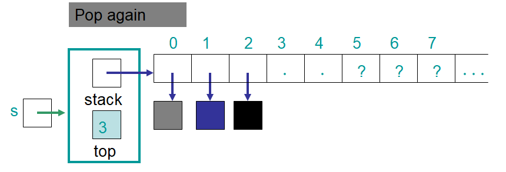
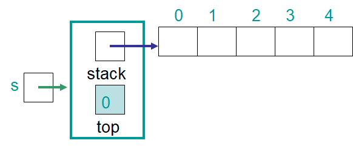

**********
ArrayStack
**********

* Having seen *what* a stack can do
* It is time to start discussing *how*
* There are a few implementation issues to consider

    * How is the data going to be stored?
    * How will the top of the stack be managed?

Implementing a Stack with an Array
==================================

* Arrays are great for storing contiguous data

    An array of size 10 storing references to six elements. The references to the six elements are stored within the
    array indices 0 -- 5.

* If an array is used for storing the data in the stack, how should the top of the stack be kept track of?
* One way would be to have the top of the stack always be index ``0``

    * Pro --- Always know where the top is
    * Con --- Every ``push`` and ``pop`` requires all elements within the stack to be moved

        * If there are :math:`n` elements in the stack, all must be moved

* Another option is to have the top be the other end

    * Pro --- No need to move anything for a ``push`` or ``pop``

        * If there are :math:`n` elements in the stack, none need to move

    * Con --- Must keep track of which index the top currently is

* Although both strategies work, the latter will be used since the ``push`` and ``pop`` operations require less work

Implementation Issues
---------------------

* An array will be used to hold the data
* The ``top`` will always refer to the *next available spot* in the array
* Due to zero based indexing, the value of ``top`` will also correspond to the number of elements in the stack
* All ``push`` operations will happen at the ``top`` index and require an update to ``top``
* All ``pop`` operations will happen at the ``top - 1`` index and require an update to ``top``

    An example ``ArrayStack`` containing four elements. Note the value stored in ``top`` refers to the next available
    spot in the array --- where the next pushed element would go. Also notice that the value in ``top`` corresponds to
    the number of elements currently in the stack.

.. figure:: arraystack1.png
    :width: 500 px
    :align: center

    The state of the ``ArrayStack`` after an element was pushed. Note that the value of ``top`` was increased by one
    such that it refers to the next available spot in the array.

    The state of the ``ArrayStack`` after an element was popped. Note that the value of ``top`` was decreased by one.

    The state of the ``ArrayStack`` after another element was popped. Note that, again, the value of ``top`` was
    decreased by one such that it refers to the next available spot in the array.

Implementation
==============

* The ``ArrayStack`` class will *implement* the ``Stack`` interface

    * This ensures that the ``ArrayStack`` implementation actually implements the operations required to make it a ``Stack``

        * The ``ArrayStack`` **is a** ``Stack``
        * Anything expecting a ``Stack`` will be happy getting an ``ArrayStack`` since **it is a stack**

    * Note line 10 in the below example where it specifies that the ``ArrayStack<T> implements Stack<T>``

* The fields are

    * An integer ``top`` to keep track of where the top of the stack is
    * The ``stack`` array to hold the elements in the stack

        * Since the ``ArrayStack`` is generic its type is ``T``

.. literalinclude:: /../main/java/ArrayStack.java
    :language: java
    :linenos:
    :lineno-start: 10
    :lines: 10-14
    :emphasize-lines: 1

.. warning::

    When starting to implement an interface, the IDE may produce a error saying that the interface is not implemented.
    This is because Java is expecting all abstract methods from the interface to be implemented. This error will go away
    once all abstract methods are implemented.

        .. figure:: warning_implement.png
            :width: 500 px
            :align: center

            Example of the error IntelliJ will produce if not all abstract methods from the ``Stack`` interface are
            implemented.

Constructors
------------

* Like the ``ContactList`` example, there will be two constructors

    * One making use of the default value
    * The other to create an array of a specified starting capacity

.. literalinclude:: /../main/java/ArrayStack.java
    :language: java
    :linenos:
    :lineno-start: 16
    :lines: 16-34
    :emphasize-lines: 5, 18

* This is making use of :doc:`constructor chaining </topics/objects-review/chaining>`
* Notice that the array being created is an array of type ``Object`` that is ``cast`` to the generic type ``T``

    * Java forbids creating a generic array
    * `Details are outside the scope of this topic and likely class <https://dzone.com/articles/covariance-and-contravariance>`_

* When doing this, Java will warn that there is now an unchecked type conversion

    * Java can't guarantee that the cast will work right

* This can be ignored, however, the warning may be suppressed by adding the following before the constructor

    * ``@SuppressWarnings("unchecked")``

* Creating an instance ``Stack<Integer> s = new ArrayStack<>(5);``

    A visualization of an ``ArrayStack`` created with a starting capacity of ``5``. The instance ``s`` could have been
    created with ``Stack<Integer> s = new ArrayStack<>(5);``. Although the type ``Integer`` is specified in the
    declaration, there is nothing within the figure to indicate that the elements within the stack would be of type
    ``Integer``.

``Push``
--------

.. literalinclude:: /../main/java/ArrayStack.java
    :language: java
    :linenos:
    :lineno-start: 36
    :lines: 36-56
    :emphasize-lines: 1, 3, 4, 5, 15

* Notice the ``@Override`` annotation before the ``push`` method

    * This tells the compiler that the method ``push`` from the interface is being overridden
    * It is not required to include this annotation, but it can help eliminate errors

* Like the ``ContactList`` example, a private ``expandCapacity`` method is included

    * If trying to ``push`` to a stack that has a full ``stack`` array, ``expandCapacity`` is called
    * The private ``expandCapacity`` method will

        * Make a new and larger array
        * Copy the contents of the old ``stack`` array to the new array
        * Set the field ``stack`` to reference the new larger array

``Pop`` and ``Peek``
--------------------

* The ``pop`` and ``peek`` methods will be similar, except peek leaves the stack unchanged

.. literalinclude:: /../main/java/ArrayStack.java
    :language: java
    :linenos:
    :lineno-start: 58
    :lines: 58-75
    :emphasize-lines: 3, 4, 5, 14, 15, 16

Exceptional Situations
^^^^^^^^^^^^^^^^^^^^^^

* What should happen if someone tries to ``pop`` or ``peek`` from an empty stack?

    * Ignore it and do nothing?
    * Crash the program?
    * Something else?

* What should be done in this situation is not up to those implementing the stack
* As a rule, one should follow `the principal of least surprise <https://en.wikipedia.org/wiki/Principle_of_least_astonishment>`_

* Consider someone using the ``ArrayStack`` class --- should they ever expect to get nothing back when requesting the top?

    * No --- the ``pop`` and ``peek`` methods explicitly say they return a value

* Perhaps it's more reasonable to assume that the request was invalid in the first place

    * An exceptional thing happened

* Remember, the ``ArrayStack`` is designed to be general purpose and can be used in many situations
* What should be done when calling ``pop`` or ``peek`` on an empty stack will depend on the specific situation

* The point is, when implementing the ``ArrayStack``, it is not possible to know what should be done in the exceptional situation
* What can be done, however, is to throw an exception to inform the user that something exceptional happened
* Then it is up to the user to deal with the exceptional situation as they see fit

``size`` and ``isEmpty``
------------------------

.. literalinclude:: /../main/java/ArrayStack.java
    :language: java
    :linenos:
    :lineno-start: 77
    :lines: 77-85
    :emphasize-lines: 3

* Notice how, because of zero based indexing, ``top`` is both

    * The index of the next available spot in the ``stack`` array
    * The number of elements in the stack

``toString``
------------

.. literalinclude:: /../main/java/ArrayStack.java
    :language: java
    :linenos:
    :lineno-start: 87
    :lines: 87-95
    :emphasize-lines: 6

* Ideally the top element in the stack would be the left most element in the string representation of a stack
* However, index ``0`` in the ``stack`` array is the bottom of the stack
* For this reason, each element is inserted to the front of the string builder

``equals`` and ``hashCode``
---------------------------

.. literalinclude:: /../main/java/ArrayStack.java
    :language: java
    :linenos:
    :lineno-start: 97
    :lines: 97-116
    :emphasize-lines: 10

* Two ``ArrayStack`` objects are considered equal if the contents of the ``stack`` arrays are equal

.. note::

    Like the other methods in the class, the ``@Override`` annotation on the ``toString``, ``equals``, and ``hashCode``
    methods tell the compiler that the method is overriding one in another class. However, unlike ``push``, ``pop``,
    ``peek``, ``size``, and ``isEmpty`` methods, the overridden methods are not from the ``Stack`` interface, but the
    ``Object`` class. All classes inherit from the ``Object`` class which has implementations of the ``toString``,
    ``equals``, and ``hashCode`` methods.

For Next Time
=============

* Download and play with

    * :download:`Stack </../main/java/Stack.java>`
    * :download:`ArrayStack </../main/java/ArrayStack.java>`
    * :download:`ArrayStack </../main/java/PlayingArrayStack.java>`

* :doc:`Check out the aside on testing <unit-tests>`
* Download and run the :download:`ArrayStackTest </../test/java/ArrayStackTest.java>` tests
* Finish reading Chapter 3

    * 16 pages

Playing Code
============

* If everything was done correctly, the following code from ``PlayingArrayStack`` should work

.. literalinclude:: /../main/java/PlayingArrayStack.java
   :language: java
   :linenos:
