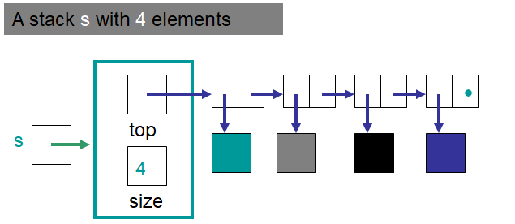
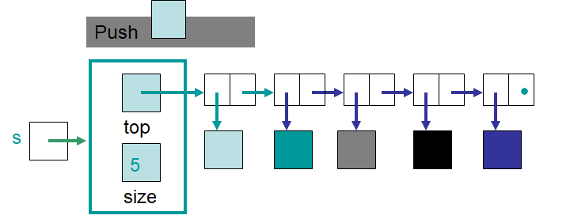
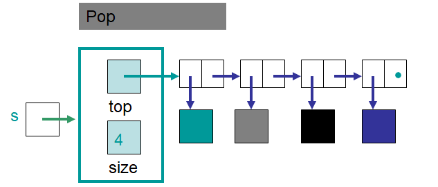
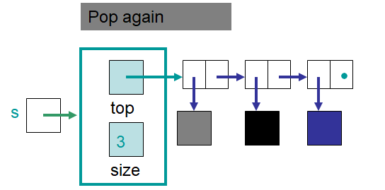

***********
LinkedStack
***********

* The ``Stack`` was defined with an interface
* An array based implementation of the stack was created --- ``ArrayStack``
* Now, being aware of linked structures, a linked based stack may be implemented --- ``LinkedStack``

Stack ADT
=========

* :download:`The Stack interface was already written </../main/java/Stack.java>`

* Remember, based on the interface, a stack must implement the following methods

    * ``push``
    * ``pop``
    * ``peek``
    * ``isEmpty``
    * ``size``

* Also remember that the interface strictly defines the *what* and says nothing about the *how*

Implementing a Stack with a Linked Structure
============================================

* The top of the stack will be managed by a field called ``top`` that is a reference to the head of a linked structure
* All pushing and popping will happen at the head end of the linked structure
* An additional field will be needed to keep track of the size of the stack

    An example ``LinkedStack`` containing four elements. Note the value stored in ``top`` is a reference to a ``Node``
    object that contains the element on the *top* of the stack.

    The state of the ``LinkedStack`` after an element was pushed. Note that ``top`` changed to reference a new ``Node``
    containing the newly pushed element.

    The state of the ``LinkedStack`` after an element was popped. Note that ``top`` changed to reference the ``Node``
    that was after the ``Node`` that contained the element on the top of the stack (the ``Node`` that was removed).

    The state of the ``LinkedStack`` after another element was popped. Note that, again, ``top`` changed to reference
    the ``Node`` that was after the ``Node`` that contained the element on the top of the stack.

Implementation
==============

.. code-block:: java
    :linenos:

    import java.util.NoSuchElementException;

    public class LinkedStack<T> implements Stack<T> {

        private Node<T> top;
        private int size;

        public LinkedStack() {
            top = null;
            size = 0;
        }

* Like the ``ArrayStack``, we want our ``LinkedStack`` to implement the ``Stack`` interface
* The constructor starts the stack as empty with nothing on it

Push
----

.. code-block:: java
    :linenos:
    :emphasize-lines: 4, 5

        @Override
        public void push(T element) {
            Node<T> toPush = new Node<T>(element);
            toPush.setNext(top);
            top = toPush;
            size++;
        }

* In ``push``, notice how this is just *adding to the front of a linked structure*

Pop & Peek
----------

.. code-block:: java
    :linenos:
    :emphasize-lines: 7

        @Override
        public T pop() {
            if (isEmpty()) {
                throw new NoSuchElementException();
            }
            T returnElement = top.getData();
            top = top.getNext();
            size--;
            return returnElement;
        }

        @Override
        public T peek() {
            if (isEmpty()) {
                throw new NoSuchElementException();
            }
            return top.getData();
        }

* Like the ``ArrayStack``, popping or peeking from an empty stack throws an exception
* Notice how ``pop`` does a *remove/delete from the front of a linked structure*

Size and isEmpty
----------------

.. code-block:: java
    :linenos:

        @Override
        public boolean isEmpty() {
            return size == 0;
        }

        @Override
        public int size() {
            return size;
        }

* The ``LinkedStack`` is empty if its ``size == 0``
    * Can you think of another way to check if it's empty?

toString
--------

.. code-block:: java
    :linenos:

        @Override
        public String toString() {
            StringBuilder builder = new StringBuilder();
            builder.append(", ");
            Node<T> currentNode = top;
            while (currentNode != null) {
                builder.insert(0, currentNode.getData());
                builder.insert(0, ", ");
                currentNode = currentNode.getNext();
            }
            builder.delete(0, 2);
            builder.append("<-- Top");
            return builder.toString();
        }

* It's a little ugly here
* We have it matching the output format that the ``ArrayStack``'s ``toString`` had

For Next Time
=============

* Look into the :doc:`nested node class aside. <nested>`
* Download and play with the :download:`LinkedStack </../main/java/LinkedStack.java>` code
* Download and run the :download:`LinkedStackTest </../test/java/LinkedStackTest.java>` tests
* Read Chapter 4 Section 6

    * 13 pages

Playing Code
============

* One could use the same code from ``PlayingArrayStack`` to play with the ``LinkedStack``
* Only need to make one change

    * ``ArrayStack`` -> ``LinkedStack``

* If everything was done correctly, the following code from ``PlayingLinkedStack`` should work

.. literalinclude:: /../main/java/PlayingLinkedStack.java
   :language: java
   :linenos:
