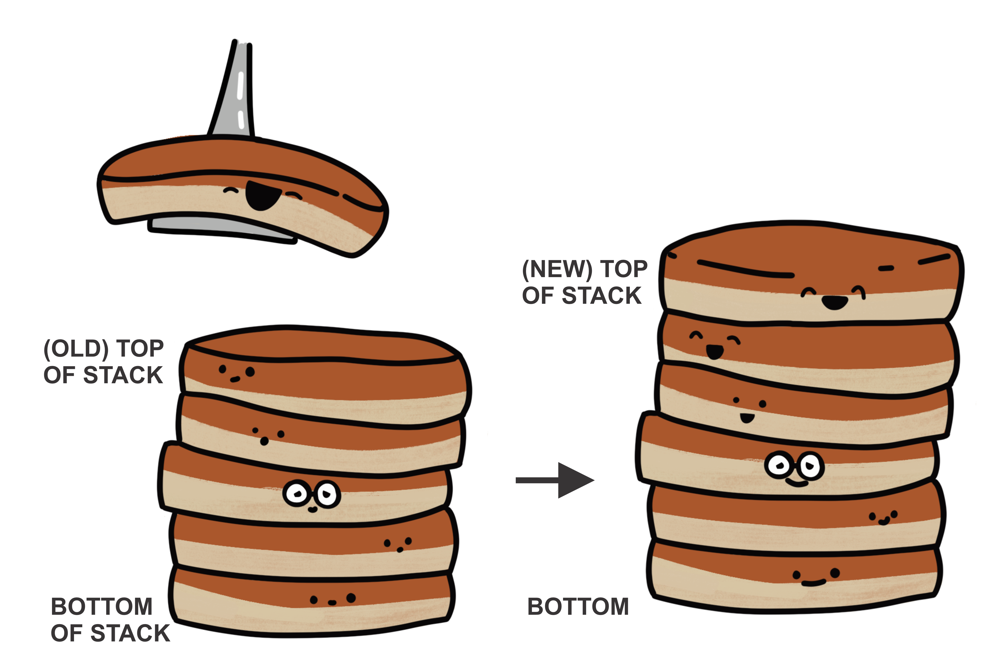
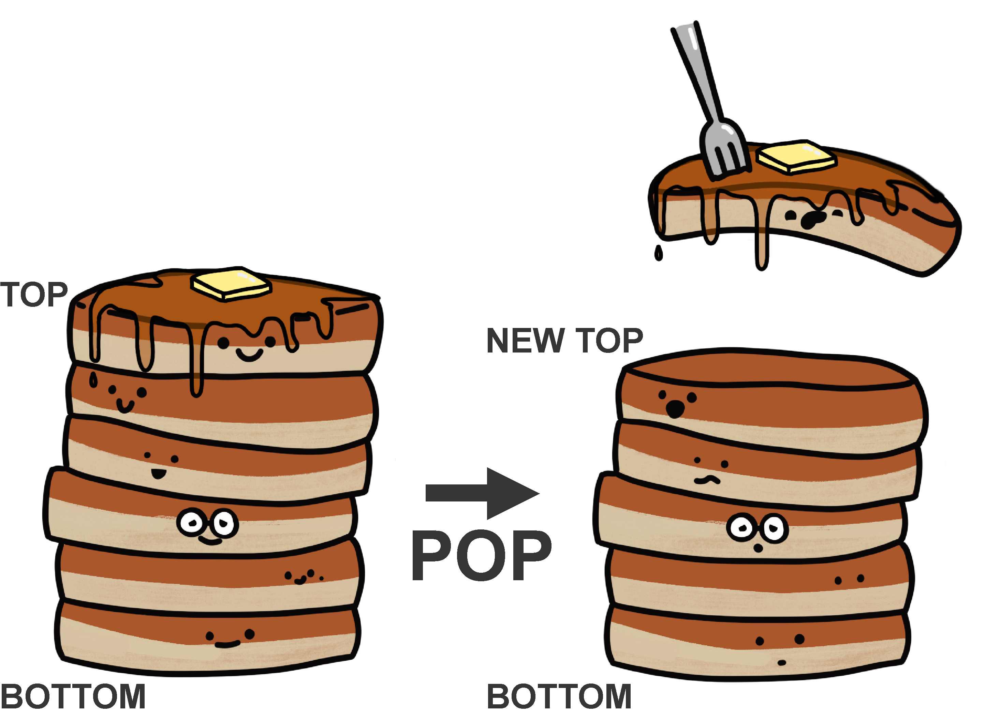

*************
The Stack ADT
*************

* Stacks are a linear collection of elements
* All adding and removing of elements happens at one end of the stack --- the *top*

    * All elements are pushed (added) to the top of the stack
    * All elements are popped (removed) from the top of the stack

* Given this, the **L**\ ast thing **I**\ n will be the **F**\ irst thing **O**\ ut

    * LIFO

* Consider the following examples of stacks

    * A stack of plates that you'd see at a buffet
    * Webpage history with the back button
    * Undo in your text editor
    * Callstack

    Adding (pushing) to the top of a stack.

    Removing (popping) from the top of a stack.

Stack Operations
================

Collection Operations
---------------------

* In general, for the collections being discussed in this course, there needs to be a way to

    * Add something to the collection
    * Remove something from the collection
    * Look at something, but do not remove it
    * Check if the collection is empty
    * Determine the number of things in the collection

* However, the way these are done may differ between the different types of collections

* Additionally, it may be helpful to

    * Generate a string representation of the collection --- ``toString``
    * Check if two collections are equal --- ``equals``

Stack Context
-------------

* Push

    * Add an element to the collection
    * The element added will be the new top of the stack

* Pop

    * Remove an element from the collection
    * The removed element will be from the top of the stack
    * The element after the removed element will be the new top, if it exists
    * The element removed is returned

* Peek

    * Return the element on the top of the stack, but leave it on the stack
    * Peeking does not alter the stack

.. note::

    It is against this definition of a stack to access anything from anywhere other than the *top* of the stack.

Stack ADT
---------

* The above describes the *what* of the stack

    * What can a stack do

* Notice how none of the above explains a single thing about *how* the stack is implemented

    * Nothing about where the data is stored
    * Nothing about how the operations do what they do

* Also notice that this has nothing to do with Java

    * Or Python
    * Or C++
    * Or ...

* This is just the definition of the stack ADT

Example Use
===========

* With only the *what*, it is possible to solve complex problems

Maze Solving
------------

    .. figure:: maze.png
        :width: 250 px
        :align: center

        A 6x7 maze. The green and red cells represent the start and end locations respectively. Black cells represent
        walls and light blue represent open spaces.

* Finding a path through a maze can be done with a simple *depth first search* algorithm
* The high-level idea is simple

    * Pick a path not visited yet
    * Keep travelling down the path until the end or a dead end is found
    * If the end is found, done
    * If a dead end is found, backtrack until another available unvisited path is found
    * Repeat

* The backtracking is handled by a stack

    * The top of the stack is the last thing (cell from a pathway) visited
    * The thing after/below the top is the second last thing (cell from a pathway) visited
    * ...

* Thus, backtracking is done by

    * Popping from the stack
    * Checking if the new top has any available unvisited paths

Algorithm for Traversing a Maze
^^^^^^^^^^^^^^^^^^^^^^^^^^^^^^^

.. code-block:: text
    :linenos:

    Add the start of the maze to the stack

    While the stack is not empty
        Get the top of the stack with a peek (current cell)
        If the top is the end
            done

        If an unvisited neighbour of the current cell exists
            Push the neighbour onto the stack

        Otherwise, if no admissible neighbour exists
            Pop from the stack

    If the loop ever exists because of an empty stack, there is no solution

Example
^^^^^^^

    .. figure:: maze_animate.gif
        :width: 250 px
        :align: center

        Animation of a depth first search through a 6x6 maze. The green and red cells represent the start and end
        locations respectively. Black cells represent walls and light blue represent open spaces. Purple represents the
        current location in the maze (top of the stack), grey represent spaces in a pathway being explored (currently
        within the stack, but not the top), and orange represents spaces that were part of a dead end path (popped from
        the stack).

* Try to see where the ``push``, ``pop``, and ``peek`` operations are happening
* Again, notice that this algorithm was described with only the *what* of a stack

    * There was no need to know how the stack was implemented in order to use it to solve a problem

Interface
=========

* There are many possible ways one could implement a stack data structure
* But, all implementations must be a *stack*

    * They must follow definition of what a stack ADT is

* In Java, one can create an **interface** that defines what the operations of the stack ADT are
* However, the interface only defines the *what*

    * Interfaces do not define the *how*

* If someone wants to implement the *how* of a stack ADT, they implement the interface

    * The interface dictates what must be implemented
    * If the implementation does not implement the interface completely, a compile time error will occur

* Ultimately, an interface is simply a list of *abstract methods* and relevant constants

    * Abstract methods are the method signature with no actual body

        * ``int someMethod(int a, int b);``
        * No visibility modifier is included as it must be public

    * Relevant constants will be ``static final``

Stack Interface
---------------

* Below is the Stack interface

    * It only includes the *what*
    * No actual implementation of any method is included

.. code-block:: java
    :linenos:

    public interface Stack<T> {

        // Javadoc comments within Stack.java file
        boolean push(T element);
        T pop();
        T peek();
        boolean isEmpty();
        int size();
    }

Generics
========

* The use of ``<T>`` is something new and not an idea discussed yet
* This is probably best explained with an example

* Imagine someone wanted to have a stack of type ``Integer``

    * ``public boolean push(Integer element);``
    * ``public Integer pop();``
    * ...

* Then, maybe someone else wants to make a stack of ``String`` objects

    * ``public boolean push(String element);``
    * ``public String pop();``
    * ...

* Then maybe a stack of ``Friend`` objects

    * ``public boolean push(Friend element);``
    * ``public Friend pop();``
    * ...

* This would require three unique interfaces (and implementations) for the stack

There has to be a Better Way!
-----------------------------

* There is --- **generics**

* ``<T>`` is a stand-in for a specific type that can be specified later when the stack is created

    * It can be thought of like a variable, but for a type

* Although jumping ahead a little, consider the following example

    * ``ArrayStack`` is discussed in the following topic

.. code-block:: java
    :linenos:

    public class SomeClass {
        public static void main(String[] args) {
            Stack<Integer> myIntegerStack = new ArrayStack<Integer>();
            Stack<String> myStringStack = new ArrayStack<String>();
            Stack<Friend> myFriendStack = new ArrayStack<Friend>();
        }
    }

* When creating an instance of the stack, the type is specified within the ``<`` and ``>`` symbols

    * This will be discussed more in the following topic

* In the above example, with the use of generics

    * Three different stacks are created, each with a different type of object as its contents
    * Only one interface (and implementation) is needed for all three

.. note::

    The inclusion of ``<Type>`` on the instantiation side is not actually needed as Java can infer the type. Going
    forward, for simplicity, Java's *diamond operator* (``<>``) will be used, like so:

        .. code-block:: java
            :linenos:

                    Stack<Integer> myIntegerStack = new ArrayStack<>();
                    Stack<String> myStringStack = new ArrayStack<>();
                    Stack<Friend> myFriendStack = new ArrayStack<>();

.. warning::

    It is not possible to use primitive types (``int``, ``double``, ``boolean``, etc.) in generics. Instead, use the
    object version of the primitive type (``Integer``, ``Double``, ``Boolean``, etc).

For Next Time
=============

* Checkout the :doc:`Postfix expression evaluation stack example <postfix>`
* Read Chapter 3 Sections 2 -- 6

    * 13 pages

Playing Code
------------

* Download and play with the :download:`Stack.java</../main/java/Stack.java>` interface