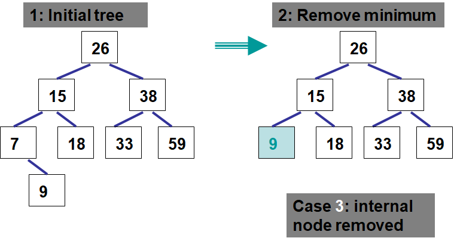

*******************
Binary Search Trees
*******************

* With binary trees covered, a more specific type of binary trees can be discussed

    * Namely, the binary *search* tree

* Compared to a binary tree, binary *search* trees have specific properties and constraints that must be followed
* These properties and constraints can be taken advantage of for improvements in certain functionality

Binary Search Tree Definition
=============================

* A binary *search* tree is a binary tree where:

    * All values in the left subtree are less than the value in the root node
    * All values in the right subtree are greater than or equal to the value in the root node

.. note::

    One could make the left subtree less than or equal to and the right subtree strictly greater than. All that matters
    is that only on subtree includes the *equal to* part.

    Alternatively, one could make the right subtree exclusively greater than, but this would disallow duplicates.

.. figure:: binary_search_tree_no_yes.png
    :width: 500 px
    :align: center

    Two binary trees. The binary tree on the left is a binary search tree. The binary tree on the right is **not** a
    binary search tree. This is because the value 16, which is in the left subtree of the subtree with the root 15,
    violates this property --- 16 is greater than 15, thus 16 must be to the right of 15 if it was a binary search tree.

    Arbitrary binary search tree.

* In the above example, note that the leftmost node is the smallest value in the tree and the rightmost is the largest

A Binary Search Tree is a Binary Tree
-------------------------------------

* A binary search tree is a special case of a binary tree

    * Therefore, it will have all the operations a binary tree would have

* But a few additional operations will be added

    * Add, but based on the important ordering
    * Remove, but must preserve ordering
    * Remove max
    * Remove min

Searching a Binary Search Tree
==============================

* The special ordering property enables a more efficient search through the tree when compared to a search regular binary tree
* For this section, assume the use of a linked implementation of a binary search tree

    * More on this below

Naive Search
------------

* Since the binary search tree is a binary tree, the search discussed in the previous topic can be used
* This search strategy has a computational complexity of :math:`O(n)`, where :math:`n` is the number of nodes in the tree

.. code-block:: java
    :linenos:

    public boolean contains(T needle) {
        return contains(root, needle);
    }

    private boolean contains(Node<T> current, T needle) {
        if (current == null) {
            return false;
        } else if (Objects.equals(current.getData(), needle)) {
            return true;
        } else {
            return contains(current.getLeft(), needle) || contains(current.getRight(), needle);
        }
    }

Binary Search
-------------

.. figure:: binary_search_tree_binary_search0.png
    :width: 250 px
    :align: center

    Arbitrary binary search tree.

* Consider the above binary search tree
* Based on the special ordering binary search trees have, can an improved search be devised?

    * **Hint:** If looking for a number greater than 14, which subtree must the element be in if it exists in the tree?

.. literalinclude:: /../main/java/LinkedBinarySearchTree.java
    :language: java
    :lineno-match:
    :lines: 235-261

* Notice the similarity between the naive search and the binary search
* They are nearly the same, except that the naive search may search both subtrees
* However, the binary search will only ever travel down one subtree due to the ``if`` statements on the value of ``comparison``

.. figure:: binary_search_tree_binary_search1.png
    :width: 250 px
    :align: center

    Traversal through the tree while searching for the value 12 and 13.

* In the above example, if searching for the number 12, it can be concluded that it exist in the tree since

    * 12 is less than 14, so it must be in the left subtree of the node containing 14
    * 12 is greater than 8, thus it must be in the right subtree
    * 12 is equal to 12, therefore we conclude that we found it

* If, however, searching for the number 13, it can be concluded that it must not exist in the tree since

    * 13 is less than 14, so it must be in the left subtree of the node containing 14
    * 13 is greater than 8, thus it must be in the right subtree
    * 13 is greater than 12, therefore it must be in the right subtree
    * 12 has no right subtree, therefore 13 must **not** be in the tree

.. figure:: binary_search_tree_binary_search2.png
    :width: 250 px
    :align: center

    Traversal through the tree while searching for the value 22.

* In the above example, if searching for the number 22, it can be concluded that it must not be in the tree since

    * 22 is greater than 14, so go right
    * 22 is less than 26, go left
    * 22 is greater than 19, so go right
    * 22 is less than 23, so go left
    * 23 has no left subtree, therefore 22 must **not** be in the tree

Binary Search Tree Operations
=============================

* Getting the size of the collection, checking if it's is empty, and getting iterators should be relatively simple by this stage
* The adding to and removing from the binary search tree is where the complexity comes in

Add
---

* Adding is going to be similar to a binary search
* Do a binary search until there is no child
* Insert the element where the child does not exist
* New nodes will be added as a leaf

.. code-block:: text
    :linenos:

    Define add
        If the node does not exist
            Insert the new node here with the element to be added

        If the node exists
            If the element is less than the node
                Call add on the left child node

            If the element is greater than or equal to the node
                Call add on the right child node

* Starting an existing binary search tree, follow the pseudocode to add the value 13

    Adding the value 13 to a binary search tree.

* Starting with an empty tree, follow the pseudocode to add the following 6 elements

.. figure:: binary_search_tree_add1.png
    :width: 666 px
    :align: center

    The creation of a binary search tree by starting with an empty tree and adding the elements 26, 15, 38,, 31, 7, and
    34. Note that when the value 26 is added, it is being added to an empty tree, thus the root node does not exist.

Min & Remove Min
----------------

* Given the nature of the binary search tree ordering, the node with the minimum element **must** be in the leftmost node in the tree
* There are three cases to consider when looking for the minimum node:

    #. The leftmost node is the root (root has no left child)
    #. The leftmost is a leaf node (no children)
    #. The leftmost node is an interior node

* Finding the minimum is simple

    * Assuming a root node exists, keep going to the left subtree until there is no more left subtree

* Removing will be a little trickier since it may be removing something that has children that must remain in the tree
* And further, not only must the children stay in the tree, but the proper binary search tree ordering **must** be preserved
* Consider the following examples and think of how one would need to manage potential children of a node being removed

.. figure:: binary_search_tree_remove_min1.png
    :width: 500 px
    :align: center

.. figure:: binary_search_tree_remove_min2.png
    :width: 500 px
    :align: center

**Case 1**

* The minimum value is in the root node, this means that

    * There is no left subtree
    * There *may* be a right subtree
    * Therefore, simply replace the root with the root of the right subtree (which may be null)

* The ordering is preserved since

    * Nothing is to the left of the root
    * Everything to the right of the root is larger than the value in the root
    * The right subtree is a binary search tree (by definition)
    * Therefore, if the right subtree becomes the new root, the binary search tree's order will be maintained

**Case 2**

* The minimum is a leaf node, this means that

    * There are no children to deal with
    * Therefore, just remove the node

* By eliminating only a leaf node, the ordering will not be affected

**Case 3**

* The minimum is an interior node, this means that

    * The node has no left subtree --- otherwise the node would not contain the minimum value since the minimum **must** be the leftmost node
    * A right subtree exists
    * Therefore, replace it with the node's right subtree's root

        * The node being removed's parent's left child will become the node being removed's right child

* The ordering is preserved in the same way as case 1

    * Nothing is to the left of the node
    * Everything to the right of the node to be removed is larger than the value in the node
    * The right subtree is a binary search tree (by definition)
    * Therefore, if the right subtree replaces the node being removed, the binary search tree's order will be maintained

**All the Cases are the Same?**

* One may have noticed that the rules for each case are actually the same
* Replace the node with the right subtree's root
* This is perhaps more obvious for cases 1 and 3

    * Consider that a leaf node's right subtree is ``null``

Max & Remove Max
----------------

* Finding and/or removing the maximum value will be very similar to finding and/or removing the minimum
* Instead of always going to the left subtree, go to the right to find the maximum
* There are still the three cases to deal with, but like with minimum, they can all be addressed in the same way

    * Replace the node with the *left* subtree's root

General Remove
--------------

* A general remove is a little more complex than the remove min or max

    How would one remove the value 26, which happens to be the tree's root, from this binary search tree?

* In the above example, there may not be an immediately obvious or clear way to address the problem

**Case 1**

* If the node being removed is a leaf node, then simply remove it

    * In the above example, if 7 or 34 is to be removed, just remove it

**Case 2**

* If the node being removed is an interior node, then things get hairy
* In some cases this may seem simple --- if 15 is removed, just replace it with it's child
* But what happens if removing 26 from the tree?

* The trick here is to replace the node with its inorder predecessor or successor
* If 26 is removed

    * 15, the value in the tree that comes right before 26, could replace it
    * Or 31, the value in the tree that comes right after 26, could replace it

* The reason this will work is, if looking for the predecessor

    * All values in the left subtree are smaller than the root and everything in the right subtree
    * The largest value in the left subtree will be greater than or equal to all other values in the left subtree
    * The largest value in the left subtree will be less than all values in the right subtree
    * Therefore, the largest value in the left subtree can replace 26 without destroying the ordering since

        * It's greater than or equal to everything in the left subtree
        * And smaller than everything in the right subtree

* Below is an example of removing multiple elements from a binary search tree

Contains
--------

* Like the other data structures, a way to check if a given element exists within the collection is needed
* Although an exhaustive depth first search through the tree would work, as discussed for the general binary tree would work

    * :math:`O(n)`

* Here, due to the nature of the binary search tree ordering, a binary search can be used

    * :math:`O(log_{2}(n))`

Counting the Number of a Given Element
--------------------------------------

* Similar to contains, to count the number of times a given element exists within a binary search tree, a binary search can be used
* However, instead of returning ``True`` or ``False`` as soon as the element is found, continue the search after finding an element to continue counting

.. _label-binary_search_trees-balanced:

Degenerate vs. Balanced
=======================

* A *balanced* tree has the property that for any node in the tree, the height of its left and right subtrees can differ by **at most** 1

    * Remember, the height of an empty tree is 0

.. figure:: binary_search_tree_balance.png
    :width: 500 px
    :align: center

    The left tree is balanced as the heights of all subtrees in the tree differ by no more than 1. The tree on the right
    is **not** balanced since the root's left subtree has a height of 0 and the right subtree has a height of 2 --- a
    difference greater than 1.

* The balanced property is important since it's part of the reason the binary search tree is efficient to search
* Consider adding the numbers ``3, 5, 9, 12, 18, 20`` in that order to an empty binary search tree

    An extreme example of an imbalanced binary search tree. This was caused by adding the elements
    ``3, 5, 9, 12, 18, 20`` in order. Each element added is larger than all elements in the tree, which causes each
    newly added element to be added to the right subtrees.

* This particular case is called a *degenerate* binary tree

    * It's effectively a linear data structure, not a tree

.. figure:: binary_search_tree_complexity.png
    :width: 250 px
    :align: center

* Consider a binary search
* With a balanced binary search tree, going to the left or right subtrees eliminates roughly half the elements

    * This is what gives the :math:`O(log(n))` search

* With a degenerate tree, where it's basically a linear data structure, all :math:`n` elements must be searched through

    * Only one element is eliminated from the search every time a node is investigated
    * Thus, the search through a degenerate tree would be :math:`O(n)`

* Fortunately there exist strategies for keeping binary search trees balanced, but these are outside the scope of this course

    * Two popular examples are *AVL Trees* and *Red-Black Trees*

For next time
=============

* Have a look at the :download:`BinarySearchTree </../main/java/BinarySearchTree.java>` interface
* Have a look at the :download:`LinkedBinarySearchTree </../main/java/LinkedBinarySearchTree.java>` implementation
* Check out :download:`LinkedBinarySearchTreeTest </../test/java/LinkedBinarySearchTreeTest.java>`

For Next Time
=============

* Read Chapter 11 Sections 1 -- 3

    * 17 pages

Playing Code
------------

* Download and play with

    * :download:`BinarySearchTree </../main/java/BinarySearchTree.java>`
    * :download:`LinkedBinarySearchTree </../main/java/LinkedBinarySearchTree.java>`
    * :download:`LinkedBinarySearchTreeTest </../test/java/LinkedBinarySearchTreeTest.java>`