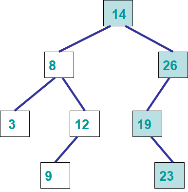

*******************
Binary Search Trees
*******************

* Now that we have covered binary trees, we can look at more specific types of binary trees
    * Namely, the binary *search* tree

* Compared to a binary tree, binary *search* trees have specific properties and constraints that must be followed
* We can take advantage of these properties and constraints for extra improvements in certain functionality

Binary Search Tree Definition
=============================

* A binary *search* tree is a binary tree where:
    * All values in the left subtree are less than the value in the root node
    * All values in the right subtree are greater than or equal to the value in the root node

.. note::

    We could make the left subtree less than or equal to and the right subtree strictly greater than too. All that
    matters is that only on subtree includes the *equal to* part.

    Alternatively, we could make the right subtree exclusively greater than, but this would disallow duplicates.

* In the above example, the tree on the left is **not** a binary search tree since a value in the left subtree of the subtree with root 15 is greater than it (16)
* The left tree is an example of a binary search tree

    .. image:: binary_search_tree_base.png
       :width: 250 px
       :align: center

* In the above example, note that the leftmost node is the smallest value in the tree and the rightmost is the largest

A Binary Search Tree is a Binary Tree
-------------------------------------

* A binary search tree is a special case of a binary tree
    * Therefore, it will have all the operations we would want our binary tree to have

* But we will have a few additional operations
    * Add, but based on the important ordering
    * Remove, but must preserve ordering
    * Remove max
    * Remove min

Searching a Binary Search Tree
==============================

* The special ordering property allows us to search for items within the binary search tree more efficiently than a regular search through a tree
* For this section, we will assume we are using a linked implementation of a binary search tree
    * More on this below

Naive Search
------------

* Since the binary search tree is a binary tree, we could use the search presented in the previous topic
* Remember that this search strategy has a computational complexity of :math:`O(n)`, where :math:`n` is the number of nodes in the tree

.. code-block:: java
    :linenos:

    public boolean contains(T needle) {
        return contains(root, needle);
    }

    private boolean contains(Node<T> current, T needle) {
        if (current == null) {
            return false;
        } else if (current.getData().equals(needle)) {
            return true;
        } else {
            return contains(current.getLeft(), needle) || contains(current.getRight(), needle);
        }
    }

Binary Search
-------------

* Consider the above binary search tree
* Based on the special ordering binary search trees have, can you devise an improved search?
    * **Hint:** If I am looking for a number greater than 14, which subtree must the element be in if it exists in the tree?

.. code-block:: java
    :linenos:

    public boolean contains(T needle) {
        return binarySearch(root, needle) != null;
    }

    private boolean binarySearch(Node<T> current, T needle) {
        if (current == null) {
            return false;
        } else if (current.getData().equals(needle)) {
            return true;
        } else {
            if (current.getData().compareTo(needle) > 0) {
                return binarySearch(current.getLeft(), needle);
            } else {
                return binarySearch(current.getRight(), needle);
            }
        }
    }

* Notice the similarity between the naive search and the binary search
* They are nearly the same, except you will notice that, the naive search may search both subtrees
* However, binary search will only ever travel down one subtree due to the ``if (current.getData().compareTo(needle) > 0)`` statement

.. image:: binary_search_tree_binary_search1.png
   :width: 250 px
   :align: center

* In the above example, if we search for the number 12, we can conclude that it exist in the tree since
    * 12 is less than 14, so it must be in the left subtree of the node containing 14
    * 12 is greater than 8, thus it must be in the right subtree
    * 12 is equal to 12, therefore we conclude that we found it

* If, however, we search for the number 13, we can conclude that it must not exist in the tree since
    * 13 is less than 14, so it must be in the left subtree of the node containing 14
    * 13 is greater than 8, thus it must be in the right subtree
    * 13 is greater than 12, therefore it must be in the right subtree
    * 12 has no right subtree, therefore 13 must **not** be in the tree

* In the above example here, if we are searching for the number 22, we can conclude that it must not be in the tree since
    * 22 is greater than 14, so go right
    * 22 is less than 26, go left
    * 22 is greater than 19, so go right
    * 22 is less than 23, so go left
    * 23 has no left subtree, therefore 22 must **not** be in the tree

Binary Search Tree Operations
=============================

* Like most collections we've seen so far, we will want to be able to get the number of elements in it, check if it's empty, and get iterators
    * By this stage these should be simple

* We'll want to add and remove elements too, but this is where the complexity comes in

Add
---

* Adding is going to be similar to a binary search
* We do a binary search until there is no child
    * Assuming we allow duplicates
    * And elements we want to add that are equal to a given node go to the right subtree
    * If we ever find an element that is equal, we continue the search in the right subtree

* Insert the element where the child does not exist
* New nodes will be added as a leaf

* **In English, add would look something like this**
    * If the root of the (sub)tree is empty
        * Insert new node here with the data
    * If (sub)tree is not empty
        * If the element is less than the root of the (sub)tree, call **add** on left subtree
        * If the element is greater than or equal to the root of the (sub)tree, call **add** on right subtree

* Given the above pseudocode, consider adding 13 to the binary search tree

.. image:: binary_search_tree_add0.png
   :width: 250 px
   :align: center

* Starting with an empty tree, follow the pseudocode to add the following 6 elements

.. image:: binary_search_tree_add1.png
   :width: 666 px
   :align: center

Min & Remove Min
----------------

* Given the nature of the binary search tree ordering, the node with the minimum element **must** be in the leftmost node in the tree
* There are three cases we'll have to take care of when looking for the minimum node
    1. The leftmost node is the root (root has no left child)
    2. The leftmost is a leaf node (no children)
    3. The leftmost node is an interior node

* Finding the minimum is simple
    * Assuming a root node exists, keep going to the left subtree until there is no more left subtree

* Removing will be a little trickier since we may be removing something that has children that must remain in the tree
* And further, not only must the children stay in the tree, but the proper binary search tree ordering **must** be preserved

* Consider the following examples and think of how one would need to manage potential children of a node being removed

.. image:: binary_search_tree_remove_min0.png
   :width: 500 px
   :align: center

.. image:: binary_search_tree_remove_min1.png
   :width: 500 px
   :align: center

**Case 1**

* The minimum value is in the root node, this means that
    * There is no left subtree
    * There *may* be a right subtree
    * Therefore, we simply make the root of the right subtree (which may be null) the new root

* The ordering is preserved since
    * Nothing is to the left of the root
    * Everything to the right of the root is larger than the value in the root
    * The right subtree is a binary search tree (by definition)
    * Therefore, if the right subtree becomes the new root, the binary search tree's order will be maintained

**Case 2**

* The minimum is a leaf node, this means that
    * We have no children to deal with
    * Therefore, just remove the node

* By eliminating only a leaf node, the ordering will not be affected

**Case 3**

* The minimum is an interior node, this means that
    * The node has no left subtree --- otherwise the node would not contain the minimum value since the minimum **must** be the leftmost node
    * A right subtree exists
    * Therefore, remove the node and make the node's right subtree's root replace it
        * The node being removed's parent's left child will become the node being removed's right child

* The ordering is preserved in the same way as case 1
    * Nothing is to the left of the node
    * Everything to the right of the node to be removed is larger than the value in the node
    * The right subtree is a binary search tree (by definition)
    * Therefore, if the right subtree replaces the node being removed, the binary search tree's order will be maintained

**All the Cases are the Same?**

* You may have noticed that the rules for each case are actually the same
* Replace the node with the right subtree
* This is perhaps more obvious for cases 1 and 3, however, if one considers that a leaf node's right subtree is ``null``, all three cases can follow the same strategy
    * For all we know, if we have case 1, the right subtree may in fact be ``null``
    * Either way, replacing the node with the right subtree works

Max & Remove Max
----------------

* Finding and/or removing the maximum value will be very similar to finding and/or removing the minimum
* Instead of always going to the left subtree, we go to the right to find the maximum
* We still have the three cases, but like with minimum, they can all be addressed in the same way
    * Replace the node with the left subtree

* Here, we still keep the children (if they exist) and preserve the binary search tree ordering

General Remove
--------------

* A general remove is a little more complex than the remove min or max

.. image:: binary_search_tree_remove_uh.png
   :width: 250 px
   :align: center

* In the above example, there may not be an immediately obvious or clear way to address the problem

**Case 1**

* If the node we are trying to remove is a leaf node, then we simply remove it
    * In the above example, if we wanted to remove 7 or 34, we just take it out

**Case 2**

* If the node we are trying to remove is an interior node, then things get hairy
* In some cases this may seem simple --- if we remove 15, just replace it with it's child
* But what happens if we try to remove 26 from the tree?

* The trick here is to replace the node with its inorder predecessor or successor
* If we remove 26
    * We could replace it with 15, the value in the tree that comes right before 26
    * Or we could replace it with 31, the value in the tree that comes right after 26

* The reason this will work is, if I am looking for the predecessor
    * All values in the left subtree are smaller than the root and everything in the right subtree
    * The largest value in the left subtree will be greater than or equal to all other values in the left subtree
    * The largest value in the left subtree will be less than all values in the right subtree
    * Therefore, the largest value in the left subtree can replace 26 without destroying the ordering since
        * It's greater than or equal to everything in the left subtree
        * And smaller than everything in the right subtree

* Below is an example of removing multiple elements from a binary search tree

.. image:: binary_search_tree_remove1.png
   :width: 500 px
   :align: center

.. image:: binary_search_tree_remove2.png
   :width: 500 px
   :align: center

.. image:: binary_search_tree_remove3.png
   :width: 500 px
   :align: center

Contains
--------

* Like the other data structures, we will want to be able to check if a given element exists within it
* Unlike before, where we were doing a linear search through a linear data structure
* Or an exhaustive depth first search through a regular binary tree

* Here, due to the nature of the binary search tree ordering, we can simply do a binary search

Counting the Number of a Given Element
--------------------------------------

* Similar to contains, to count the number of times a given element exists within a binary search tree, we can do a binary search
* However, instead of returning ``True`` or ``False`` as soon as the element is found, continue the search after finding an element and keep track of the count as we go

* One trick here is, continue the search on the left or right subtree, depending on which side we choose to put duplicate values
    * For example, if we choose to always put a value equal to a given node's data to the right, we continue the search on the right subtree

.. _label-topic23-binary_search_trees-balanced:

Degenerate vs. Balanced
=======================

* A *balanced* tree has the property that for any node in the tree, the height of its left and right subtrees can differ by **at most** 1
    * Remember, the height of an empty tree is 0

* In the above example, the left tree is balanced since all subtrees in the tree differ in height by no more than 1
* The right tree is *not* balanced since the root's left subtree has height 0 and the right subtree has height 2
    * Difference of 2

* The balanced property is important since it's part of the reason the binary search tree is efficient to search

* Consider adding the numbers ``3, 5, 9, 12, 18, 20`` in that order to an empty binary search tree

.. image:: binary_search_tree_degenerate_animation.gif
   :width: 250 px
   :align: center

* This is an example we see an extreme case of imbalance
* This particular case is called a *degenerate* binary tree
    * It's effectively a linear data structure, not a tree

* If we have a balanced binary search tree, every time we decide to go to the left or right subtree, we eliminate roughly half the elements from the search
    * This is what gives us the :math:`O(log(n))` search

* If we have a degenerate tree, where it's basically a linear data structure, we would have to search through all :math:`n` elements,
    * Thus, the search through a degenerate tree would be :math:`O(n)`

* Fortunately there exist strategies for keeping our trees balanced, but these are outside the scope of this course
    * Two popular examples are *AVL Trees* and *Red-Black Trees*

For next time
=============

* Have a look at the :download:`BinarySearchTree </../main/java/BinarySearchTree.java>` interface
* Have a look at the :download:`LinkedBinarySearchTree </../main/java/LinkedBinarySearchTree.java>` implementation
* Check out :download:`LinkedBinarySearchTreeTest </../test/java/LinkedBinarySearchTreeTest.java>`
* Read Chapter 11 Sections 1 -- 3
    * 17 pages
