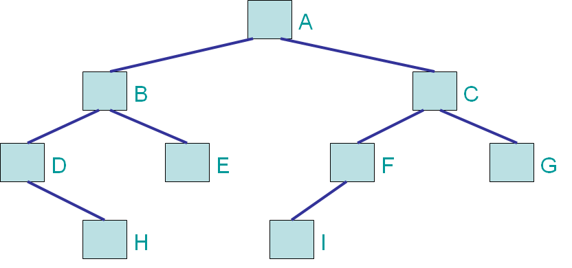
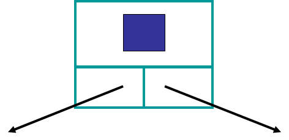

************
Binary Trees
************

* A general **tree** is one where each node can have any number of children

* An **n-ary** tree is one where each node has no more than :math:`n` children

Binary Tree Definition
======================

* A **binary** tree is one where each node has no more than two (2) children
    * 2-ary tree
    * Tree with a degree/arity of 2

* If a node has children, they are referred to as the *left* and *right* children
    * Which are also referred to as the left and right subtrees
    * In the above example, *B* is the left subtree and *C* is the right subtree of *A*

* In a binary tree, position matters --- it matters if a subtree is the left or right

* A recursive definition of a binary tree is
    * An empty tree
    * Or, a tree that has a root whose left and right subtrees are binary trees

.. note::

   Based on this information, what would a *unary* tree be?

.. _label-binary_trees-traversals:

Traversals
==========

.. image:: /topics/linked-structures/example1.png
   :width: 500 px
   :align: center

* With a simple linear structure, the order in which you traverse the nodes is rather natural
* Start at one end and go to the other
* For example, start at the head node and visit each node's next

* We could define other traversal orders if we wanted to, but that would be atypical

* With a nonlinear data structure like a binary tree, the order to traverse the nodes in is not immediately obvious
* We have a few common options to choose from

Pre-order
---------

* A pre-order traversal is a common order to traverse a binary tree
* The general idea is
    * Start at the root
    * *Access the node*, then go to the left child, then the right child

* To get more precise in a recursive definition

* **Preorder Traversal**
    * If the (sub)tree is not empty
        * Access the root of the (sub)tree
        * Do a **Preorder Traversal** on the left subtree
        * Do a **Preorder Traversal** on the right subtree

* Notice that the root of the (sub)tree is accessed before (*pre-*) any recursive calls

* With the definition of a pre-order traversal, what order would the nodes be visited?

    ``A, B, D, H, E, C, F, I, G``

In-order
--------

* An in-order traversal is another common traversal
* The general idea is
    * Start at the root
    * Go to the left child, *Access the node*, then the right child

* To get more precise in a recursive definition

* **Inorder Traversal**
    * If the (sub)tree is not empty
        * Do an **Inorder Traversal** on the left subtree
        * Access the root of the (sub)tree
        * Do an **Inorder Traversal** on the right subtree

* Notice that the root of the (sub)tree is accessed *in* between any recursive calls

* With the definition of a in-order traversal, what order would the nodes be visited?

    ``D, H, B, E, A, I, F, C, G``

Post-order
----------

* Take a wild guess at what this one will be

* A post-order traversal is another traversal
* The general idea is
    * Start at the root
    * Go to the left child, then the right child, then *Access the node*,

* To get more precise in a recursive definition

* **Postorder Traversal**
    * If the (sub)tree is not empty
        * Do an **Postorder Traversal** on the left subtree
        * Do an **Postorder Traversal** on the right subtree
        * Access the root of the (sub)tree

* Notice that the root of the (sub)tree is accessed after (*post-*) any recursive calls

* With the definition of a post-order traversal, what order would the nodes be visited?

    ``H, D, E, B, I, F, G, C, A``

Level-order
-----------

* A level-order traversal is a little different when compared to the others
* The search doesn't work it's way down each branch of the tree one by one
* Instead, it traverses the *breadth* of the tree on the way down all branches

* The idea is
    * Start at the root
    * Visit the nodes in each level from left to right

* With this idea, there is no immediately obvious recursive definition of this traversal
* An iterative definition of the traversal is perhaps simpler to derive

* **Levelorder Traversal**
    * If it exists, add the root to a *queue*
    * While the queue is not empty
        * Dequeue a node
        * Access the dequeued node
        * If it exists, enqueue the left child
        * If it exists, enqueue the right child

* With the definition of a level-order traversal, what order would the nodes be visited?

    ``A, B, C, D, E, F, G, H, I``

Iterative Pre/In/Post-Order
---------------------------

* With the iterative level-order traversal, we used a *queue*
* What do you think would happen if we switched it out for a stack?

* With the recursive pre-/in-/post-order traversals, we used the call stack
    * We didn't need an implementation of a stack data structure, but we could have used one

* How would we change the level-order traversal to do a pre-/in-/post-order traversal?

Traversal Analysis
------------------

* Consider a binary tree with :math:`n` nodes
* Without getting too deep into analysis territory, if we want to traverse all :math:`n` nodes, what is the computational complexity of
    * pre-order traversal?
    * in-order traversal?
    * post-order traversal?
    * level-order traversal?

* Intuitively, they're all :math:`O(n)` since we will need to visit each node once and only once

* If I change the question slightly, consider a binary tree with **height** :math:`h`
    * What is the computational complexity of the traversals?

* :math:`O(2^{h})`
* Why?
* Consider the relationship between the height of a binary tree and the number of nodes within the tree

Interface
=========

* What would we want to do with our binary trees?
    * Check if an element exists in the tree
    * Check if the tree is empty
    * Get the size of the tree (how many elements are in the tree)
    * Traverse the tree
    * Add an element
        * But where?
    * Remove an element
        * Which one? From where?

* With add and remove, what we want/what it means will depend on the type of binary tree
    * Adding/removing something to a stack and queue was more straightforward
        * Pushing and popping happened at the top of the stack
        * Enqueuing and dequeueing happen at opposite ends

* Similar to the bag, we know we want to add and remove stuff from our binary tree, but what exactly add and remove means may differ depending on the specific type of binary tree

.. code-block:: java
    :linenos:

    import java.util.Iterator;

    public interface BinaryTree<T> extends Iterable<T> {

        void add(T element);
        T remove(T element);
        T getRootElement();
        boolean contains(T element);
        boolean isEmpty();
        int size();
        Iterator<T> iterator();
        Iterator<T> preOrderIterator();
        Iterator<T> inOrderIterator();
        Iterator<T> postOrderIterator();
        Iterator<T> levelOrderIterator();
        String toString();
    }

Implementation
==============

Linked Implementation
---------------------

* Although we will not be implementing a binary tree, it will be inherited from for specific binary tree implementations
    * For example, a ``BinarySearchTree``

* One way to implement a binary tree is with a collection of linked nodes as our container
* We will use a size variable to keep track of the number of elements within the tree
* We will need a reference to keep track of the root node
    * Like how a reference was used to keep track of the top of a stack

Binary Tree Node
^^^^^^^^^^^^^^^^

* Until now, our node class has only had a single successor
* However, there is no rule saying that we can't add more for our needs

* Here, we will have our node contain:
    * A reference to some element
    * A reference to a left child
    * A reference to a right child

* We can make this new ``Node`` class a standalone class, but this may cause some confusion between the nodes with one successor and the nodes with two
* A simple way around this is to make the ``Node`` class a static nested class inside the specific ``BinaryTree`` based implementation

.. code-block:: java
    :linenos:

    private static class Node<T> {

        private T data;
        private Node<T> left;
        private Node<T> right;

        private Node(T data) {
            this.data = data;
            this.left = null;
            this.right = null;
        }

        private T getData() {
            return data;
        }

        private void setData(T data) {
            this.data = data;
        }

        private Node<T> getLeft() {
            return left;
        }

        private void setLeft(Node<T> left) {
            this.left = left;
        }

        private Node<T> getRight() {
            return right;
        }

        private void setRight(Node<T> right) {
            this.right = right;
        }
    }

Linked Binary Tree
^^^^^^^^^^^^^^^^^^

* Although there will be no implementation of a general ``BinaryTree``, we can discuss what some specific tree based algorithms

**Size**

* If we have some arbitrary binary tree and do not know it's size (and it has no size field), how would we count the number of elements?
* If the current node exists, then the size of the (sub)tree will be 1 + the size of the left subtree + the size of the right subtree

.. code-block:: java
    :linenos:

    public int size() {
        return size(root);
    }

    private int size(Node<T> current) {
        if (current == null) {
            return 0;
        } else {
            return 1 + size(current.getLeft()) + size(current.getRight());
        }
    }

* Here we also make use of a public helper method that always starts the recursive method at the root

* What is the computational complexity of ``size()``?
    * :math:`O(n)`, where :math:`n` is the number of nodes in the tree

**Contains**

* If we have an arbitrary binary tree and we want to search it for a specific element

* If the current element is what we're looking for, we found it
    * Otherwise, check the left subtree
    * If you didn't find it in the left subtree, then check the right subtree

.. code-block:: java
    :linenos:

    public boolean contains(T needle) {
        return contains(root, needle);
    }

    private boolean contains(Node<T> current, T needle) {
        if (current == null) {
            return false;
        } else if (current.getData().equals(needle)) {
            return true;
        } else {
            return contains(current.getLeft(), needle) || contains(current.getRight(), needle);
        }
    }

* Mind the use of the short-circuit or in the above example

* What is the computational complexity of ``size()``?
    * :math:`O(n)`, where :math:`n` is the number of nodes in the tree
    * Although we may not need to search the right subtree, we consider the worst case scenario

**Traversals**

* Preorder traversal printing out the contents

.. code-block:: java
    :linenos:

    public void preOrder() {
        preOrder(root);
    }

    private void preOrder(Node<T> current) {
        if (current != null) {
            System.out.println(current.getData());
            preOrder(current.getLeft());
            preOrder(current.getRight());
        }
    }

* An inorder traversal, but instead of printing out the contents, add them to some other collection

.. code-block:: java
    :linenos:

    public IndexedBag<T> inOrder() {
        IndexedBag<T> sequence = new ArrayIndexedBag<>();
        inOrder(root, sequence);
        return sequence;
    }

    private void inOrder(Node<T> current, IndexedBag<T> sequence) {
        if (current != null) {
            inOrder(current.getLeft(), sequence);
            sequence.add(current.getData());
            inOrder(current.getRight(), sequence);
        }
    }

For next time
=============

* Have a look at the :download:`BinaryTree </../main/java/BinaryTree.java>` interface
* Read Chapter 10 Sections 4 -- 7
    * 34 pages (mostly code though)
