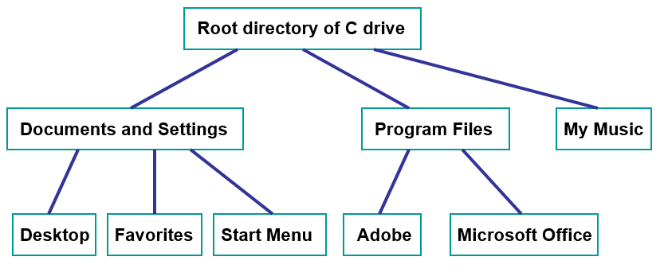
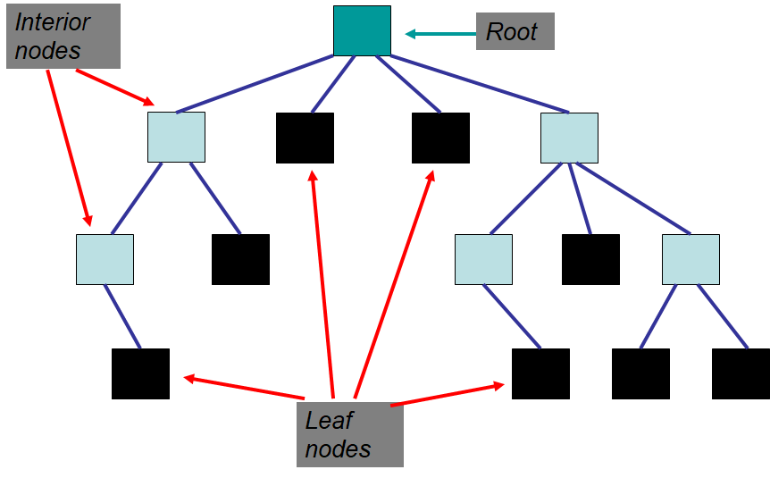
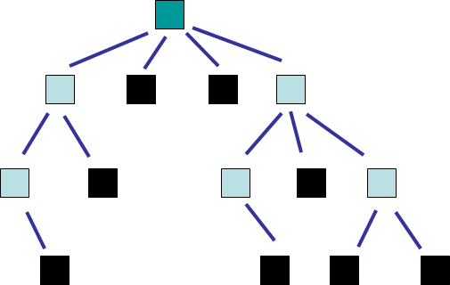
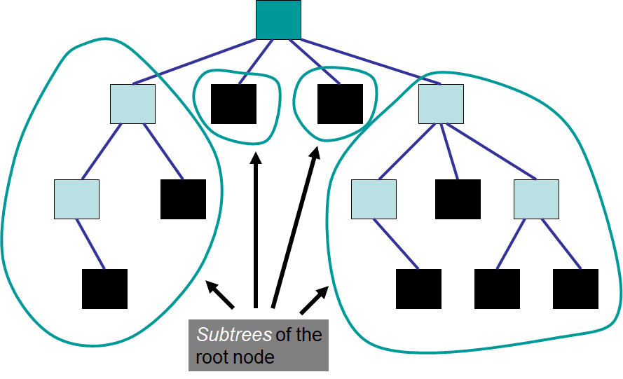
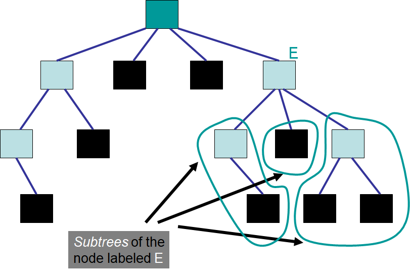
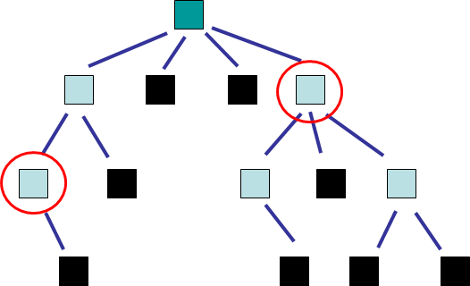
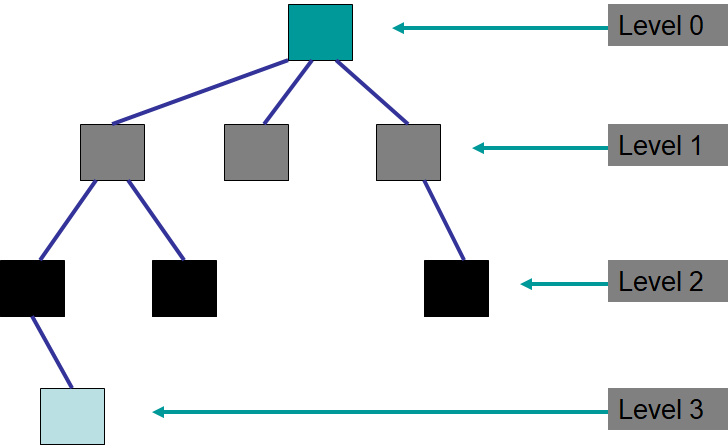

********
Tree ADT
********

* Trees are *nonlinear* data structures

    * The data does not naturally arrange in an obvious linear, sequential way

* Trees are useful when organizing data in some hierarchical way

    * Family trees
    * Inheritance
    * File systems on a computer
    * Decision trees
    * Table of contents of a book

    A simple file system on a computer.

Definitions & Terminology
=========================

Tree Definition
---------------

* A **tree** is a collection of elements such that:

    * It is empty
    * Or, it has a special element called the *root*, from which descends zero or more trees (subtrees)

* Notice that this definition is recursive

.. figure:: tree_definition.png
    :width: 500 px
    :align: center

    Example of an arbitrary tree with subtrees identified. The root element has four existing subtrees. Each of these
    subtrees has a root with zero or many descending subtrees.

Nodes
-----

* A **node** is a single entity in the tree
* An **edge** connects nodes
* The **root node** is a special element that is the origin of the tree

    * A tree can have one or zero root nodes

* A **leaf node** is a node without an edge to a child node
* An **interior node** is *not* a leaf node
* An **empty tree** is a tree with no nodes or edges

    * This is still a tree based on the definition of the tree discussed above
    * Think empty stack/queue/bag --- they still exist, but they're just empty

.. warning::

    It is possible to find alternative definitions of trees; however, the definition included here is used as it is
    common.

    Tree with nodes labelled as a root, interior, or leaf node. In this example, there are six interior nodes, including
    the root, and eight leaf nodes.

Relationships
-------------

* A **parent/predecessor** of a given node is the node directly above in the hierarchy

    * Each node can have at most one parent, except for the root, which has no parent

* A **child/successor** of a given node is the node directly below in the hierarchy

    * Each node can have any number of children

* A **sibling** of a given node is a node that has the same parent
* An **ancestor** of a given node is the parent, or the parent's parent, or ...
* A **descendant** of a given node is the child, or the child's child, or ...

    Example of an arbitrary tree.

* Observations

    * A leaf node cannot have any children
    * The root node of the whole tree has no parent node
    * With the exception of the root node, each node has exactly one parent

* A **subtree** of a given node is a child node and all descendants

    * A subtree is itself a tree
    * A node may have many subtrees

    Tree with the subtrees of the root node identified.

    Tree with the subtrees of the node labelled "E" identified.

.. _label-topic21-trees-properties:

Properties
----------

* A **path** is the sequence of nodes and edges leading from one node to another
* The **path length** is the number of *edges* in the path
* The **level** of a given node is the number of *edges* between the root and the node

    * Recursive definition

        * The level of the root is ``0``
        * The level of a node that is not the root is the level of its parent ``+ 1``

* The **height** of a tree is the number of levels the tree has

    Tree with two nodes emphasized.

* Observations

    * The path length between the two emphasized nodes is three (``3``)
    * The height of this tree is three (``3``)
    * A tree with only a root is zero (``0``)
    * The height of an empty tree is negative one (``-1``)

    Tree with three levels. This tree has a height of three (``3``).

* The **degree/arity of a given node** is the number of *children* the node has
* The **degree/arity of a tree** is the maximum degree/arity of the tree's nodes

For Next Time
=============

* Read Chapter 10 Sections 1 -- 3

    * 10 pages
